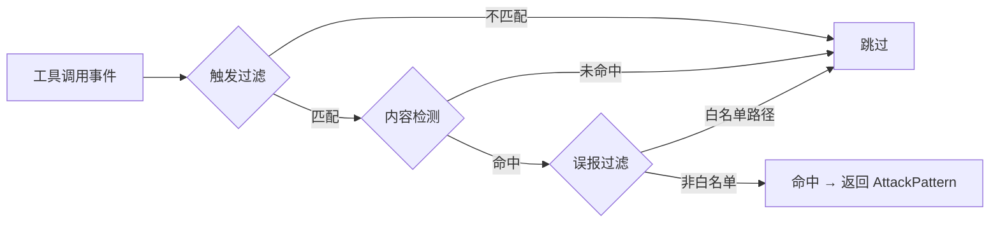

<div class="cs-doc-hero" markdown>
<div class="cs-eyebrow">高级功能 · L2 检测规则</div>

## 用 YAML 扩展 L2 攻击检测规则库

ClawSentry L2 规则引擎基于 YAML 驱动的攻击模式库对工具调用进行确定性正则检测，内置 25 条模式覆盖 OWASP Agentic AI Top 5（ASI01-05）。

<div class="cs-pill-row" markdown>
<span class="cs-pill">25 条内置模式</span>
<span class="cs-pill">ASI01-05</span>
<span class="cs-pill">可自定义规则路径</span>
<span class="cs-pill">运行时热更新</span>
</div>
</div>

!!! abstract "本页快速导航"
    [内置模式总览](#builtin-patterns) · [匹配流程](#matching-pipeline) · [AttackPattern 字段](#pattern-schema) · [自定义模式 YAML 格式](#custom-patterns) · [triggers 触发条件](#triggers) · [detection 检测逻辑](#detection) · [误报过滤](#false-positives) · [热更新](#hot-reload)

---

## 内置模式总览 {#builtin-patterns}

内置库 `attack_patterns.yaml` 共 **25 条**，分 5 个 OWASP ASI 类别：

| 类别 (`category`) | OWASP | 条数 | 检测方式 | 典型指标 |
|-------------------|-------|:----:|----------|----------|
| `goal_hijack` | ASI01 | 5 | 读取文件/HTTP 响应的内容正则 | `ignore previous instructions`、HTML 注释注入、Unicode 零宽字符、SSTI 模板标记、Markdown 追踪像素 |
| `tool_misuse` | ASI02 | 7 | bash/exec 命令字符串正则 | `curl -d @`、DNS/ICMP 隧道外传、反弹 shell、S3/GCS/Azure 云存储上传、可疑 pip/npm URL 安装 |
| `privilege_abuse` | ASI03 | 5 | 文件读写路径 + 命令字符串正则 | `../../../etc/passwd`、`sudo rm /etc`、Docker socket 挂载、`insmod`/`modprobe`、crontab 持久化 |
| `supply_chain` | ASI04 | 2 | bash 命令字符串正则 | pip/npm 常见错别字包名（typosquat）、`git clone … && make install` |
| `code_execution` | ASI05 | 6 | bash/写入文件内容正则 | `curl \| bash`、`base64 -d \| sh`、polyglot `-c` 一行脚本、`LD_PRELOAD=…`、`pickle.loads`、`eval(atob(…))` |

---

## 匹配流程 {#matching-pipeline}

每个工具调用事件依次经过三个阶段，三个阶段**全部通过**才计为命中：

| 阶段 | 方法 | 通过条件 |
|------|------|----------|
| 1 — 触发过滤 | `_triggers_match()` | 事件满足 `triggers` 声明的工具名 / 路径 / 命令条件 |
| 2 — 内容检测 | `_detection_match()` | 至少一条 `regex_patterns` 正则匹配内容（大于 100 KB 时截断） |
| 3 — 误报抑制 | `_is_false_positive()` | 目标路径**不**命中任何 `false_positive_filters` 白名单 glob |

命中结果为 `AttackPattern` 副本，`max_weight` 字段设为本次命中权重最高的正则权重值。



---

## AttackPattern 字段 {#pattern-schema}

`AttackPattern` 是 `pattern_matcher.py` 中的核心数据类：

| 字段 | 类型 | 必填 | 说明 |
|------|------|:----:|------|
| `id` | `str` | 是 | 全局唯一模式 ID（如 `ASI01-001`） |
| `category` | `str` | 是 | 分类标签，仅用于日志和过滤，不影响检测逻辑 |
| `description` | `str` | 是 | 人类可读描述 |
| `risk_level` | `RiskLevel` | 是 | `low` / `medium` / `high` / `critical` |
| `triggers` | `dict` | 是 | 触发条件（见 [triggers 详解](#triggers)） |
| `detection` | `dict` | 是 | 正则检测配置（见 [detection 详解](#detection)） |
| `false_positive_filters` | `list` | 否 | 误报白名单路径列表 |
| `risk_escalation` | `dict` | 否 | 风险等级覆写，格式 `{from: "medium", to: "high"}` |
| `references` | `dict` | 否 | 参考文献，含 `incidents` 和 `papers` 列表 |
| `mitre_attack` | `dict` | 否 | MITRE ATT&CK 映射，含 `tactics` 和 `techniques` 列表 |
| `max_weight` | `int` | — | 运行时填充：本次命中的最高正则权重（0 表示未命中） |

---

## triggers 触发条件 {#triggers}

`triggers` 决定"什么情况下对该事件运行检测"。支持以下字段：

| 字段 | 作用 | 匹配方式 |
|------|------|----------|
| `tool_names` | 工具名白名单 | 大小写不敏感精确匹配（如 `bash`、`read_file`） |
| `file_extensions` | 文件扩展名列表 | `str.endswith()`（如 `.md`、`.pem`） |
| `file_patterns` | 文件名 glob | `fnmatch` 匹配文件名 basename（如 `README*`） |
| `command_patterns` | 命令字符串正则 | 匹配 `payload["command"]`，加载时预编译 |
| `path_patterns` | 路径正则 | 匹配 `payload["path"]` 或 `payload["file_path"]`，加载时预编译 |
| `logic` | 多条件逻辑 | `"AND"`（默认 `"OR"`），与 `conditions` 配合使用 |
| `conditions` | 子条件列表 | 每个子条件可嵌套 `OR` 列表 |

!!! warning "空 triggers 不匹配任何事件"
    若 `triggers` 为空字典（`{}`），该模式**不会**对任何事件触发，不会产生全局兜底效果。

**单条件（直接列字段，逻辑 OR）：**

```yaml
triggers:
  tool_names: ["bash", "shell", "exec"]
```

**AND 复合条件（所有子条件同时满足）：**

```yaml
triggers:
  logic: "AND"
  conditions:
    - tool_names: ["read_file", "read"]
    - OR:
        - file_extensions: [".md", ".txt", ".rst"]
        - file_patterns: ["README*", "CONTRIBUTING*"]
```

**结合路径正则（crontab 场景）：**

```yaml
triggers:
  logic: "OR"
  conditions:
    - tool_names: ["bash", "shell", "exec"]
    - tool_names: ["write_file", "write"]
      path_patterns: [".*cron.*"]
```

---

## detection 检测逻辑 {#detection}

`detection.regex_patterns` 是一个正则列表，支持两种格式：

```yaml
detection:
  regex_patterns:
    # 简写形式（默认权重 5）
    - "curl.*--upload-file"

    # 带权重形式（权重 1-10）
    - pattern: "curl.*-F.*file=@"
      weight: 9
```

| 字段 | 说明 |
|------|------|
| `pattern` | Python `re` 兼容正则；加载时经 `safe_regex` 编译，失败则跳过该条 |
| `weight` | 整数 1-10，未填写默认 5；命中时取所有命中正则中的最大值赋给 `max_weight` |

!!! info "预编译与输入截断"
    所有正则在 **`load_patterns()` 时预编译**，不在每次调用时重复编译。输入内容超过 **100 KB** 时截断后再匹配，防止 ReDoS。

---

## 误报过滤 {#false-positives}

`false_positive_filters` 声明已知安全的路径，命中时该模式**跳过检测**（不计入风险评分）。

目前支持的过滤类型：

| 类型 | 匹配字段 | 匹配方式 |
|------|----------|----------|
| `whitelist_path` | `payload["path"]` 或 `payload["file_path"]` | `fnmatch` glob |

```yaml
false_positive_filters:
  - type: "whitelist_path"
    paths:
      - "/tmp/test_*"
      - "*/node_modules/*"
      - "*/test_fixtures/*"
      - "*/ci/*"
```

!!! tip "高误报模式的推荐做法"
    对误报率较高的模式（如 ASI01-003 零宽字符），先通过白名单排除已知安全目录，收集一段时间真实数据后再收紧范围，而非直接删除模式。

---

## 自定义模式 YAML 格式 {#custom-patterns}

完整字段示例（所有可选字段均已注释）：

```yaml
version: "1.1"

patterns:
  - id: "CORP-001"                    # 必填：全局唯一字符串
    category: "internal_exfil"        # 必填：分类标签（自由定义，不影响逻辑）
    description: "检测向非授权 S3 桶上传数据"  # 必填
    risk_level: "high"                # 必填：low / medium / high / critical

    triggers:                         # 必填：触发条件
      logic: "AND"                    # 可选：AND 或 OR（默认 OR）
      conditions:
        - tool_names: ["bash", "exec"]
        - OR:
            - command_patterns: ["s3://(?!my-company-bucket)"]
            - file_extensions: [".sh"]

    detection:                        # 必填：检测正则
      regex_patterns:
        - pattern: "aws\\s+s3\\s+(cp|sync|mv).*s3://"
          weight: 8                   # 可选：1-10，默认 5

    false_positive_filters:           # 可选：已知安全路径白名单
      - type: "whitelist_path"
        paths:
          - "*/test_*"
          - "*/ci/*"

    risk_escalation:                  # 可选：风险等级覆写
      from: "medium"
      to: "high"

    references:                       # 可选：参考文献
      incidents: ["CVE-2025-XXXXX"]
      papers: ["owasp-aitop10-2025"]

    mitre_attack:                     # 可选：MITRE ATT&CK 映射
      tactics: ["TA0010"]
      techniques: ["T1537"]
```

**部署步骤：**

1. 将自定义模式保存到文件（如 `/opt/clawsentry/my_patterns.yaml`）
2. 设置环境变量：
   ```bash
   export CS_L2_ATTACK_PATTERNS_PATH=/opt/clawsentry/my_patterns.yaml
   ```
3. 重启 Gateway（`clawsentry stack` 或 `clawsentry gateway`）
4. 验证启动日志中显示已加载的自定义模式数量：
   ```
   INFO  PatternMatcher loaded 25 core + N custom patterns (total: 25+N)
   ```

!!! warning "ID 冲突处理"
    自定义模式的 `id` 若与内置模式重复，该自定义模式将被**跳过**并产生警告日志。自定义模式与内置模式合并使用，不会替换内置库。

---

## 热更新 {#hot-reload}

`PatternMatcher.reload()` 从磁盘重新加载模式（内置 + 自定义），**无需重启进程**：

```python
from clawsentry.gateway.pattern_matcher import PatternMatcher

matcher = PatternMatcher(evolved_patterns_path="/opt/cs/evolved.yaml")
# ... 运行时 ...
matcher.reload()  # 热更新：重新读取 YAML 文件
```

进化模式（`EvolvedPattern`）额外字段包括 `status`（`candidate` / `experimental` / `stable`）、`confidence`（0.0-1.0）、`confirmed_count`、`false_positive_count` 等。只有状态为 `experimental` 或 `stable` 的进化模式会在 `reload()` 后生效。详见[自进化模式库](pattern-evolution.md)。

---

## 代码位置 {#source-code}

| 模块 | 路径 | 职责 |
|------|------|------|
| `PatternMatcher` / `AttackPattern` | `src/clawsentry/gateway/pattern_matcher.py` | YAML 加载、触发逻辑、正则匹配、误报过滤 |
| 内置模式库 | `src/clawsentry/gateway/attack_patterns.yaml` | 25 条 ASI01-05 核心模式定义 |
| `RuleBasedAnalyzer` | `src/clawsentry/gateway/semantic_analyzer.py` | 集成 `PatternMatcher`，输出 L2 分析结果 |
| `DetectionConfig` | `src/clawsentry/gateway/detection_config.py` | `patterns_path` 字段（自定义文件路径） |

---

## 相关页面

- [L2 语义分析](../decision-layers/l2-semantic.md) — `PatternMatcher` 的集成点与 `RuleBasedAnalyzer` 工作机制
- [自进化模式库](pattern-evolution.md) — 从生产数据自动生成候选模式并晋升为稳定规则
- [检测管线配置](../configuration/detection-config.md) — `CS_L2_ATTACK_PATTERNS_PATH` 完整参数说明
- [环境变量参考](../configuration/env-vars.md) — 所有 `CS_*` 环境变量列表
- [规则治理](rule-governance.md) — 规则 lint、dry-run 与生产上线检查
