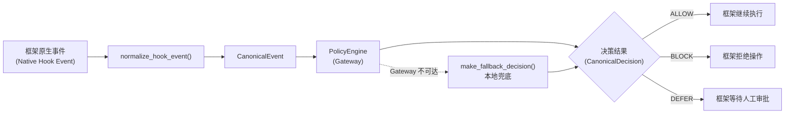
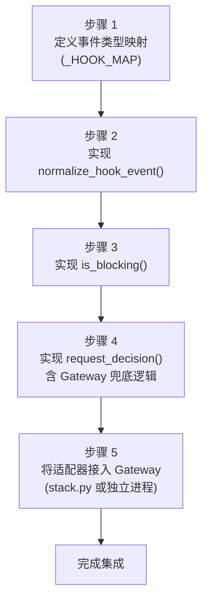

<div class="cs-doc-hero" markdown>
<div class="cs-eyebrow">高级 · 框架集成</div>

## 实现自定义 AHP 适配器

通过编写适配器，将任意 AI Agent 框架接入 ClawSentry：将框架原生事件规范化为 `CanonicalEvent`，并转发至 Gateway 的统一策略决策链。

<div class="cs-pill-row" markdown>
<span class="cs-pill">6 个内置框架</span>
<span class="cs-pill">鸭子类型接口</span>
<span class="cs-pill">UDS / HTTP / 进程内</span>
<span class="cs-pill">失败关闭兜底</span>
</div>
</div>

**适配器**是框架与 ClawSentry Gateway 之间的桥梁。其唯一职责是将框架原生事件转译为 `CanonicalEvent` 对象，并提交给 Gateway 的 `PolicyEngine` 进行安全决策 —— 所有允许/阻断/延迟判断均由 Gateway 作出，适配器本身不做任何策略判断。

---

## 已支持的框架

ClawSentry 内置了六个框架的适配器。仅当你的框架不在以下列表中时，才需要编写自定义适配器。

| 框架 | 适配器类 (Adapter class) | Hook 类型 (Hook type) |
|---|---|---|
| a3s-code | `A3SCodeAdapter` | `PreToolUse`（阻断）+ `PostToolUse`/`PostResponse`（审计） |
| OpenClaw | `OpenClawAdapter` | WebSocket `exec.approval.requested` + Webhook |
| Claude Code | `A3SCodeAdapter` | `PreToolUse`（阻断）+ `PostToolUse`/`UserPromptSubmit`（审计） |

!!! note "Claude Code 共用 A3S 适配器"
    Claude Code 使用 `A3SCodeAdapter`，并设置 `source_framework="claude-code"` —— 不存在独立的 `ClaudeCodeAdapter` 类。

| Codex | `CodexAdapter` | `PreToolUse`/`PermissionRequest`（阻断）+ `PostToolUse`（审计） |
| Gemini CLI | `GeminiAdapter` | `BeforeTool`（阻断） |
| Kimi CLI | `KimiAdapter` | `PreToolUse`/`UserPromptSubmit`（阻断）+ `PostToolUse`（审计） |

---

## 适配器接口

ClawSentry 使用**鸭子类型** —— 没有正式的基类。任何提供以下属性和方法的对象均为合法适配器。

```python
class MyAdapter:
    SOURCE_FRAMEWORK: str = "my-framework"    # CanonicalEvent.source_framework
    CALLER_ADAPTER_ID: str = "my-adapter.v1"  # DecisionContext.caller_adapter

    def normalize_hook_event(
        self,
        hook_type: str,
        payload: dict,
        session_id: str | None = None,
        agent_id: str | None = None,
    ) -> CanonicalEvent | None: ...

    def is_blocking(self, hook_type: str) -> bool: ...

    async def request_decision(
        self,
        event: CanonicalEvent,
        context: DecisionContext | None = None,
        deadline_ms: int | None = None,
        decision_tier: DecisionTier = DecisionTier.L1,
    ) -> CanonicalDecision: ...
```

### 方法契约

| 方法 (Method) | 返回值 (Returns) | 用途 (Purpose) |
|---|---|---|
| `normalize_hook_event` | `CanonicalEvent \| None` | 将原始 Hook 事件映射到规范模型。对未知或需跳过的事件类型返回 `None`，不得抛出异常。 |
| `is_blocking` | `bool` | 当 Agent 必须等待决策后才能继续执行时（例如 `pre_action`）返回 `True`；纯审计事件返回 `False`。 |
| `request_decision` | `CanonicalDecision` | 将规范事件发送至 Gateway 并返回决策结果。Gateway 不可达时必须实现本地兜底。 |

---

## 事件处理数据流



---

## CanonicalEvent 字段

`CanonicalEvent` 是定义在 `src/clawsentry/gateway/models.py` 中的 Pydantic 模型。

### 必填字段

| 字段 (Field) | 类型 (Type) | 说明 (Description) |
|---|---|---|
| `schema_version` | `str` | 固定为 `"ahp.1.0"`，须匹配模式 `ahp.<major>.<minor>`。 |
| `event_id` | `str` | 稳定的 24 位十六进制 ID，使用 `generate_event_id()` 生成（见下文）。 |
| `trace_id` | `str` | 请求链路关联 ID。可使用 `tool_use_id`、`turn_id` 或新生成的 UUID。 |
| `event_type` | `EventType` | 取值之一：`pre_action`、`post_action`、`pre_prompt`、`post_response`、`error`、`session`。 |
| `session_id` | `str` | 框架会话标识符。缺失时使用 `CanonicalEvent.sentinel_session_id(framework)`。 |
| `agent_id` | `str` | 框架 Agent 标识符。缺失时使用 `CanonicalEvent.sentinel_agent_id(framework)`。 |
| `source_framework` | `str` | 必须与适配器的 `SOURCE_FRAMEWORK` 一致。 |
| `occurred_at` | `str` | UTC ISO8601 时间戳。框架未提供时使用 `utc_now_iso()`。 |
| `payload` | `dict` | 完整的规范化事件载荷。 |

### 可选字段

| 字段 (Field) | 类型 (Type) | 说明 (Description) |
|---|---|---|
| `event_subtype` | `str \| None` | 框架特定的事件名称，例如 `"PreToolUse"`。当 `source_framework` 为 `"a3s-code"` 或 `"openclaw"` 时为必填。 |
| `tool_name` | `str \| None` | 被调用的工具名。从 `payload["tool"]` 或 `payload["tool_name"]` 中提取。 |
| `risk_hints` | `list[str]` | 由 `extract_risk_hints(tool_name, command)` 填充。 |
| `framework_meta` | `FrameworkMeta \| None` | 携带 `NormalizationMeta` 及框架特定的扩展字段。 |
| `depth` | `int \| None` | Agent 调用栈深度。 |
| `run_id` | `str \| None` | 框架任务或运行标识符。 |
| `approval_id` | `str \| None` | 审批生命周期标识符（OpenClaw / Codex）。 |
| `source_seq` | `int \| None` | 运行内单调递增的事件序列号。 |

!!! warning "验证约束"
    当 `source_framework` 为 `"a3s-code"` 或 `"openclaw"` 时，Pydantic 校验器**要求**填写 `event_subtype`。自定义框架名称不受此约束，但强烈建议填写以提升审计可读性。

    对于 `source_framework="openclaw"`，还需额外提供以下两个字段：

    - `source_protocol_version` — 必须提供（非空字符串）。
    - `mapping_profile` — 必须提供，且须匹配模式 `^openclaw@[A-Za-z0-9._-]+/protocol\.v\d+(?:\.\d+)*/profile\.v[1-9]\d*$`（例如 `openclaw@abc1234/protocol.v1/profile.v1`）。

---

## 共享工具函数

请直接导入以下辅助函数，而非自行实现。

```python
from clawsentry.adapters.event_id import generate_event_id
from clawsentry.gateway.models import (
    CanonicalEvent, CanonicalDecision,
    DecisionContext, DecisionTier,
    EventType, FrameworkMeta, NormalizationMeta,
    extract_risk_hints, utc_now_iso,
)
from clawsentry.adapters.a3s_adapter import infer_content_origin
from clawsentry.gateway.policy_engine import make_fallback_decision
```

| 辅助函数 (Helper) | 签名 (Signature) | 用途 (Purpose) |
|---|---|---|
| `generate_event_id` | `(source_framework, session_id, event_subtype, occurred_at, payload) → str` | 基于 SHA-256 的稳定 24 位事件 ID。 |
| `extract_risk_hints` | `(tool_name, command) → list[str]` | 返回风险标签，例如 `"destructive_pattern"` 和 `"shell_execution"`。 |
| `infer_content_origin` | `(tool_name, payload) → "external" \| "user" \| "unknown"` | 判断载荷数据是否来源于外部。将结果注入 `payload["_clawsentry_meta"]["content_origin"]`。 |
| `utc_now_iso` | `() → str` | 返回当前 UTC 时间的 ISO8601 字符串。 |
| `make_fallback_decision` | `(event, risk_hints_contain_high_danger) → CanonicalDecision` | Gateway 不可达时产生保守的本地决策。 |
| `CanonicalEvent.sentinel_session_id` | `(framework) → str` | 返回 `"unknown_session:{framework}"`。 |
| `CanonicalEvent.sentinel_agent_id` | `(framework) → str` | 返回 `"unknown_agent:{framework}"`。 |

---

## 分步集成指南



### 步骤 1 — 定义事件类型映射

创建一个字典，将框架的 Hook 名称映射到 `(EventType, is_blocking)` 元组。

```python
from clawsentry.gateway.models import EventType

_HOOK_MAP: dict[str, tuple[EventType, bool]] = {
    "tool_call":   (EventType.PRE_ACTION,  True),
    "tool_result": (EventType.POST_ACTION, False),
    "user_input":  (EventType.PRE_PROMPT,  True),
    "error":       (EventType.ERROR,       False),
}
```

阻断事件（`True`）会暂停 Agent，直到 Gateway 响应。非阻断事件仅用于审计，异步发送。

### 步骤 2 — 实现 `normalize_hook_event`

```python
from clawsentry.adapters.event_id import generate_event_id
from clawsentry.adapters.a3s_adapter import infer_content_origin
from clawsentry.gateway.models import (
    CanonicalEvent, EventType, FrameworkMeta, NormalizationMeta,
    extract_risk_hints, utc_now_iso,
)
import uuid

def normalize_hook_event(self, hook_type, payload, session_id=None, agent_id=None):
    mapping = _HOOK_MAP.get(hook_type)
    if mapping is None:
        return None  # unknown type — return None, do not raise

    event_type, _ = mapping
    occurred_at = utc_now_iso()

    # Fall back to sentinel values for missing identifiers
    effective_session = session_id or CanonicalEvent.sentinel_session_id(self.SOURCE_FRAMEWORK)
    effective_agent   = agent_id   or CanonicalEvent.sentinel_agent_id(self.SOURCE_FRAMEWORK)
    missing = ([f for f in ("session_id", "agent_id")
                if not locals()[f.replace("_id", "_" + f.split("_")[0])]])

    tool_name = payload.get("tool") or payload.get("tool_name")
    command   = str(payload.get("command", "") or payload.get("path", ""))
    risk_hints = extract_risk_hints(tool_name, command)

    # Enrich payload with content-origin classification
    enriched = dict(payload)
    enriched["_clawsentry_meta"] = {"content_origin": infer_content_origin(tool_name, payload)}

    norm_meta = NormalizationMeta(
        rule_id="my-framework-direct-map",
        inferred=False,
        confidence="high",
        raw_event_type=hook_type,
        raw_event_source=self.SOURCE_FRAMEWORK,
        missing_fields=[f for f in ("session_id", "agent_id")
                        if not (session_id if f == "session_id" else agent_id)],
        fallback_rule="sentinel_value" if not (session_id and agent_id) else None,
    )

    return CanonicalEvent(
        event_id=generate_event_id(
            self.SOURCE_FRAMEWORK, effective_session, hook_type, occurred_at, enriched
        ),
        trace_id=str(uuid.uuid4()),
        event_type=event_type,
        session_id=effective_session,
        agent_id=effective_agent,
        source_framework=self.SOURCE_FRAMEWORK,
        occurred_at=occurred_at,
        payload=enriched,
        event_subtype=hook_type,
        tool_name=tool_name,
        risk_hints=risk_hints,
        framework_meta=FrameworkMeta(normalization=norm_meta),
    )
```

### 步骤 3 — 实现 `is_blocking`

```python
def is_blocking(self, hook_type: str) -> bool:
    mapping = _HOOK_MAP.get(hook_type)
    return mapping[1] if mapping else False
```

### 步骤 4 — 实现带兜底逻辑的 `request_decision`

通过 UDS 连接 Gateway。每当 Gateway 不可达时，应用 `make_fallback_decision`。

```python
import asyncio, json, struct, time
from clawsentry.gateway.models import (
    CanonicalDecision, DecisionContext, DecisionTier, SyncDecisionRequest,
)
from clawsentry.gateway.policy_engine import make_fallback_decision

async def request_decision(self, event, context=None, deadline_ms=None,
                           decision_tier=DecisionTier.L1):
    effective_deadline = deadline_ms or self.default_deadline_ms
    ctx = context or DecisionContext(caller_adapter=self.CALLER_ADAPTER_ID)

    req = SyncDecisionRequest(
        request_id=f"my-{event.event_id}-{int(time.monotonic() * 1000)}",
        deadline_ms=effective_deadline,
        decision_tier=decision_tier,
        event=event,
        context=ctx,
    )
    body = json.dumps({
        "jsonrpc": "2.0", "id": 1,
        "method": "ahp/sync_decision",
        "params": req.model_dump(mode="json"),
    }).encode()

    try:
        reader, writer = await asyncio.open_unix_connection(self.uds_path)
        writer.write(struct.pack("!I", len(body)) + body)
        await writer.drain()
        length = struct.unpack("!I", await asyncio.wait_for(
            reader.readexactly(4), timeout=effective_deadline / 1000.0 + 0.5
        ))[0]
        data = await asyncio.wait_for(
            reader.readexactly(length), timeout=effective_deadline / 1000.0 + 0.5
        )
        writer.close()
        resp = json.loads(data)
        if resp.get("result", {}).get("rpc_status") == "ok":
            return CanonicalDecision(**resp["result"]["decision"])
    except Exception:
        pass  # fall through to local fallback

    has_high_danger = bool(
        set(event.risk_hints) & {"destructive_pattern", "shell_execution"}
    )
    return make_fallback_decision(event, risk_hints_contain_high_danger=has_high_danger)
```

### 步骤 5 — 将适配器接入 Gateway

在 `src/clawsentry/gateway/stack.py` 中添加适配器的启动逻辑，以环境变量作为开关：

```python
if os.getenv("MY_FRAMEWORK_ENABLED"):
    from my_package.my_adapter import MyAdapter
    adapter = MyAdapter(uds_path=uds_socket_path)
    # register HTTP endpoint or WS listener that calls adapter.handle_event()
```

也可以将适配器作为**独立进程**运行，通过 UDS 或 HTTP 连接到已启动的 Gateway：

```bash
# 终端 1 — 启动 Gateway
clawsentry gateway

# 终端 2 — 启动适配器服务
python my_adapter_service.py
```

---

## 兜底行为

当 Gateway 不可达时，`make_fallback_decision` 按以下矩阵执行：

| 事件类型 (Event type) | 条件 (Condition) | 兜底裁决 (Fallback verdict) |
|---|---|---|
| `pre_action` | `risk_hints` 包含 `destructive_pattern` 或 `shell_execution` | **BLOCK**（失败关闭） |
| `pre_action` | 无高危 hint | **DEFER** |
| `pre_prompt` | — | **ALLOW**（失败开放） |
| `post_action` / `post_response` / `error` / `session` | — | **ALLOW**（纯审计事件） |

!!! warning "务必实现兜底逻辑"
    `request_decision` 绝不能抛出未处理的异常。Gateway 不可用时，应返回 `make_fallback_decision(event, ...)`。因未处理异常而阻塞 Agent，比保守的本地决策更糟糕。

---

## 配置

适配器通过以下环境变量选择，优先级从高到低：CLI 参数覆盖 > 进程环境变量 > `--env-file` > 内置默认值。

| 环境变量 (Env var) | 默认值 (Default) | 说明 (Description) |
|---|---|---|
| `CS_FRAMEWORK` | `""` | 默认激活的框架标识符（例如 `my-framework`）。 |
| `CS_ENABLED_FRAMEWORKS` | `[]` | 逗号分隔的已启用框架标识符列表。 |
| `CS_MODE` | `normal` | 运行模式：`normal`、`strict`、`permissive`、`benchmark`。 |
| `CS_PRESET` | `medium` | 检测预设：`low`、`medium`、`high`、`strict`。 |
| `CS_L2_ENABLED` | `false` | 启用 L2 语义分析以进行深度检测。 |
| `CS_L3_ENABLED` | `false` | 启用 L3 咨询 Agent 处理复杂情况。 |

`CS_FRAMEWORK` / `CS_ENABLED_FRAMEWORKS` 的有效值仅限六个内置框架标识符：`a3s-code`、`openclaw`、`codex`、`claude-code`、`gemini-cli`、`kimi-cli`。`env_config.py` 中的 `parse_enabled_frameworks` 会根据固定的 `_SUPPORTED_FRAMEWORKS` frozenset 进行过滤，静默丢弃无法识别的名称。自定义适配器必须通过 UDS 或 HTTP 独立连接 Gateway —— 无法通过这些环境变量激活。

!!! note "UDS 套接字路径"
    Gateway 默认监听 `/tmp/clawsentry.sock`。如需使用其他路径，请在适配器的 `__init__` 中显式传入 `uds_path`。

---

## 完整最小示例

```python title="my_framework_adapter.py"
"""Minimal ClawSentry adapter for MyFramework."""
from __future__ import annotations

import asyncio, json, struct, time, uuid
from typing import Any

from clawsentry.adapters.a3s_adapter import infer_content_origin
from clawsentry.adapters.event_id import generate_event_id
from clawsentry.gateway.models import (
    CanonicalDecision, CanonicalEvent, DecisionContext, DecisionTier,
    EventType, FrameworkMeta, NormalizationMeta,
    SyncDecisionRequest, extract_risk_hints, utc_now_iso,
)
from clawsentry.gateway.policy_engine import make_fallback_decision

_HOOK_MAP: dict[str, tuple[EventType, bool]] = {
    "tool_call":   (EventType.PRE_ACTION,  True),
    "tool_result": (EventType.POST_ACTION, False),
    "user_input":  (EventType.PRE_PROMPT,  True),
    "error":       (EventType.ERROR,       False),
}


class MyFrameworkAdapter:
    SOURCE_FRAMEWORK = "my-framework"
    CALLER_ADAPTER_ID = "my-framework-adapter.v1"

    def __init__(self, uds_path: str = "/tmp/clawsentry.sock",
                 default_deadline_ms: int = 4500) -> None:
        self.uds_path = uds_path
        self.default_deadline_ms = default_deadline_ms

    # ------------------------------------------------------------------
    # Normalization
    # ------------------------------------------------------------------

    def normalize_hook_event(
        self,
        hook_type: str,
        payload: dict[str, Any],
        session_id: str | None = None,
        agent_id: str | None = None,
    ) -> CanonicalEvent | None:
        mapping = _HOOK_MAP.get(hook_type)
        if mapping is None:
            return None  # unknown type — skip silently

        event_type, _ = mapping
        occurred_at = utc_now_iso()
        effective_session = session_id or CanonicalEvent.sentinel_session_id(self.SOURCE_FRAMEWORK)
        effective_agent   = agent_id   or CanonicalEvent.sentinel_agent_id(self.SOURCE_FRAMEWORK)
        missing = [f for f, v in (("session_id", session_id), ("agent_id", agent_id)) if not v]

        tool_name = payload.get("tool") or payload.get("tool_name")
        command   = str(payload.get("command", "") or payload.get("path", ""))
        risk_hints = extract_risk_hints(tool_name, command)

        enriched = dict(payload)
        enriched["_clawsentry_meta"] = {"content_origin": infer_content_origin(tool_name, payload)}

        norm_meta = NormalizationMeta(
            rule_id="my-framework-direct-map",
            inferred=False,
            confidence="high",
            raw_event_type=hook_type,
            raw_event_source=self.SOURCE_FRAMEWORK,
            missing_fields=missing,
            fallback_rule="sentinel_value" if missing else None,
        )

        return CanonicalEvent(
            event_id=generate_event_id(
                self.SOURCE_FRAMEWORK, effective_session, hook_type, occurred_at, enriched
            ),
            trace_id=str(uuid.uuid4()),
            event_type=event_type,
            session_id=effective_session,
            agent_id=effective_agent,
            source_framework=self.SOURCE_FRAMEWORK,
            occurred_at=occurred_at,
            payload=enriched,
            event_subtype=hook_type,
            tool_name=tool_name,
            risk_hints=risk_hints,
            framework_meta=FrameworkMeta(normalization=norm_meta),
        )

    def is_blocking(self, hook_type: str) -> bool:
        mapping = _HOOK_MAP.get(hook_type)
        return mapping[1] if mapping else False

    # ------------------------------------------------------------------
    # Gateway communication
    # ------------------------------------------------------------------

    async def request_decision(
        self,
        event: CanonicalEvent,
        context: DecisionContext | None = None,
        deadline_ms: int | None = None,
        decision_tier: DecisionTier = DecisionTier.L1,
    ) -> CanonicalDecision:
        effective_deadline = deadline_ms or self.default_deadline_ms
        ctx = context or DecisionContext(caller_adapter=self.CALLER_ADAPTER_ID)
        req = SyncDecisionRequest(
            request_id=f"my-{event.event_id}-{int(time.monotonic() * 1000)}",
            deadline_ms=effective_deadline,
            decision_tier=decision_tier,
            event=event,
            context=ctx,
        )
        body = json.dumps({
            "jsonrpc": "2.0", "id": 1,
            "method": "ahp/sync_decision",
            "params": req.model_dump(mode="json"),
        }).encode()

        try:
            reader, writer = await asyncio.open_unix_connection(self.uds_path)
            writer.write(struct.pack("!I", len(body)) + body)
            await writer.drain()
            raw_len = await asyncio.wait_for(reader.readexactly(4),
                                             timeout=effective_deadline / 1000.0 + 0.5)
            resp_bytes = await asyncio.wait_for(
                reader.readexactly(struct.unpack("!I", raw_len)[0]),
                timeout=effective_deadline / 1000.0 + 0.5,
            )
            writer.close()
            resp = json.loads(resp_bytes)
            if resp.get("result", {}).get("rpc_status") == "ok":
                return CanonicalDecision(**resp["result"]["decision"])
        except Exception:
            pass  # gateway unreachable — use local fallback

        has_high_danger = bool(
            set(event.risk_hints) & {"destructive_pattern", "shell_execution"}
        )
        return make_fallback_decision(event, risk_hints_contain_high_danger=has_high_danger)

    # ------------------------------------------------------------------
    # Convenience handler
    # ------------------------------------------------------------------

    async def handle_event(
        self,
        hook_type: str,
        payload: dict[str, Any],
        session_id: str | None = None,
        agent_id: str | None = None,
    ) -> CanonicalDecision | None:
        """Normalize + send to Gateway. Returns decision for blocking events, None otherwise."""
        event = self.normalize_hook_event(hook_type, payload, session_id, agent_id)
        if event is None:
            return None
        if not self.is_blocking(hook_type):
            return None  # fire-and-forget audit event
        return await self.request_decision(event)
```
