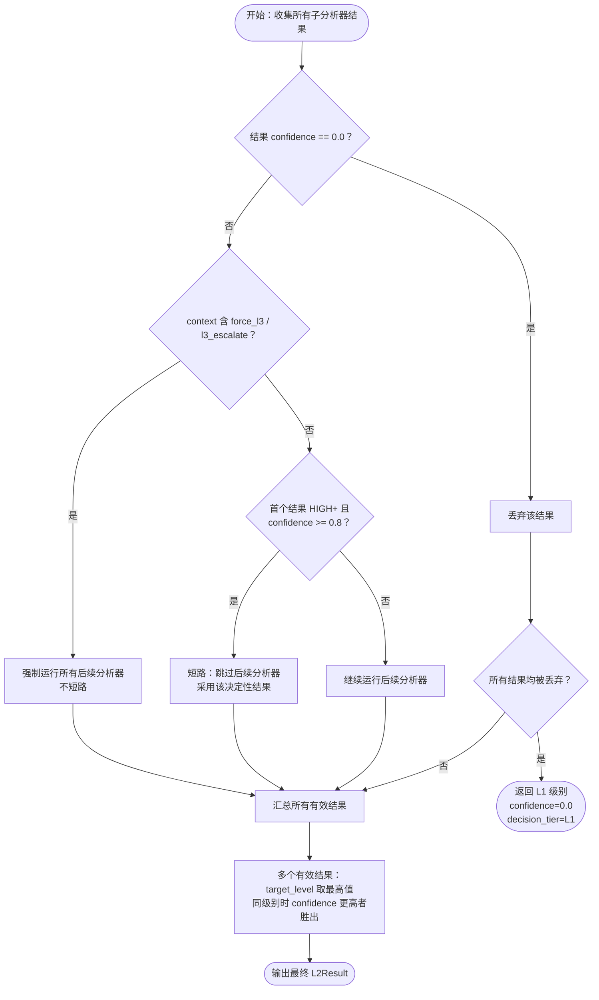

<div class="cs-doc-hero" markdown>
<div class="cs-eyebrow">进阶 · L2 语义分析</div>

## 自定义 L2 语义分析器

将自定义 `SemanticAnalyzer` 接入 `CompositeAnalyzer` 链，在 ClawSentry 内置规则分析器与 LLM 分析器之上叠加业务域特定的风险逻辑。

<div class="cs-pill-row" markdown>
<span class="cs-pill">SemanticAnalyzer 协议</span>
<span class="cs-pill">CompositeAnalyzer</span>
<span class="cs-pill">只升不降</span>
<span class="cs-pill">超时熔断保护</span>
</div>
</div>

L2 语义分析位于确定性 L1 规则引擎与最终决策之间。任何满足 `SemanticAnalyzer` Protocol 的对象都可以组合进分析器链，无需继承任何基类。

---

## SemanticAnalyzer 协议

```python title="clawsentry/gateway/semantic_analyzer.py (excerpt)"
from typing import Optional, Protocol, runtime_checkable

@runtime_checkable
class SemanticAnalyzer(Protocol):
    """Protocol for pluggable L2 semantic analyzers."""

    @property
    def analyzer_id(self) -> str: ...

    async def analyze(
        self,
        event: CanonicalEvent,
        context: Optional[DecisionContext],
        l1_snapshot: RiskSnapshot,
        budget_ms: float,
    ) -> L2Result: ...
```

`@runtime_checkable` 意味着 `isinstance(obj, SemanticAnalyzer)` 在运行时可用——不要求继承任何基类。

---

## L2Result 字段说明

```python
@dataclass(frozen=True)
class L2Result:
    target_level: RiskLevel
    reasons: list[str] = field(default_factory=list)
    confidence: float = 0.0
    analyzer_id: str = ""
    latency_ms: float = 0.0
    trace: Optional[dict] = None
    decision_tier: DecisionTier = DecisionTier.L2
```

| 字段 | 类型 | 说明 |
|---|---|---|
| `target_level` | `RiskLevel` | 必填。`PolicyEngine` 执行 `max(l1_level, target_level)`——结果只升不降。 |
| `confidence` | `float` 0.0–1.0 | **`0.0` 表示降级/失败。** `CompositeAnalyzer` 会丢弃所有 `confidence == 0.0` 的结果。 |
| `reasons` | `list[str]` | 人类可读的发现描述，显示于决策记录和仪表盘。 |
| `analyzer_id` | `str` | 应与 `self.analyzer_id` 一致，用于审计日志。 |
| `latency_ms` | `float` | 已用毫秒数。传入 `round((time.monotonic() - start) * 1000, 3)`。 |
| `trace` | `Optional[dict]` | 任意调试/审计字典，存储于 `TrajectoryStore.l3_trace_json`。 |
| `decision_tier` | `DecisionTier` | 默认为 `DecisionTier.L2`。降级回 L1 兜底时设为 `DecisionTier.L1`。 |

---

## 接入流程概览

```mermaid
flowchart TD
    A([实现 SemanticAnalyzer Protocol]) --> B[处理预算与异常\nbudget_ms / TimeoutError / Exception]
    B --> C[注入 L1PolicyEngine\nL1PolicyEngine&#40;analyzer=...&#41;]
    C --> D{是否启用 LLM 栈？}
    D -- 否 --> E[CompositeAnalyzer\nRuleBasedAnalyzer + 自定义]
    D -- 是 --> F[build_analyzer_from_env\n获取环境驱动分析器]
    F --> G[CompositeAnalyzer\nenv_analyzer + 自定义]
    E --> H([引擎就绪，进入决策流程])
    G --> H
```



---

## 集成步骤

### 第一步 — 实现分析器

```python title="my_analyzer.py"
import time
from typing import Optional

from clawsentry.gateway.models import (
    CanonicalEvent, DecisionContext, RiskLevel, RiskSnapshot,
)
from clawsentry.gateway.semantic_analyzer import L2Result


class DomainBlocklistAnalyzer:
    """Example: block commands matching a domain-specific deny list."""

    BLOCKED = {"rm -rf /", "nc -e /bin/sh", "curl | bash"}

    @property
    def analyzer_id(self) -> str:
        return "domain-blocklist"

    async def analyze(
        self,
        event: CanonicalEvent,
        context: Optional[DecisionContext],
        l1_snapshot: RiskSnapshot,
        budget_ms: float,
    ) -> L2Result:
        start = time.monotonic()
        target_level = l1_snapshot.risk_level  # never go below L1
        reasons: list[str] = []

        cmd = str((event.payload or {}).get("command", "")).lower()
        for blocked in self.BLOCKED:
            if blocked in cmd:
                target_level = RiskLevel.CRITICAL
                reasons.append(f"blocked command pattern: {blocked!r}")

        return L2Result(
            target_level=target_level,
            reasons=reasons,
            confidence=1.0 if reasons else 0.5,
            analyzer_id=self.analyzer_id,
            latency_ms=round((time.monotonic() - start) * 1000, 3),
        )
```

!!! warning "只升不降"
    始终用 `target_level = l1_snapshot.risk_level` 初始化。`PolicyEngine` 内部会强制执行 `max(l1, l2)`，但从 L1 级别起步可避免在无操作结果上产生误导性的 `confidence` 信号。

!!! warning "confidence=0.0 具有特殊含义"
    `CompositeAnalyzer` 会静默丢弃所有 `confidence == 0.0` 的 `L2Result`。`0.0` 专门用于降级/失败路径——表示希望透传给下一个分析器或回退到 L1。

### 第二步 — 处理预算与异常

```python
    async def analyze(self, event, context, l1_snapshot, budget_ms):
        try:
            result = await asyncio.wait_for(
                self._external_check(event),
                timeout=budget_ms / 1000,
            )
            return result
        except asyncio.TimeoutError:
            return L2Result(
                target_level=l1_snapshot.risk_level,
                reasons=["external check timed out"],
                confidence=0.0,          # degraded — CompositeAnalyzer will skip
                analyzer_id=self.analyzer_id,
                decision_tier=DecisionTier.L1,
            )
        except Exception:
            return L2Result(
                target_level=l1_snapshot.risk_level,
                reasons=["analysis failed"],
                confidence=0.0,
                analyzer_id=self.analyzer_id,
                decision_tier=DecisionTier.L1,
            )
```

!!! note "不要抛出异常"
    `CompositeAnalyzer` 会捕获每个子分析器抛出的异常并将其记录为失败。请返回 `confidence=0.0` 的结果，而不是直接抛出异常。

### 第三步 — 构建 CompositeAnalyzer 并传入 L1PolicyEngine

```python title="gateway_startup.py"
from clawsentry.gateway.policy_engine import L1PolicyEngine
from clawsentry.gateway.semantic_analyzer import CompositeAnalyzer, RuleBasedAnalyzer
from my_analyzer import DomainBlocklistAnalyzer

analyzer = CompositeAnalyzer([
    RuleBasedAnalyzer(),          # fast, deterministic — run first
    DomainBlocklistAnalyzer(),    # domain logic
])

engine = L1PolicyEngine(analyzer=analyzer)
```

`L1PolicyEngine.__init__` 接受任何满足 `SemanticAnalyzer` Protocol 的 `analyzer=` 参数。若 `analyzer` 为 `None`，则默认使用裸 `RuleBasedAnalyzer`。

### 第四步 — 可选：与 LLM 分析栈组合

```python
from clawsentry.gateway.llm_factory import build_analyzer_from_env
from clawsentry.gateway.semantic_analyzer import CompositeAnalyzer, RuleBasedAnalyzer

# Build the default env-driven analyzer (rule + LLM [+ L3 agent if CS_L3_ENABLED])
env_analyzer = build_analyzer_from_env()

if env_analyzer is not None:
    # Prepend or append your custom analyzer
    analyzer = CompositeAnalyzer([env_analyzer, DomainBlocklistAnalyzer()])
else:
    analyzer = CompositeAnalyzer([RuleBasedAnalyzer(), DomainBlocklistAnalyzer()])

engine = L1PolicyEngine(analyzer=analyzer)
```

`build_analyzer_from_env()` 在 `CS_LLM_PROVIDER` 未设置时返回 `None`；配置了 LLM 提供商时返回 `CompositeAnalyzer(RuleBasedAnalyzer, LLMAnalyzer)`；当 `CS_L3_ENABLED=true` 时还会额外包装一个 `AgentAnalyzer`（L3）。

---

## CompositeAnalyzer 合并规则



| 场景 | 结果 |
|---|---|
| 首个分析器返回 HIGH+ 且 `confidence >= 0.8` | 后续分析器被**跳过**（决定性结果短路）。 |
| `context.session_risk_summary` 含 `force_l3 / l3_escalate` | 无论首个结果如何，后续分析器始终执行。 |
| 某结果 `confidence == 0.0` | 从候选集中丢弃。 |
| 所有结果均被丢弃（全部降级） | 返回 L1 级别，`confidence=0.0`，`decision_tier=L1`。 |
| 多个有效结果 | 最高 `target_level` 胜出；同级别时以 `confidence` 更高者为准。 |

---

## CanonicalEvent 与 RiskSnapshot 参考

**L2 中使用的 CanonicalEvent 字段**

| 字段 | 类型 | 描述 |
|---|---|---|
| `tool_name` | `Optional[str]` | 调用的工具（如 `bash`、`read_file`）。 |
| `event_type` | `EventType` | `pre_action`、`post_action` 等。 |
| `risk_hints` | `list[str]` | 来自适配器的提示标签（如 `prompt_injection`）。 |
| `payload` | `dict[str, Any]` | 事件载荷；应视为不可信输入处理。 |
| `session_id` | `str` | 会话标识符。 |
| `agent_id` | `str` | 智能体标识符。 |
| `source_framework` | `str` | 框架标签（如 `a3s-code`、`openclaw`）。 |

**L2 中使用的 RiskSnapshot 字段**

| 字段 | 类型 | 描述 |
|---|---|---|
| `risk_level` | `RiskLevel` | L1 计算的风险级别——作为 `target_level` 基线使用。 |
| `composite_score` | `int` 0–7 | `max(D1,D2,D3) + D4 + D5`。 |
| `dimensions` | `RiskDimensions` | D1–D5 各维度得分。 |
| `short_circuit_rule` | `Optional[str]` | 当短路规则（SC-1/2/3）触发时设置。 |
| `rule_hits` | `list[str]` | L1 匹配到的规则 ID 列表。 |
| `effect_summary` | `Optional[str]` | 文件/网络/进程/凭证影响证据。 |
| `taint_flow_summary` | `Optional[str]` | 源到汇的污点传播提示。 |

**RiskLevel 枚举值**

```python
class RiskLevel(str, enum.Enum):
    LOW      = "low"
    MEDIUM   = "medium"
    HIGH     = "high"
    CRITICAL = "critical"
```
