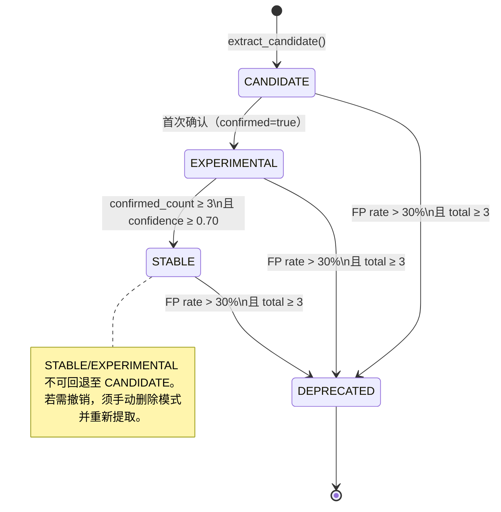
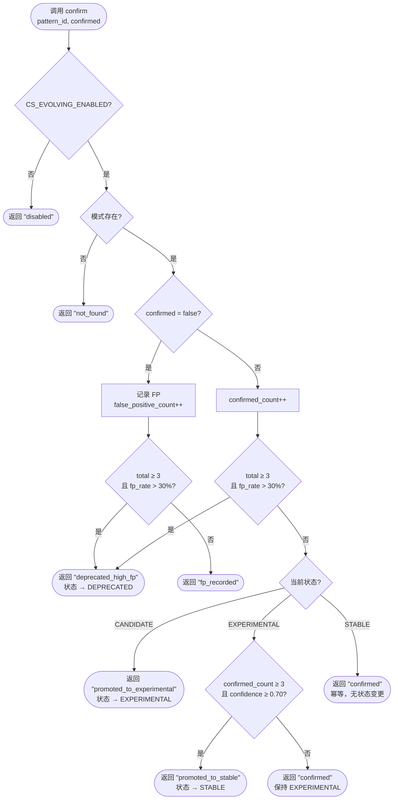

<div class="cs-doc-hero" markdown>
<div class="cs-eyebrow">高级 · 自适应检测</div>

## 自动从生产事件提取并演进攻击模式

自动从高风险生产事件中提取候选攻击模式，并通过算子反馈驱动其经历四阶段生命周期，随时间推移不断扩充检测规则集。

<div class="cs-pill-row" markdown>
<span class="cs-pill">实验性功能</span>
<span class="cs-pill">默认关闭</span>
<span class="cs-pill">环境变量开关</span>
<span class="cs-pill">四阶段生命周期</span>
</div>
</div>

## 概述 {#overview}

当 L1 或 L2 将某事件分类为高风险时，`PatternEvolutionManager.extract_candidate()` 会将触发命令清洗为可复用的正则表达式，并以 `CANDIDATE` 状态存储。算子通过 REST API 确认或拒绝候选模式，系统则根据反馈计数和五因子置信度分数自动晋升或废弃模式。

!!! info "默认关闭"
    模式演进由 `CS_EVOLVING_ENABLED`（默认 `false`）控制。在设置该标志前，不会发生任何候选提取或存储写入。若未配置 `CS_EVOLVED_PATTERNS_PATH`，启用该标志将在启动时抛出 `ValueError`。

---

## `EvolvedPattern` 结构 {#schema}

`EvolvedPattern` 是 `AttackPattern` 的子类，继承其所有触发/检测/FP 过滤字段。附加的生命周期字段如下：

| 字段 | 类型 | 默认值 | 说明 |
|---|---|---|---|
| `status` | `PatternStatus` | `CANDIDATE` | 生命周期阶段（见下文） |
| `confidence` | `float` | `0.0` | 计算所得 0.0–1.0 分值；晋升 STABLE 需达到 ≥ 0.70 |
| `source_framework` | `str` | `""` | 触发事件所属框架（如 `a3s-code`、`openclaw`） |
| `confirmed_count` | `int` | `0` | 算子确认次数 |
| `false_positive_count` | `int` | `0` | 算子误报拒绝次数 |
| `created_at` | `str` | UTC ISO-8601 | 提取时设置的时间戳 |
| `last_triggered_at` | `str \| None` | `None` | 最近一次触发的 ISO-8601 时间戳；用于时效性评分 |

`is_active` 属性仅在 `status` 为 `EXPERIMENTAL` 或 `STABLE` 时返回 `True`。`PatternMatcher` 将此作为将演进模式纳入实时检测的唯一判断条件。

---

## 模式生命周期 {#lifecycle}



### 状态值

| 状态 | 值 | 参与检测 | 含义 |
|---|---|:---:|---|
| `CANDIDATE` | `"candidate"` | 否 | 刚提取；等待算子首次审核 |
| `EXPERIMENTAL` | `"experimental"` | **是** | 至少一次确认；在 L2 匹配中激活 |
| `STABLE` | `"stable"` | **是** | ≥ 3 次确认且置信度 ≥ 0.70；视为可靠 |
| `DEPRECATED` | `"deprecated"` | 否 | 误报率超出阈值或模式被丢弃 |

### 转换规则（`promote_pattern()` 按优先级顺序评估）

所有转换均由对 `PatternEvolutionManager.confirm()` 的调用触发。



**规则 1 — FP 废弃（最高优先级）：**

适用于任意状态。若 `total = confirmed_count + false_positive_count ≥ 3` 且 `false_positive_count / total > 0.30`，则模式立即设为 `DEPRECATED`，忽略其他条件。返回 `"deprecated_high_fp"`。

**规则 2 — CANDIDATE → EXPERIMENTAL：**

由对 `CANDIDATE` 模式的任意 confirmed=`True` 调用触发（FP 检查通过后）。返回 `"promoted_to_experimental"`。

**规则 3 — EXPERIMENTAL → STABLE：**

由对 `EXPERIMENTAL` 模式的 confirmed=`True` 调用触发，且同时满足以下两个条件：

- `confirmed_count ≥ 3`
- `compute_confidence(...) ≥ 0.70`

返回 `"promoted_to_stable"`。若计数满足但置信度不足，模式保持 `EXPERIMENTAL` 状态并返回 `"confirmed"`。

**STABLE → STABLE：** 进一步确认返回 `"confirmed"`，不改变状态。

### `confirm()` 的返回值

| 返回值 | 触发条件 |
|---|---|
| `"disabled"` | `CS_EVOLVING_ENABLED` 为 false |
| `"not_found"` | `pattern_id` 不存在于存储中 |
| `"deprecated_high_fp"` | FP 率超出阈值 |
| `"promoted_to_experimental"` | CANDIDATE 的首次确认 |
| `"promoted_to_stable"` | EXPERIMENTAL 满足计数 + 置信度阈值 |
| `"confirmed"` | 已确认但未晋升（计数/置信度尚未满足，或已为 STABLE） |
| `"fp_recorded"` | FP 已记录；total < 3 或 fp_rate ≤ 30%——不废弃 |

---

## 置信度评分 {#confidence}

`compute_confidence()` 返回 0.0–1.0 分值，用作 STABLE 晋升的阈值判断。计算公式：

```
confidence = 0.30 × R_confirm + 0.20 × R_frequency + 0.20 × R_cross_fw + 0.20 × R_accuracy + 0.10 × R_recency
```

| 因子 | 权重 | 变量 | 计算方法 |
|---|:---:|---|---|
| 确认比率 | 30% | `R_confirm` | `confirmed_count / max(total, 1)` |
| 触发频率 | 20% | `R_frequency` | `min(trigger_count / 10.0, 1.0)` — 10 次触发后饱和 |
| 跨框架加成 | 20% | `R_cross_fw` | `min((framework_count - 1) / 2.0, 1.0)` — 1 个来源为 0.0，2 个为 0.5，3+ 个为 1.0 |
| 准确率 | 20% | `R_accuracy` | `1.0 - fp_rate` |
| 时效性 | 10% | `R_recency` | 见下表 |

基于 `days_since_last_trigger` 的时效衰减：

| 距上次触发天数 | `R_recency` |
|:---:|:---:|
| ≤ 7 | 1.0 |
| ≤ 30 | 0.5 |
| > 30 | 0.2 |

!!! note "`promote_pattern()` 如何调用 `compute_confidence()`"
    在评估 EXPERIMENTAL → STABLE 时，`promote_pattern()` 传入 `framework_count=1` 和 `days_since_last=0`（假设为最近触发）。因此内部晋升检查不使用跨框架评分；该因子仅用于外部报告或自定义晋升逻辑。

---

## 候选模式提取 {#extraction}

当演进功能启用时，`PatternEvolutionManager.extract_candidate()` 由 Gateway 在每次高风险事件时自动调用。

### 去重

工具名和命令以 `"{tool_name}:{command}"` 格式组合，经 SHA-256 哈希后取前 16 个十六进制字符作为去重键。相同命令始终映射到相同的模式 ID——`EV-{前 8 个十六进制字符，大写}`。重复调用返回已有 ID，不创建新模式。

### 类别推断（`_infer_category()`）

类别按优先级顺序解析：

1. **ASI 原因代码**（最高优先级）：

    | `reasons` 中的代码 | 类别 |
    |---|---|
    | `ASI01` | `goal_hijack` |
    | `ASI02` | `data_exfiltration` |
    | `ASI03` | `privilege_abuse` |
    | `ASI04` | `supply_chain` |
    | `ASI05` | `code_execution` |

2. **命令关键字兜底**：

    | 关键字 | 类别 |
    |---|---|
    | `curl`, `wget`, `nc `, `ncat` | `data_exfiltration` |
    | `sudo`, `chmod`, `chown` | `privilege_abuse` |
    | `eval`, `exec`, `python -c`, `bash -c` | `code_execution` |

3. 无匹配时返回 `"unknown"`。

### 正则清洗（`_sanitize_for_regex()`）

命令中的具体值被替换为通用占位符，生成可复用的检测正则：

| 原始 token 类型 | 替换内容 |
|---|---|
| HTTP/HTTPS URL | `https?://\S+` |
| IPv4 地址 | `\d{1,3}\.\d{1,3}\.\d{1,3}\.\d{1,3}` |
| 文件路径（`/…`） | `[\w./-]+` |

其余 shell 元字符均经 `re.escape()` 转义。清洗后的模式以权重 `6` 存储于 `detection.regex_patterns` 字段。

---

## 与基础模式的集成 {#integration}

`pattern_matcher.py` 中的 `load_patterns()` 是核心模式与演进模式的合并点：

- **核心模式** 始终从内置的 `attack_patterns.yaml`（≥ 25 条模式）加载。
- **演进模式** 在提供 `evolved_path` 时追加，需通过两项过滤：
    - `is_active` 必须为 `True`（状态为 EXPERIMENTAL 或 STABLE）。
    - 模式 ID 不得与核心模式 ID 冲突。冲突将记录警告并跳过。

`PatternMatcher.reload()` 在不重启进程的情况下重新从磁盘读取两个文件，使演进决策立即生效。

!!! warning "ID 命名空间"
    演进模式使用 `EV-` 前缀以避免与内置 `ASI*` ID 冲突。请勿在核心 YAML 中手动创建带有 `EV-` 前缀的模式。

---

## 存储持久化 {#persistence}

`EvolvedPatternStore` 使用原子性的 `tempfile + os.replace` 序列将模式写入 YAML 文件，防止失败时数据损坏。文件格式：

```yaml
version: "1.0"
evolved: true
patterns:
  - id: EV-A3F8B2C1
    status: experimental
    confidence: 0.72
    confirmed_count: 2
    false_positive_count: 0
    ...
```

### 达到 `max_patterns` 上限时的驱逐策略

当存储达到上限（`max_patterns`，默认 500）时，在添加新模式前会驱逐一条旧模式：

1. 驱逐最旧的 `DEPRECATED` 模式（按 `created_at` 升序）。
2. 若无，则驱逐最旧的 `CANDIDATE` 模式。
3. 若所有模式均为 `EXPERIMENTAL` 或 `STABLE`，`add()` 返回 `False`，候选模式被丢弃。

!!! warning "EXPERIMENTAL 和 STABLE 模式永不被驱逐"
    只有 DEPRECATED 和 CANDIDATE 模式可被驱逐。模式一旦达到 EXPERIMENTAL 或 STABLE，无论存储压力多大都会被保留。

---

## 配置 {#config}

| 环境变量 | 类型 | 默认值 | 说明 |
|---|---|:---:|---|
| `CS_EVOLVING_ENABLED` | bool | `false` | 设为 `1`、`true` 或 `yes`（大小写不敏感）以激活提取和 API 写入 |
| `CS_EVOLVED_PATTERNS_PATH` | string | — | 演进 YAML 文件的绝对路径；`CS_EVOLVING_ENABLED=true` 时必填 |

`PatternEvolutionManager` 构造函数参数：

| 参数 | 类型 | 默认值 | 说明 |
|---|---|:---:|---|
| `store_path` | `str` | — | 对应 `CS_EVOLVED_PATTERNS_PATH` |
| `enabled` | `bool` | `False` | 对应 `CS_EVOLVING_ENABLED` |
| `max_patterns` | `int` | `500` | 存储模式数量的硬上限 |

!!! danger "空 `store_path` 在启动时报错"
    传入 `enabled=True` 且 `store_path` 为空或仅含空白字符时，立即抛出 `ValueError`。启用前请验证 `CS_EVOLVED_PATTERNS_PATH` 已正确设置。

---

## REST API {#api}

所有端点均需 Bearer token（`CS_AUTH_TOKEN`）。

### `GET /ahp/patterns`

返回存储中的所有演进模式（所有状态）。`CS_EVOLVING_ENABLED` 为 false 时返回空 `patterns` 列表。

**响应字段：** `enabled`、`store_path`、`count`、`active_count`、`candidate_count`、`patterns`（模式对象数组，含 `id`、`category`、`description`、`risk_level`、`status`、`confidence`、`source_framework`、`confirmed_count`、`false_positive_count`、`created_at`）。

### `POST /ahp/patterns/confirm`

通过算子反馈驱动状态转换。每次调用后自动持久化到磁盘。

**请求体：**

```json
{ "pattern_id": "EV-A3F8B2C1", "confirmed": true }
```

| 字段 | 类型 | 必填 | 说明 |
|---|---|:---:|---|
| `pattern_id` | `string` | 是 | `EV-XXXXXXXX` 格式的模式 ID |
| `confirmed` | `boolean` | 是 | `true` = 真实攻击；`false` = 误报。必须为 JSON 布尔值——字符串 `"true"` 返回 HTTP 400 |

**HTTP 状态码：**

| 代码 | 条件 |
|:---:|---|
| 200 | 成功；响应体包含 `{"result": "…", "pattern_id": "…"}` |
| 400 | 请求字段缺失或无效 |
| 403 | 演进功能已禁用 |
| 404 | `pattern_id` 不存在于存储中 |

**`result` 值：** `promoted_to_experimental`、`promoted_to_stable`、`confirmed`、`fp_recorded`、`deprecated_high_fp`。

---

## 快速入门 {#quickstart}

=== "环境变量"

    ```bash
    export CS_EVOLVING_ENABLED=true
    export CS_EVOLVED_PATTERNS_PATH=/var/lib/clawsentry/evolved_patterns.yaml
    clawsentry-gateway
    ```

=== ".env 文件"

    ```env
    CS_EVOLVING_ENABLED=true
    CS_EVOLVED_PATTERNS_PATH=/var/lib/clawsentry/evolved_patterns.yaml
    ```

Gateway 处理一定流量后，查询候选模式：

```bash
curl http://localhost:8080/ahp/patterns \
  -H "Authorization: Bearer $CS_AUTH_TOKEN" | jq '.patterns[] | select(.status=="candidate")'
```

将候选模式确认为真实攻击：

```bash
curl -s -X POST http://localhost:8080/ahp/patterns/confirm \
  -H "Authorization: Bearer $CS_AUTH_TOKEN" \
  -H "Content-Type: application/json" \
  -d '{"pattern_id": "EV-A3F8B2C1", "confirmed": true}'
```

---

## 代码位置 {#code-locations}

| 模块 | 路径 | 职责 |
|---|---|---|
| 演进核心 | `src/clawsentry/gateway/pattern_evolution.py` | `EvolvedPattern`、`EvolvedPatternStore`、`compute_confidence()`、`promote_pattern()`、`PatternEvolutionManager` |
| 模式加载/匹配 | `src/clawsentry/gateway/pattern_matcher.py` | `load_patterns()` 双源合并、`is_active` 过滤、`PatternMatcher.reload()` |
| 内置规则集 | `src/clawsentry/gateway/attack_patterns.yaml` | 核心模式（≥ 25 条）；不由演进功能管理 |
| 配置集成 | `src/clawsentry/gateway/detection_config.py` | `evolving_enabled` + `evolved_patterns_path` 字段 |
| REST API | `src/clawsentry/gateway/server.py` | `GET /ahp/patterns`、`POST /ahp/patterns/confirm` |

---

## 相关页面

- [攻击模式](attack-patterns.md) — 演进模式所扩展的核心 YAML 规则集
- [自定义分析器](custom-analyzer.md) — 集成了 `PatternMatcher` 的 L2 `RuleBasedAnalyzer`
- [配置概览](../configuration/configuration-overview.md) — 包含 `CS_EVOLVING_ENABLED` 在内的所有环境变量
- [API 概览](../api/overview.md) — REST 端点的认证与错误处理
