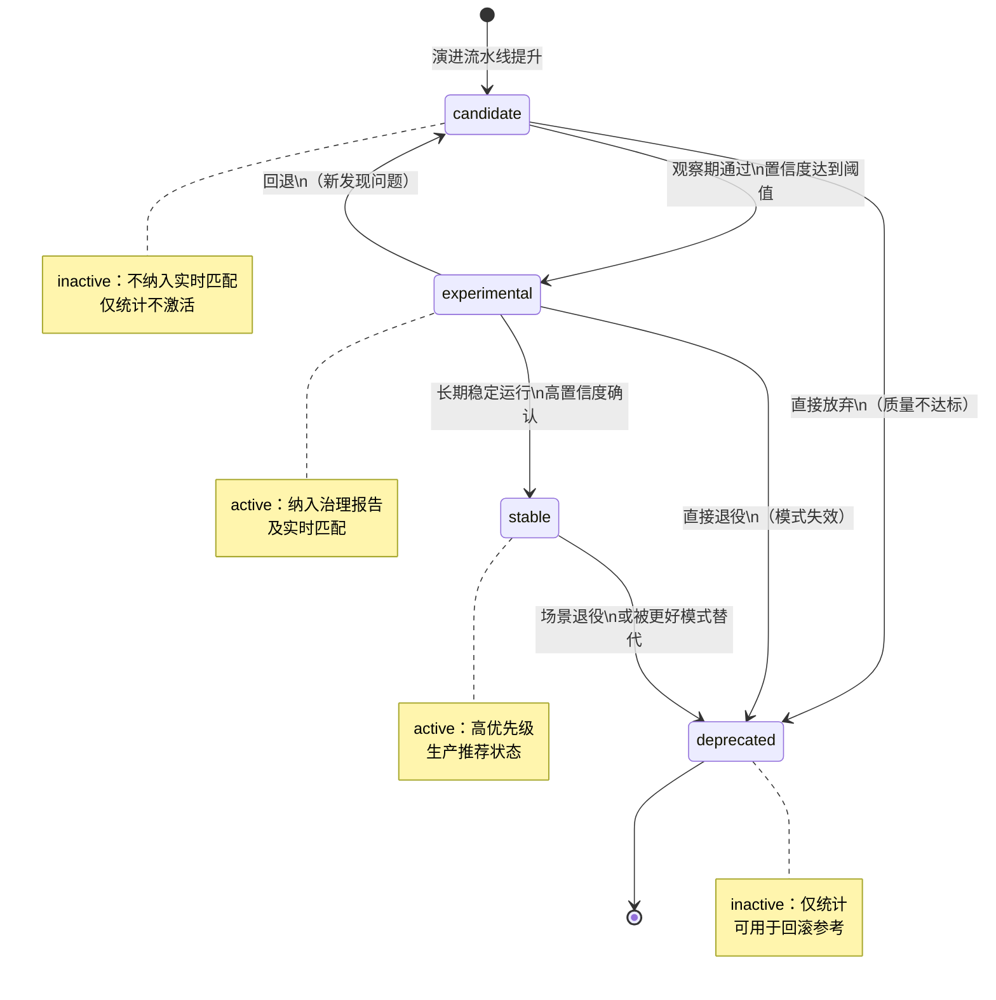
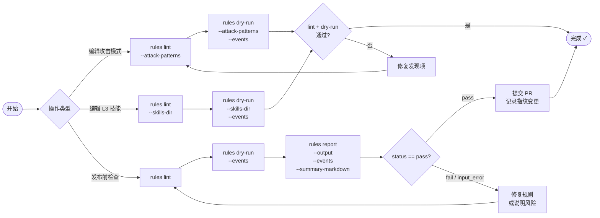

<div class="cs-doc-hero" markdown>
<div class="cs-eyebrow">高级 · 策略治理</div>

## 规则上线前的验证与演练

在规则上线前，对攻击模式和 L3 审查技能进行验证与演练。检查规则是否可以正常加载、检测冲突、预览哪些模式会匹配示例事件，并生成可供发布签收的确定性指纹。

<div class="cs-pill-row" markdown>
<span class="cs-pill">rules lint</span>
<span class="cs-pill">rules dry-run</span>
<span class="cs-pill">rules report</span>
<span class="cs-pill">CI artifact</span>
</div>
</div>

!!! abstract "快速导航"
    [操作边界](#scope) · [规则面](#rule-surfaces) · [`rules lint`](#rules-lint) · [`rules dry-run`](#rules-dry-run) · [`rules report`](#rules-report) · [技能选择逻辑](#skill-selection) · [发现项参考](#findings) · [输出字段](#outputs) · [典型工作流](#workflow)

## 操作边界 {#scope}

> 规则治理是规则面的**作者时自检与演练层**，而非运行时策略解释器。

其管理范围：

- L2 攻击模式 YAML
- 演进模式 YAML（可选）
- L3 审查技能 YAML（内置与自定义）

其**不**涵盖的内容：

| 范围之外 | 原因 |
|---|---|
| 引入新的运行时调度器 | 治理仅在作者时运行 |
| 替换 `PatternMatcher`、`SkillRegistry` 或 `L3TriggerPolicy` | 这些组件负责处理实时流量 |
| 定义全局 L1/L2/L3 控制流 DSL | 不向请求路径添加任何新抽象 |

## 规则面 {#rule-surfaces}

| 规则面 | 位置 | 作用 |
|---|---|---|
| 核心攻击模式 | `src/clawsentry/gateway/attack_patterns.yaml` | 主 L2 模式库 |
| 演进模式 | 来自 `--evolved-patterns` 标志的路径 | 经过演进流水线提升的模式；只有 `experimental` 和 `stable` 状态为活跃 |
| 内置审查技能 | `src/clawsentry/gateway/skills/*.yaml` | 随产品附带的 L3 审查技能 |
| 自定义审查技能 | 来自 `--skills-dir` 标志的目录 | 项目特定的 L3 技能；叠加在内置技能之上，而非替换 |

!!! note "加载行为"
    - 内置审查技能始终加载。
    - `--skills-dir` 追加到内置集合中，不替换内置集合。
    - `--evolved-patterns` 将活跃的演进模式（`experimental` 或 `stable` 状态）添加到治理报告；`candidate` 和 `deprecated` 模式会被统计但不纳入。

## 演进模式生命周期 {#evolved-lifecycle}

演进模式携带 `status` 字段，控制其是否处于活跃状态：

| 状态 | 在治理中活跃 | 说明 |
|---|---|---|
| `candidate` | 否 | 新晋升的模式；处于观察期 |
| `experimental` | 是 | 已有足够置信度，可纳入实时匹配 |
| `stable` | 是 | 已确认的高置信度模式 |
| `deprecated` | 否 | 已从活跃使用中退役 |

### 规则生命周期状态图



## `clawsentry rules lint` {#rules-lint}

在不接触任何运行时状态的情况下，验证当前规则面。若无发现项则返回退出码 `0`，若存在发现项则返回 `1`。

```
clawsentry rules lint
  [--attack-patterns PATH]
  [--evolved-patterns PATH]
  [--skills-dir DIR]
  [--json]
```

**检查内容：**

| 检查项 | 发现项类型 |
|---|---|
| 源文件存在且可解析为有效 YAML | `missing_*_source`、`invalid_*_yaml`、`invalid_*_shape` |
| 每个攻击模式通过条目级 schema 验证 | `invalid_attack_pattern_schema` |
| 核心/演进源内部及跨源无重复模式 ID | `duplicate_attack_pattern_id` |
| 无重复审查技能名称 | `duplicate_review_skill_name` |
| 无两个审查技能共享相同触发器签名 | `review_skill_signature_conflict` |

**示例：**

```bash
# 仅对内置规则面执行 lint
clawsentry rules lint --json

# 使用自定义路径执行 lint
clawsentry rules lint \
  --attack-patterns /opt/clawsentry/patterns.yaml \
  --evolved-patterns /var/lib/clawsentry/evolved_patterns.yaml \
  --skills-dir /etc/clawsentry/skills \
  --json
```

## `clawsentry rules dry-run` {#rules-dry-run}

在不修改任何运行时状态的情况下，将示例规范事件输入当前规则面运行。对于每个事件，报告哪些攻击模式匹配以及将选择哪个审查技能。

```
clawsentry rules dry-run
  --events FILE
  [--attack-patterns PATH]
  [--evolved-patterns PATH]
  [--skills-dir DIR]
  [--json]
```

**接受的事件输入格式：**

| 格式 | 描述 |
|---|---|
| JSON 对象 | 单个规范事件 |
| JSON 数组 | 一个文件中的多个事件 |
| JSONL | 每行一个事件 |

!!! note "无副作用"
    `dry-run` 不写入轨迹存储、不触发任何 L3 工作器、不产生审计日志条目。它仅读取规则面并评估所提供的事件。

**示例：**

```bash
clawsentry rules dry-run --events examples/sample-events.jsonl --json
```

输出中的每个事件包含：

| 字段 | 描述 |
|---|---|
| `event_id` | 来自输入事件的标识符 |
| `matched_pattern_ids` | 匹配的模式 ID 排序列表 |
| `selected_skill` | 将处理此事件的审查技能名称 |

## `clawsentry rules report` {#rules-report}

将 `lint` 和可选的 `dry-run` 合并为单个 JSON 制品，供 CI 流水线和发布检查清单使用。

```
clawsentry rules report
  --output FILE
  [--events FILE]
  [--summary-markdown FILE]
  [--attack-patterns PATH]
  [--evolved-patterns PATH]
  [--skills-dir DIR]
  [--json]
```

**退出码：**

| 退出码 | 含义 |
|---|---|
| `0` | lint 或 dry-run 中无发现项 |
| `1` | lint 或 dry-run 中存在一个或多个发现项 |
| `2` | 输入错误（事件文件不可读或结构无效） |

**JSON 制品内容：**

| 字段 | 描述 |
|---|---|
| `report_schema_version` | `cs-01.rule-governance.ci-report.v1` |
| `status` | `pass`、`fail` 或 `input_error` |
| `exit_code` | 数字退出码（0、1 或 2） |
| `fingerprint` | 完整规则集的确定性 SHA-256 摘要 |
| `checks.lint` | lint 阶段的状态和发现项数量 |
| `checks.dry_run` | dry-run 阶段的状态、事件数量、发现项数量及任何输入错误 |
| `lint` | 完整 lint 有效载荷（源摘要、发现项、模式/技能列表） |
| `dry_run` | 完整 dry-run 有效载荷（含匹配结果的事件），若省略则为 `null` |

传入 `--summary-markdown` 还可同时写出人类可读的 Markdown 仪表板，适合 PR 审查或发布说明使用。

**示例：**

```bash
clawsentry rules report \
  --output artifacts/rules-report.json \
  --events examples/sample-events.jsonl \
  --summary-markdown artifacts/rules-dashboard.md
```

### 内置示例事件覆盖 {#sample-events}

随产品附带的 `examples/sample-events.jsonl` 文件涵盖三个最小代表性场景：

| 示例类型 | 用途 |
|---|---|
| 安全读取 | 验证良性读取操作不会被标记为高风险 |
| 凭据上传 | 验证凭据外泄事件与预期模式匹配 |
| 下载并执行 | 验证供应链风险事件进入 dry-run 证据 |

将这些作为基线，并为您的部署添加自定义的良性事件、预期匹配事件和近似误报事件。

## 技能选择逻辑 {#skill-selection}

治理 dry-run 使用与实时 L3 路径相同的技能选择算法：

1. 对每个已启用的非 `general-review` 技能按事件评分。
2. 各匹配类型的评分权重：

| 匹配类型 | 分值 |
|---|---|
| 每个 `risk_hints` 交集 | +10 |
| `tool_name` 匹配 | +5 |
| 每个 `payload_patterns` 子串匹配 | +1 |

3. 得分最高的技能胜出；同分时以 `priority` 字段打破（值越高越优先）。
4. 若没有技能得分高于零，事件路由至 `general-review`。

## 发现项参考 {#findings}

发现项在 lint 和 dry-run 报告的 `findings` 数组中返回，按 `(kind, item_id, message)` 排序。

| `kind` | 严重性 | 触发条件 |
|---|---|---|
| `missing_attack_patterns_source` | error | 攻击模式文件未找到 |
| `missing_evolved_patterns_source` | error | 演进模式文件未找到 |
| `missing_review_skills_source` | error | 技能目录未找到 |
| `invalid_attack_patterns_yaml` | error | 攻击模式文件 YAML 解析失败 |
| `invalid_evolved_patterns_yaml` | error | 演进模式文件 YAML 解析失败 |
| `invalid_review_skill_yaml` | error | 技能文件 YAML 解析失败 |
| `invalid_attack_patterns_shape` | error | 顶层文档不是映射 |
| `invalid_evolved_patterns_shape` | error | 顶层文档不是映射 |
| `invalid_review_skill_shape` | error | 技能文档不是映射 |
| `invalid_attack_patterns_shape` | error | `patterns` 键不是列表 |
| `invalid_attack_pattern_schema` | error | 某条模式条目未通过条目级验证 |
| `duplicate_attack_pattern_id` | error | 两个模式共享相同 ID |
| `invalid_review_skill_schema` | error | 技能文件未通过 schema 验证 |
| `duplicate_review_skill_name` | error | 两个技能文件共享相同 `name` |
| `review_skill_signature_conflict` | error | 两个或多个技能共享相同触发器签名 |
| `invalid_dry_run_event` | error | 示例事件无法解析或验证 |

## 输出字段 {#outputs}

### `fingerprint`

整个活跃规则集的 SHA-256 摘要，涵盖核心攻击模式、活跃演进模式和所有已加载的审查技能。用于确认两次治理运行看到了相同的规则面。

### `source_summaries`

规则源条目数组，每个已加载源一条：

| `source_kind` | 出现时机 |
|---|---|
| `attack_patterns` | 始终 |
| `review_skills` | 始终 |
| `evolved_patterns` | 提供 `--evolved-patterns` 时 |
| `custom_review_skills` | `--skills-dir` 与内置路径不同时 |

每条条目包含 `source_name`、`version` 和 `item_count`。

### `version_summary`

| 字段 | 描述 |
|---|---|
| `report_schema_version` | `cs-01.rule-governance.v1` |
| `attack_patterns_version` | 攻击模式 YAML 中的版本字符串 |
| `evolved_patterns_version` | 演进模式 YAML 中的版本字符串，若无则为 `none` |
| `review_skills_version` | 所有已加载技能文档的 SHA-256 派生摘要 |
| `attack_patterns_count` | 活跃模式数量（核心 + 活跃演进） |
| `inactive_evolved_patterns_count` | 因 `candidate` 或 `deprecated` 状态而被跳过的演进模式数量 |
| `review_skills_count` | 已加载的审查技能数量 |

## 典型工作流 {#workflow}

### 规则治理操作流程



### 编辑攻击模式后

```bash
clawsentry rules lint --attack-patterns /opt/clawsentry/patterns.yaml --json
clawsentry rules dry-run \
  --attack-patterns /opt/clawsentry/patterns.yaml \
  --events examples/sample-events.jsonl --json
```

### 编辑自定义 L3 技能后

```bash
clawsentry rules lint --skills-dir /etc/clawsentry/skills --json
clawsentry rules dry-run \
  --skills-dir /etc/clawsentry/skills \
  --events examples/sample-events.jsonl --json
```

### 发布检查清单

在合并或部署任何规则面变更前，运行以下三条命令：

```bash
clawsentry rules lint --json
clawsentry rules dry-run --events examples/sample-events.jsonl --json
clawsentry rules report \
  --output artifacts/rules-report.json \
  --events examples/sample-events.jsonl \
  --summary-markdown artifacts/rules-dashboard.md
```

!!! warning "发布门控"
    若 `status` 不为 `pass`，或仪表板显示无法解释的 `FAIL` 发现项，请在发布前修复规则或记录风险说明。

### Policy-change review checklist / 策略变更审查清单 {#policy-change-review-checklist}

在合并攻击模式、演进模式或审查技能的变更时，在 PR 或变更说明中记录以下内容：

| 事项 | 记录内容 | 证据 |
|---|---|---|
| 变更意图 | 添加、放宽、收紧或移除规则；关联的风险场景 | PR 说明中的一行目标描述 |
| 规则范围 | 受影响的规则面：核心模式、演进模式、内置技能或自定义技能 | `rules lint --json` 输出的 `source_summaries` |
| 指纹变化 | 变更前后的指纹，供审查者确认看到的是相同规则集 | `rules report --output ...` |
| 示例事件覆盖 | 至少一个良性事件、一个预期匹配事件和一个近似误报事件 | `rules dry-run --events ... --json` |
| 冲突检查 | `duplicate_*`、`signature_conflict` 和 schema 发现项为零或已有说明 | `findings` 数组和报告仪表板 |
| 误报风险 | 新规则可能影响哪些正常操作；是否需要更新允许列表或文档 | dry-run 示例和审查者备注 |
| 回滚方案 | 如何回滚：还原文件、将演进模式设为 `deprecated`、移除自定义技能，或回退至最后已知指纹 | 变更说明中的回滚章节 |

## 相关页面

- [CLI 参考](../cli/index.md) — `rules` 命令语法和退出码
- [攻击模式](attack-patterns.md) — 攻击模式 YAML 结构
- [自定义技能](custom-skills.md) — 审查技能 YAML 结构
- [模式演进](pattern-evolution.md) — 演进模式来源与生命周期
