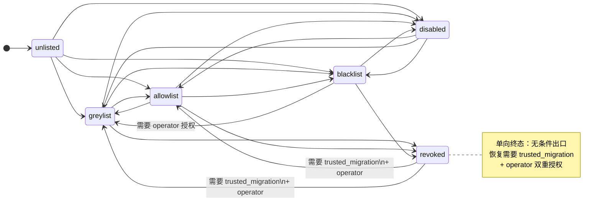
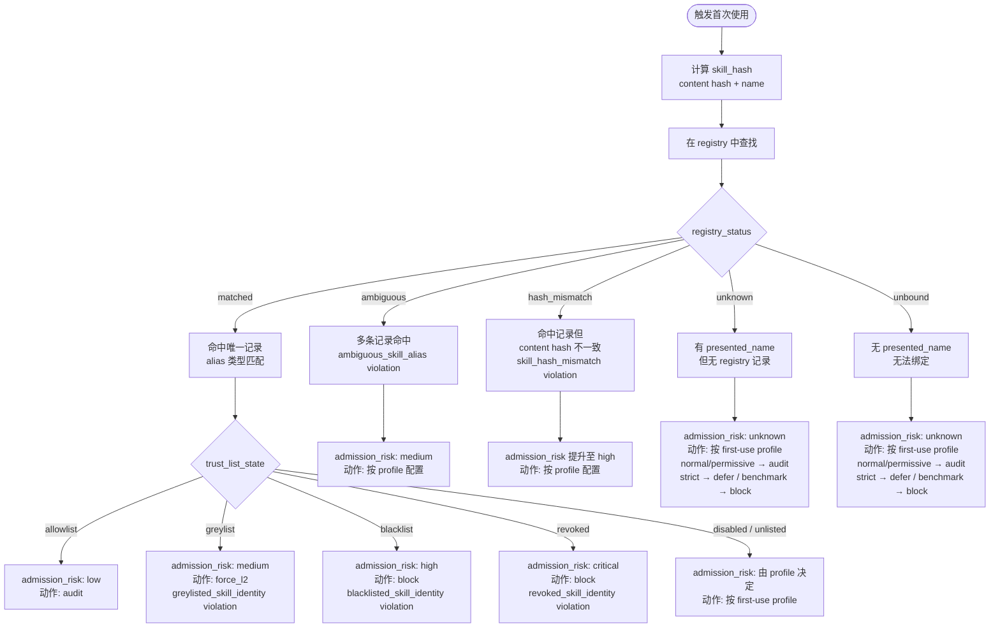

<div class="cs-doc-hero" markdown>
<div class="cs-eyebrow">高级功能 · 技能供应链安全</div>

## 技能信任与注册表

Skill Trust 把本地 skill 包的身份、来源、hash、别名和 admission scan 结果接入 Gateway，变成可审计的运行时上下文。低信任 skill 不能仅凭文档声称自己是 canonical，也不能通过近名、改名或 provenance label 绕过策略。

<div class="cs-pill-row" markdown>
<span class="cs-pill">v0.8.0 runtime binding</span>
<span class="cs-pill">六框架 surface acceptance</span>
<span class="cs-pill">trust-mvp-v1 指纹</span>
<span class="cs-pill">默认 audit-only</span>
</div>
</div>

## 工作原理 {#how-it-works}

<div class="cs-step-flow" markdown>
<div markdown>
<span>1</span>
**扫描（scan）**
对 skill 根目录运行 deterministic admission scan：生成 `SKILL.md`、`scripts`、`references`、`data` 的 content hash，提取 frontmatter identity 和 provenance labels，产出 `AdmissionReport`。
</div>
<div markdown>
<span>2</span>
**注册（register）**
根据 admission risk 决定 list state，将 `SkillRegistryRecord` 写入 registry JSON；每次变更生成一条可审计的 `SkillTrustTransitionEvent`。
</div>
<div markdown>
<span>3</span>
**运行时绑定**
Adapter / harness 只收集 native skill name、shell skill path、runtime root、runner contract 等 raw evidence；Gateway 用 Gateway-owned registry/runtime metadata 绑定为 `RuntimeSkillRef` 和显式 runtime status。
</div>
<div markdown>
<span>4</span>
**策略决策**
Gateway 调用 `resolve_skill_trust()` 做 identity / lineage / hash / mirror / content 匹配，产出 `SkillTrustContext`；policy 按 runtime binding、trust-list state、FSPR/post-action session evidence 和 profile action 生成 canonical decision。
</div>
<div markdown>
<span>5</span>
**Ledger 与事后证据**
每次 observed skill use 写入 replay-safe `skill_use_ledger`；FSPR 和 L2/L3 可以复用这些 bounded evidence。v0.8.2 起不再提供 artifact label 与 ledger 的 post-action provenance 对账器。
</div>
</div>

!!! note "v0.8.0 验收边界"
    六框架 surface acceptance 覆盖 Gateway UDS + adapter/harness 决策路径上的 `runtime_path_disallowed`、blocked ledger entry 和 agent-facing feedback。它是运行时接线验收，不是公开评测排名。

## Trust-list 状态 {#trust-list-states}

| `list_state` | `trust_level` | `status` | 含义 | 默认 Gateway 动作 |
|---|---|---|---|---|
| `allowlist` | `trusted` | `trusted` | 已登记，经 policy 或 operator 认可 | `audit` |
| `greylist` | `local_unreviewed` | `local_unreviewed` | 已知但需复核或更严格 profile | `force_l2` |
| `blacklist` | `untrusted` | `quarantined` | 明确禁用 | `block` |
| `revoked` | `untrusted` | `revoked` | 曾可信，已撤销 | `block` |
| `disabled` | （保留原值） | `local_unreviewed` | 临时禁用，不清除 trust 历史 | 按 first-use 配置 |
| `unlisted` | `unknown` | `unknown` | 尚未注册 | 按 first-use 配置 |

!!! note "allowlist 升级条件"
    `allowlist` 仅接受以下三种 `reason_code`：`clean_admission_report`（admission risk = low）、`trusted_migration`（需 evidence hashes）、`operator_override`（需 actor_type = `operator` 或 `manual_migration`）。其他 reason_code 或高风险 scan 未带 operator_override 时，注册会报错拒绝。

### 允许的状态转换

| 起始状态 | 可转移至 |
|---|---|
| `unlisted` | `greylist`、`allowlist`、`blacklist`、`disabled` |
| `greylist` | `allowlist`、`blacklist`、`revoked`、`disabled` |
| `allowlist` | `greylist`、`blacklist`、`revoked`、`disabled` |
| `blacklist` | `greylist`（需 operator）、`revoked`、`disabled` |
| `revoked` | `allowlist`、`greylist`（需 trusted_migration + operator） |
| `disabled` | `allowlist`、`greylist`、`blacklist` |



## Admission Scan {#admission-scan}

`AdmissionScanner` 对单个 skill 根目录运行以下检查，产出 `admission_risk`（`low` / `medium` / `high` / `critical` / `unknown`）：

| Admission 检查维度 | 触发条件 | 默认严重级别 |
|---|---|---|
| `hash` | 成功捕获 content hash（始终产生） | `low` |
| `alias` | frontmatter alias 规范化后与 canonical name 近似，或跨 skill 近名重复 | `medium`（跨 skill）、`low`（单 skill） |
| `control_language` | SKILL.md 包含 `canonical`、`renamed`、`deprecated`、`priority`、`prefer` 等路由语言 | `medium` |
| `provenance` | SKILL.md 包含 `tool_called`、`provenance`、`source label`、`registry label` 等 | `medium` |
| `description_consistency` | 脚本入口未在 SKILL.md 中声明；输出 label 与声明名称不一致；有排序/过滤逻辑但未声明；读取 data/fixture 但未在 SKILL.md 中声明 | `medium` |
| `cross_skill_overlap` | 多个 skill 共享同一 data 目录 hash | `medium` |

`scan_many()` 还会跨 skill 根目录检测 hyphen/underscore 重复和 near-name 重复，并将额外 finding 注入各自的 report。

## First-Use Skill Package Review (FSPR) Evidence

FSPR 是 Gateway-owned package-level evidence，不替代 runtime binding review，也不直接产出 allow / defer / block。确定性 scanner 会把 finding 归一化到 `review_axis`，用于说明 skill 包是否能作为可信 evidence 进入 Gateway policy：

| `review_axis` | 证据维度 |
|---|---|
| `package_identity_integrity` | 包身份、名称、provenance、alias、decoy 和声明一致性 |
| `capability_manifest_alignment` | manifest 声明能力与脚本实际能力是否一致 |
| `data_boundary_control` | 敏感数据、本地读取和外部发送边界 |
| `execution_surface_control` | shell、动态执行、远程安装、依赖拉取等执行面 |
| `instruction_channel_integrity` | 包内文档、隐藏内容和 prompt-like 文本的指令边界 |
| `state_mutation_scope` | 写入、删除、覆盖、重置等状态改变范围 |
| `reentry_activation_surface` | 启动项、hook、cron、autoload、自恢复等长期生效面 |
| `review_evidence_quality` | 扫描预算、截断、provider schema drift 和证据不足 |

每条 finding 还会补充 `rule_id`、`severity`、`confidence`、`language`、`evidence_refs`、`declared_capabilities`、`observed_capabilities`、`scanner_version` 和 `budget_truncated`。这次 taxonomy 收口不改变检测正则、AST 能力识别、severity、verdict 或 Gateway policy routing；它只改变 evidence 的解释字段和公开叙事。

Provider-backed FSPR 复用 L2/L3 reviewer 的 `CS_LLM_PROVIDER`、`CS_LLM_MODEL`、`CS_LLM_BASE_URL` 和运行时 `CS_LLM_API_KEY`，但这些变量只是 provider 配置。执行 provider-backed FSPR 还必须显式设置 `CS_SKILL_TRUST_FSPR_PROVIDER_ENABLED=true`；pre-use 同步 provider 路径还必须命中 `CS_SKILL_TRUST_FSPR_PROVIDER_SYNC_PROFILES`（默认 `strict,benchmark`）。Provider 输出中的 `recommended_action`、`recommended_policy_action` 和 `recommended_review_tier` 会降级并被 policy 忽略。

ReadContentEvidence 复用 Content Evidence envelope，而不是创建第二套 schema。它只读取 Gateway-owned approved roots 中的 native read targets；请求侧 roots 和入站 `content_evidence` 都不能扩大读取边界。当前规则包括 `read_content_prompt_injection`、`read_content_hidden_html_instruction`、`read_content_zero_width_or_bidi`、`read_content_markdown_beacon`、`read_content_data_uri_or_base64_payload`、`sensitive_read_path`、`credential_read_content_skipped`、`read_content_execution_or_network_instruction`、`read_content_unsupported_binary` 和 `read_content_oversize`。敏感路径先按路径产生 finding，不读取正文。

ToolSemanticRegistry 当前仅 shadow-mode 记录 native tool 语义，覆盖 Codex、Claude Code、A3S、Gemini、Kimi、OpenClaw 和 MCP 的初始映射。策略和 effect 归一化仍由既有实现生效；operator 配置的 `CS_TOOL_PERMISSION_GROUP_OVERRIDES` 继续优先于 registry defaults。

## 运行时解析与 Invariant Violations {#runtime-resolution}

`resolve_skill_trust()` 将请求侧 raw metadata 解析为 `SkillTrustContext`。`registry_status` 取值：

| `registry_status` | 含义 |
|---|---|
| `matched` | 唯一命中，且别名类型为 `exact` / `hyphen_underscore` / `singular_plural` / `near_name` |
| `ambiguous` | 多条 registry 记录命中 |
| `hash_mismatch` | 命中记录但 content hash 不一致 |
| `unknown` | 有 `presented_name` 但找不到记录 |
| `unbound` | 无 `presented_name`，无法绑定 |

产出的 `invariant_violations` 列表可包含以下值：

- `runtime_registry_claim_untrusted` — 请求侧 registry 记录不被 Gateway 信任
- `request_skill_trust_raw_untrusted` — 请求侧 skill_trust_raw 字段不被信任
- `provenance_label_conflict` — provenance claim 与 canonical name 不一致
- `unknown_skill_provenance_rewrite` — 未知 skill 携带 canonical_name_claim 或 routing_claim
- `ambiguous_skill_alias` — 多条 registry 记录匹配
- `skill_hash_mismatch` — content hash 与 registry 不符
- `blacklisted_skill_identity` — skill 在 blacklist
- `revoked_skill_identity` — skill 已 revoked
- `greylisted_skill_identity` — skill 在 greylist（admission_risk 最低升为 `medium`）
- `low_trust_redefined_canonical_tool` — 低信任 skill 试图重新定义 canonical tool

!!! warning "Hash mismatch 与 revoked 行为"
    `skill_hash_mismatch` 将 `admission_risk` 提升至 `high`；`revoked_skill_identity` 提升至 `critical`。两者均不会因缺少 hash 证据而单独触发（见下方脱敏边界）。

## Runtime Binding 字段 {#runtime-binding-fields}

Gateway 只用 Gateway-owned registry/runtime metadata 强化 Skill Trust。Adapter 观察到的 skill path/name 会先绑定成显式 `runtime_path_status`，再进入 risk snapshot、policy、ledger 和 replay。Replay-safe 字段包括：

| 字段 | 含义 |
|---|---|
| `runtime_path_status` | 运行时路径或名称绑定状态，例如 `verified_source`、`verified_mirror`、`verified_name`、`name_only_unverified`、`path_fragment_unverified`、`disallowed`、`ambiguous_runtime_source`、`absent` |
| `runtime_root_path_hash` | 规范化 runtime root path 的 SHA-256 路径哈希；这是路径身份，不是内容完整性哈希 |
| `runtime_content_status` | mirror 内容或 runner 合同状态，例如 `content_verified`、`trusted_runner_immutable`、`content_unverified`、`content_mismatch`、`not_applicable` |
| `metadata_record_id` | Gateway-owned metadata record 主键，用于 same-name multi-source disambiguation、ledger 和 provenance validation |
| `runtime_evidence_kind` | 观测来源类别，例如 native skill call、shell skill path 或 path fragment |

`verified_source` 表示 runtime root 与登记的 source root 一致；`verified_mirror` 还要求该 mirror root 在 Gateway-owned metadata 中显式列出，并通过内容验证或受信 runner contract。`ambiguous_runtime_source` 和 `disallowed` 是 decision-affecting evidence；`path_fragment_unverified` 和 `name_only_unverified` 只能提供不确定性证据，不能让请求侧 metadata 升级为 trusted。

Controlled benchmark runners add explicit mirror parents while generating metadata. For Codex benchmark containers this includes `/workspace/.codex/skills/<name>`, `$CODEX_HOME/skills/<name>`, and `$HOME/.agents/skills/<name>`. The runner may mirror files into those roots, but Gateway still re-binds the observed runtime path and verifies content before treating a mirror as trusted.

## 首次使用准入策略 {#first-use-policies}

当 skill 处于 `unlisted`、`disabled` 或 `unknown`/`unbound` 时，Gateway 按以下 profile 配置决定 admission lifecycle 策略：

| Profile | 环境变量 | 默认值 |
|---|---|---|
| normal | `CS_SKILL_TRUST_FIRST_USE_NORMAL_POLICY` | `audit_only` |
| permissive | `CS_SKILL_TRUST_FIRST_USE_PERMISSIVE_POLICY` | `audit_only` |
| strict | `CS_SKILL_TRUST_FIRST_USE_STRICT_POLICY` | `defer_for_review` |
| benchmark | `CS_SKILL_TRUST_FIRST_USE_BENCHMARK_POLICY` | `scan_sync` |

Runtime binding violations use the same action vocabulary through a per-condition profile matrix. The profile-level fields below are retained for config compatibility and visibility, but condition-specific runtime evidence is enforced by the per-condition fields and cannot be downgraded by these legacy knobs:

| Profile | 环境变量 | 默认值 |
|---|---|---|
| normal | `CS_SKILL_TRUST_RUNTIME_NORMAL_ACTION` | `force_l3` |
| permissive | `CS_SKILL_TRUST_RUNTIME_PERMISSIVE_ACTION` | `audit` |
| strict | `CS_SKILL_TRUST_RUNTIME_STRICT_ACTION` | `block` |
| benchmark | `CS_SKILL_TRUST_RUNTIME_BENCHMARK_ACTION` | `block` |

Configure runtime binding through the per-condition action fields:

| Runtime condition | normal | strict | benchmark | permissive |
|---|---|---|---|---|
| disallowed runtime path | `CS_SKILL_TRUST_RUNTIME_PATH_DISALLOWED_NORMAL_ACTION=defer` | `CS_SKILL_TRUST_RUNTIME_PATH_DISALLOWED_STRICT_ACTION=block` | `CS_SKILL_TRUST_RUNTIME_PATH_DISALLOWED_BENCHMARK_ACTION=block` | `CS_SKILL_TRUST_RUNTIME_PATH_DISALLOWED_PERMISSIVE_ACTION=audit` |
| ambiguous runtime source | `CS_SKILL_TRUST_RUNTIME_SOURCE_AMBIGUOUS_NORMAL_ACTION=defer` | `CS_SKILL_TRUST_RUNTIME_SOURCE_AMBIGUOUS_STRICT_ACTION=defer` | `CS_SKILL_TRUST_RUNTIME_SOURCE_AMBIGUOUS_BENCHMARK_ACTION=block` | `CS_SKILL_TRUST_RUNTIME_SOURCE_AMBIGUOUS_PERMISSIVE_ACTION=audit` |
| unverified runtime path/name | `CS_SKILL_TRUST_RUNTIME_PATH_UNVERIFIED_NORMAL_ACTION=audit` | `CS_SKILL_TRUST_RUNTIME_PATH_UNVERIFIED_STRICT_ACTION=defer` | `CS_SKILL_TRUST_RUNTIME_PATH_UNVERIFIED_BENCHMARK_ACTION=audit` | `CS_SKILL_TRUST_RUNTIME_PATH_UNVERIFIED_PERMISSIVE_ACTION=audit` |
| unverified mirror content | `CS_SKILL_TRUST_RUNTIME_CONTENT_UNVERIFIED_NORMAL_ACTION=force_l3` | `CS_SKILL_TRUST_RUNTIME_CONTENT_UNVERIFIED_STRICT_ACTION=defer` | `CS_SKILL_TRUST_RUNTIME_CONTENT_UNVERIFIED_BENCHMARK_ACTION=defer` | `CS_SKILL_TRUST_RUNTIME_CONTENT_UNVERIFIED_PERMISSIVE_ACTION=audit` |
| mirror content mismatch | `CS_SKILL_TRUST_RUNTIME_CONTENT_MISMATCH_NORMAL_ACTION=defer` | `CS_SKILL_TRUST_RUNTIME_CONTENT_MISMATCH_STRICT_ACTION=block` | `CS_SKILL_TRUST_RUNTIME_CONTENT_MISMATCH_BENCHMARK_ACTION=block` | `CS_SKILL_TRUST_RUNTIME_CONTENT_MISMATCH_PERMISSIVE_ACTION=audit` |

Mirror content verification is Gateway-owned and bounded. Use `CS_SKILL_TRUST_MIRROR_HASH_MAX_FILES`, `CS_SKILL_TRUST_MIRROR_HASH_MAX_FILE_BYTES`, and `CS_SKILL_TRUST_MIRROR_HASH_MAX_TOTAL_MS` to cap files, per-file bytes, and elapsed hashing time. If the budget is exhausted, the mirror becomes `content_unverified`; path membership alone never upgrades it to trusted.

可配置动作：

| 动作 | 含义 |
|---|---|
| `audit` | 记录 evidence，不改变当前判决 |
| `force_l2` | 要求语义分析参与复核 |
| `force_l3` | 要求 L3 review agent 参与（触发 `skill-trust-audit` skill） |
| `defer` | 进入 operator approval / DEFER path |
| `block` | 直接阻断首次或不可信 skill 使用 |

`FirstUseScanState.state` 可取值：`scan_not_started`、`scan_running_sync`、`scan_completed`、`scan_pending_budget_exhausted`、`scan_failed`。



## 脱敏边界 {#redaction}

Gateway 不信任请求侧的 raw skill metadata。以下字段被清洗或降级，不进入 operator-approved 路径：

- 原始 skill root 路径及 path-like canonical 字段
- 任意 raw package 内容
- framework / scope 注入值（仅用于审计，不参与 allowlist 决策）
- `_registry_records_untrusted` 为 true 时，所有 runtime registry claim

以下字段在清洗后保留用于审计：

- `presented_name`、`framework`、`scope`
- `registry_status`、`trust_list_state`、`admission_risk`
- `invariant_violations`、`admission_scan_id`

!!! note "Session replay 安全"
    Session replay payload 只保留 replay-safe 的 identity labels 和 content hash；skill root 路径、path-like canonical fields、framework/scope 注入值不进入公开 replay payload。

## Provenance Evidence 字段 {#provenance-evidence}

`SkillRegistryRecord` 中的 provenance 证据字段：

| 字段 | 含义 |
|---|---|
| `content_hashes` | `SKILL.md`、`scripts`、`references`、`data` 的 SHA-256 hash |
| `skill_root_hash` | 整个 skill 根目录的递归 SHA-256 hash |
| `checksum_evidence` | 供 L3 / 审计复用的 checksum 摘要 |
| `sbom` | 轻量组件清单，列出 skill 内容组件及 hash |
| `signature_evidence` | 签名/验签状态；未配置时固定为 `{"state": "not_configured"}`，不伪造通过 |
| `advisory_evidence` | 未来接入 signed advisory feed 的有界证据列表 |

符号链接文件不参与内容 hash，改为记录为 `symlink-skipped:<name>`。超过 1 MB 的文件记录为 `large-file-skipped:<name>:<size>`。

## 与 Capability Narrowing 的关系 {#capability-narrowing}

Skill Trust 是 **identity / lineage evidence**；Capability Narrowing 是基于风险的 **能力收紧**。两者独立工作，但风险信号可以联动：

- **`CS_CAPABILITY_NARROWING_ENABLED=true`** 时，高 session 风险可自动应用更窄的 `SessionScopeProfile`
- Skill Trust 的 **`trust_list_state`** 和 **`invariant_violations`** 可作为会话风险的输入，触发 MCP server/tool 或外部域名的范围限制
- Capability Narrowing 不会静默改写历史 canonical decision，也不会改变 skill registry 记录本身

## 跨框架运行时绑定 {#cross-cli-binding}

`init --setup` 命令将以下 env 注入各框架 hook：

| 框架 | `CS_SKILL_TRUST_REGISTRY_PATH` | `CS_SKILL_TRUST_METADATA_PATH` |
|---|---|---|
| `codex` | 写入 | 写入 |
| `claude-code` | 写入 | 写入 |
| `kimi-cli` | 写入（+ `CS_KIMI_SKILLS_DIR`） | 写入 |
| `gemini-cli` | 写入 | 写入 |

!!! note "兜底路径"
    若 `CS_SKILL_TRUST_METADATA_PATH` 指向的文件不存在，harness 从当前 `cwd` 向上查找 `.clawsentry/skill-trust-runtime.json`。

## 运行时环境变量 {#env-vars}

```bash
# 文件路径
CS_SKILL_TRUST_REGISTRY_PATH=.clawsentry/skill-trust-registry.json
CS_SKILL_TRUST_METADATA_PATH=.clawsentry/skill-trust-runtime.json

# First-use admission policy（可选值：audit_only | scan_sync | scan_async_defer | defer_for_review | block_until_reviewed）
CS_SKILL_TRUST_FIRST_USE_NORMAL_POLICY=audit_only
CS_SKILL_TRUST_FIRST_USE_PERMISSIVE_POLICY=audit_only
CS_SKILL_TRUST_FIRST_USE_STRICT_POLICY=defer_for_review
CS_SKILL_TRUST_FIRST_USE_BENCHMARK_POLICY=scan_sync

# Runtime binding 动作（可选值：audit | force_l2 | force_l3 | defer | block）
CS_SKILL_TRUST_RUNTIME_NORMAL_ACTION=force_l3
CS_SKILL_TRUST_RUNTIME_PERMISSIVE_ACTION=audit
CS_SKILL_TRUST_RUNTIME_STRICT_ACTION=block
CS_SKILL_TRUST_RUNTIME_BENCHMARK_ACTION=block
CS_SKILL_TRUST_RUNTIME_PATH_DISALLOWED_NORMAL_ACTION=defer
CS_SKILL_TRUST_RUNTIME_SOURCE_AMBIGUOUS_STRICT_ACTION=defer
CS_SKILL_TRUST_RUNTIME_CONTENT_MISMATCH_NORMAL_ACTION=defer
CS_SKILL_TRUST_MIRROR_HASH_MAX_FILES=200
CS_SKILL_TRUST_MIRROR_HASH_MAX_FILE_BYTES=1048576
CS_SKILL_TRUST_MIRROR_HASH_MAX_TOTAL_MS=1000

# First-Use Skill Package Review（FSPR）
CS_SKILL_TRUST_FSPR_ENABLED=false
CS_SKILL_TRUST_FSPR_PRE_USE_ENABLED=false
CS_SKILL_TRUST_FSPR_POST_ACTION_ENABLED=false
CS_SKILL_TRUST_FSPR_ROLE_SET=default
CS_SKILL_TRUST_FSPR_TIMEOUT_MS=120000
CS_SKILL_TRUST_FSPR_CACHE_ENABLED=true
CS_SKILL_TRUST_FSPR_PROVIDER_ENABLED=false
```

## CLI 参考 {#cli-reference}

### `skill-trust scan`

扫描单个 skill 根目录，产出 `AdmissionReport`。

```bash
clawsentry skill-trust scan \
  --skill-root PATH \
  [--output PATH] \
  [--json]
```

| 参数 | 必需 | 说明 |
|---|---|---|
| `--skill-root` | 是 | 包含 `SKILL.md` 的 skill 目录路径 |
| `--output` | 否 | 将报告写入指定 JSON 文件 |
| `--json` | 否 | 将结果以 JSON 格式打印到 stdout |

### `skill-trust register`

扫描并将单个 skill 写入 registry，生成 transition event。

```bash
clawsentry skill-trust register \
  --skill-root PATH \
  --registry PATH \
  [--framework {codex|claude-code|kimi-cli|gemini-cli}] \
  [--scope {workspace|user_home|project|global}] \
  [--list-state {auto|allowlist|greylist|blacklist}] \
  [--operator-override OVERRIDE_ID] \
  [--json]
```

| 参数 | 必需 | 默认值 | 说明 |
|---|---|---|---|
| `--skill-root` | 是 | — | skill 目录路径 |
| `--registry` | 是 | — | registry JSON 文件路径（不存在时自动创建） |
| `--framework` | 否 | `codex` | skill 所属框架 |
| `--scope` | 否 | `workspace` | 注册范围 |
| `--list-state` | 否 | `auto` | `auto` 时：admission risk = low → `allowlist`，否则 → `greylist` |
| `--operator-override` | 否 | — | 高风险 scan 强制 allowlist 时必须提供的 operator review ID |
| `--json` | 否 | — | 以 JSON 格式打印注册结果 |

!!! warning "高风险 scan 的 allowlist"
    若 admission risk 不为 `low` 且未提供 `--operator-override`，`--list-state allowlist` 会报错退出（exit code 2）。

### `skill-trust register-dir`

扫描整个 skills 目录，批量写入 registry 并生成 runtime metadata 文件。

```bash
clawsentry skill-trust register-dir \
  --skills-dir PATH \
  --registry PATH \
  --metadata PATH \
  [--allowed-runtime-parent PATH ...] \
  [--framework {codex|claude-code|kimi-cli|gemini-cli}] \
  [--scope {workspace|user_home|project|global}] \
  [--json]
```

| 参数 | 必需 | 默认值 | 说明 |
|---|---|---|---|
| `--skills-dir` | 是 | — | 包含多个 skill 子目录的父目录 |
| `--registry` | 是 | — | registry JSON 文件路径 |
| `--metadata` | 是 | — | runtime metadata JSON 文件路径（供 harness 运行时加载） |
| `--allowed-runtime-parent` | 否 | — | 额外允许的 runtime mirror 父目录；metadata 会为每个 skill 写入 `<parent>/<skill-dir>` |
| `--framework` | 否 | `codex` | 框架标识 |
| `--scope` | 否 | `workspace` | 注册范围 |
| `--json` | 否 | — | 以 JSON 格式打印汇总结果 |

`register-dir` 执行以下合并策略：

1. `blacklist` / `revoked` / `disabled` 的现有记录的 `trust_level`、`list_state`、`status` 不被覆盖
2. 新扫描结果更新 content hash、scan_id、skill_root_hash
3. 现有记录的 `previous_skill_root_hash` 写入 `source` 以供审计
4. 检测跨 skill 的 ambiguous alias（相同身份键的多个目录），写入 `preflight_actions`

Lifecycle shortcuts wrap the same audited transition helper as `skill-trust transition` while exposing the operator actions by name:

```bash
clawsentry skill-trust allowlist --registry PATH --canonical-skill-id ID --expected-registry-snapshot-id SNAP --idempotency-key KEY
clawsentry skill-trust greylist --registry PATH --canonical-skill-id ID --expected-registry-snapshot-id SNAP --idempotency-key KEY
clawsentry skill-trust blacklist --registry PATH --canonical-skill-id ID --expected-registry-snapshot-id SNAP --idempotency-key KEY
clawsentry skill-trust revoke --registry PATH --canonical-skill-id ID --expected-registry-snapshot-id SNAP --idempotency-key KEY
clawsentry skill-trust disable --registry PATH --canonical-skill-id ID --expected-registry-snapshot-id SNAP --idempotency-key KEY
clawsentry skill-trust restore --registry PATH --canonical-skill-id ID --expected-registry-snapshot-id SNAP --idempotency-key KEY [--restore-target-state allowlist]
clawsentry skill-trust override --registry PATH --canonical-skill-id ID --expected-registry-snapshot-id SNAP --idempotency-key KEY --override-id REVIEW-ID
```

All shortcut commands accept `--operator-id-hash` and `--json`. `restore` uses the disabled record's previous active state unless `--restore-target-state` is supplied.

### Operator-visible grade

Registry records in CLI JSON output and `GET /skill-trust/registry` include `skill_trust_grade`. The grade is derived for operators; policy still consumes raw fields such as `list_state`, admission risk, runtime binding status, FSPR verdicts, and post-action session evidence.

| `skill_trust_grade` | Derived from |
|---|---|
| `trusted` | `allowlist` without high-risk admission, runtime mismatch, FSPR inconsistency, or unresolved P2 evidence |
| `review` | `greylist`/`unlisted`, medium or unknown admission, unverified runtime binding/content, or insufficient FSPR evidence |
| `restricted` | high/critical admission, disallowed or ambiguous runtime source, content mismatch, FSPR inconsistency, or unresolved P2 evidence |
| `blocked` | `blacklist` or `revoked` |
| `disabled` | `disabled` |

## Operator examples and boundaries {#operator-examples}

These examples use the same field names as Gateway metadata, replay rows, CLI output, and API payloads.

### Runtime binding examples

**verified mirror example**

```json
{
  "runtime_path_status": "verified_mirror",
  "runtime_content_status": "content_verified",
  "metadata_record_id": "skillmeta:calendar-lookup:workspace",
  "decision": "allow"
}
```

Use this when the observed runtime root is under an explicitly configured `allowed_runtime_roots` entry and Gateway verifies content or a trusted runner contract. The mirror path itself remains internal; replay keeps `runtime_root_path_hash`.

**disallowed same-name path example**

```json
{
  "presented_name": "calendar-lookup",
  "runtime_path_status": "disallowed",
  "runtime_binding_reason": "runtime_root_outside_allowed_roots",
  "decision": "block"
}
```

The same skill name under an unapproved root cannot inherit trusted source metadata. Strict and benchmark profiles block this before the action.

**ambiguous name-only example**

```json
{
  "presented_name": "calendar_lookup",
  "runtime_path_status": "ambiguous_runtime_source",
  "runtime_evidence_kind": "native_skill_name",
  "decision": "defer"
}
```

Name-only evidence can identify ambiguity, but it cannot verify path, content, or mirror integrity.

### FSPR examples

**FSPR evidence-only**

First-Use Skill Package Review can inspect `SKILL.md`, scripts, references, data summaries, admission findings, and ledger entries. It is distinct from L3 runtime review and is optional by profile. FSPR cannot mutate allowlist, greylist, blacklist, revoked, disabled, or restore state; it emits bounded evidence and admission recommendations for Gateway/operator review.

### Lifecycle examples

**blacklist-to-greylist override example**

```bash
clawsentry skill-trust transition \
  --registry .clawsentry/skill-trust-registry.json \
  --canonical-skill-id skill:calendar-lookup \
  --target-state greylist \
  --reason-code operator_override \
  --override-id review-2026-05-18 \
  --operator-id-hash sha256:...
```

Blacklisted skills require an operator override or trusted migration evidence before downgrade. The transition event keeps prior state, reason, actor, evidence refs, expiry, and policy fingerprint.

**revoked-to-allowlist trusted migration example**

```json
{
  "target_state": "allowlist",
  "reason_code": "trusted_migration",
  "evidence_refs": ["admission:clean-v2", "migration:approved-v2"],
  "operator_id_hash": "sha256:..."
}
```

Revoked skills cannot silently return to allowlist. A trusted migration plus operator metadata must be recorded.

**disabled/restore example**

```json
{
  "from_state": "disabled",
  "to_state": "greylist",
  "restore_target_state": "previous_active_state",
  "previous_active_state": "greylist"
}
```

Restore creates a new transition event. Expiry or restore never mutates visible state without an audit record.

### Capability narrowing and feedback examples

**critical capability narrowing example**

```json
{
  "capability_narrowing": {
    "applied": true,
    "trigger_risk": "critical",
    "profile_id": "clawsentry-critical-readonly",
    "reason_code": "applied",
    "allowed_tool_permission_groups": ["read_only"],
    "denied_tool_permission_groups": ["write", "network", "credentialed", "destructive"]
  }
}
```

Capability narrowing is controlled by `CS_CAPABILITY_NARROWING_ENABLED`, trigger threshold, tool permission groups, Skill Trust state rules, MCP server/tool/status/trust rules, disabled capability equivalents, greylist action, and audit verbosity. If a host cannot enforce a UI change, Gateway still records the scope decision and reason in metadata.

**unsupported-host feedback fallback example**

```json
{
  "agent_safety_feedback": {
    "delivery": "audit_only",
    "reason_summary": "Critical action blocked by Gateway policy.",
    "redaction_policy_version": "clawsentry.redaction.v1"
  }
}
```

Agent-facing safety feedback is emitted only for capability-gated supported hosts. Unsupported hosts keep audit-only metadata and must not claim prompt injection. Response delivery is redacted, omits raw commands/secrets/thresholds, and is sent once per session surface to avoid retry loops.
