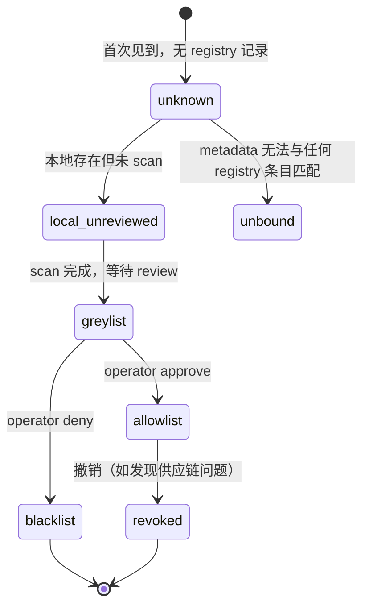

<div class="cs-doc-hero" markdown>
<div class="cs-eyebrow">Advanced · Skill Supply Chain Security</div>

## Skill Trust / Registry

Skill Trust 把本地 skill 包的身份、来源、hash、别名和安全扫描结果接入 Gateway，变成可审计的运行时上下文。它解决的是 skill 供应链与 metadata trust 问题：低信任 skill 不能只靠文档声称自己是 canonical，也不能通过近名、改名或 provenance label 绕过策略。

<div class="cs-pill-row" markdown>
<span class="cs-pill">v0.7.0 基础能力</span>
<span class="cs-pill">v0.7.5 Cross-CLI binding</span>
<span class="cs-pill">默认 audit-only</span>
<span class="cs-pill">6 个支持框架</span>
</div>
</div>

## 工作原理 {#how-it-works}

<div class="cs-step-flow" markdown>
<div markdown>
<span>1</span>
**Scan**
对 skill 根目录运行 deterministic scan，生成 content hash、SBOM 和 provenance evidence
</div>
<div markdown>
<span>2</span>
**Register**
把通过 review 的 skill 写入 registry，并生成 Gateway-owned runtime metadata
</div>
<div markdown>
<span>3</span>
**Runtime binding**
各框架 setup 时把 skill 路径和 metadata 文件路径写入 hook command 的 env；harness 在执行时自动找到 registry
</div>
<div markdown>
<span>4</span>
**Decision**
Gateway 在 `pre_action` 决策中解析请求携带的 skill raw metadata，与 registry 做 identity/provenance/hash 匹配，按 trust state 执行配置的动作
</div>
</div>

## Cross-CLI Runtime Binding（v0.7.5）{#cross-cli-binding}

v0.7.5 统一了所有框架的 skill 路径和运行时 metadata 接入方式。各框架 `init --setup` 命令会把以下 env 写入 hook command：

| 框架 | Setup 命令 | 写入的 Skill Trust env |
|---|---|---|
| Codex | `clawsentry init codex --setup` | `CS_SKILL_TRUST_REGISTRY_PATH`, `CS_SKILL_TRUST_METADATA_PATH` |
| Claude Code | `clawsentry init claude-code --setup` | `CS_SKILL_TRUST_REGISTRY_PATH`, `CS_SKILL_TRUST_METADATA_PATH` |
| Kimi CLI | `clawsentry init kimi-cli --setup` | `CS_KIMI_SKILLS_DIR`, `CS_SKILL_TRUST_REGISTRY_PATH`, `CS_SKILL_TRUST_METADATA_PATH` |
| Gemini CLI | `clawsentry init gemini-cli --setup` | `CS_SKILL_TRUST_REGISTRY_PATH`, `CS_SKILL_TRUST_METADATA_PATH` |
| a3s-code | 通过 StdioTransport/HttpTransport 接入 | `CS_SKILL_TRUST_REGISTRY_PATH`, `CS_SKILL_TRUST_METADATA_PATH` |

**Fallback 路径：** 若 `CS_SKILL_TRUST_METADATA_PATH` 指向的文件不存在，harness 会从当前 `cwd` 向上查找 `.clawsentry/skill-trust-runtime.json`，因此隔离 benchmark、项目级注册和用户级框架 home 目录可以共用同一套 Gateway 风险上下文。

**Replay safety：** Session replay 只保留 replay-safe 的 Skill Trust identity labels 和 hash；原始 skill root path、path-like canonical fields、framework/scope 注入值不会进入公开 replay payload。

## Trust States {#trust-states}



| 状态 | 典型含义 | 默认动作 |
|---|---|---|
| `allowlist` | 已登记并经 operator 或 policy 认可 | `audit`（记录，不改判决）|
| `greylist` | 已知但需要复核或更严格 profile | `force_l2` |
| `blacklist` | 禁用或明确不可信 | `block` |
| `revoked` | 之前可信但已撤销 | `block` |
| `local_unreviewed` | 本地存在，但缺少 registry review | 按 first-use action 配置 |
| `unknown` / `unbound` | 请求侧 metadata 无法绑定到 registry | 按 first-use action 配置 |

## First-use Action 配置 {#first-use-actions}

当 skill 是 `local_unreviewed`、`unknown` 或 `unbound` 时，Gateway 按以下配置处理：

| Profile | 环境变量 | 默认动作 | 典型场景 |
|---|---|---|---|
| normal | `CS_SKILL_TRUST_FIRST_USE_NORMAL_ACTION` | `audit` | 开发环境，记录但不阻断 |
| permissive | `CS_SKILL_TRUST_FIRST_USE_PERMISSIVE_ACTION` | `audit` | 最宽松，仅记录 |
| strict | `CS_SKILL_TRUST_FIRST_USE_STRICT_ACTION` | `defer` | 生产环境，人工确认 |
| benchmark | `CS_SKILL_TRUST_FIRST_USE_BENCHMARK_ACTION` | `block` | 无人值守测试，阻断未知 skill |

| 动作 | 含义 |
|---|---|
| `audit` | 记录 evidence，不改变当前判决 |
| `force_l2` | 要求语义分析参与复核 |
| `force_l3` | 要求 L3 review agent 参与复核（会触发 `skill-trust-audit` skill）|
| `defer` | 进入 operator approval / DEFER path |
| `block` | 直接阻断首次或不可信 skill 使用 |

## 与 L2/L3 的联动 {#l2-l3-integration}

当 first-use action 为 `force_l3` 时，Policy Engine 会：

1. 写入 `l3_request_reason=first_use_skill_trust_action`
2. 携带 compact `l3_trigger_source_metadata`
3. L3 prompt 选择或辅助 `skill-trust-audit` skill
4. 工具结果、skill 文档内容、provenance labels 均以 `trust_level=untrusted_evidence` 注入——模型不会把 skill 文档当作指令

## CLI 参考 {#cli-reference}

**扫描 skill：**

```bash
clawsentry skill-trust scan \
  --skill-root ~/.codex/skills/travel_planning \
  --json
```

输出示例：

```json
{
  "skill_name": "travel_planning",
  "content_hashes": { "SKILL.md": "sha256:...", "scripts/": "sha256:..." },
  "trust_state": "local_unreviewed",
  "sbom": []
}
```

**注册单个 skill：**

```bash
clawsentry skill-trust register \
  --skill-root ~/.codex/skills/travel_planning \
  --registry .clawsentry/skill-trust-registry.json \
  --framework codex \
  --scope workspace \
  --list-state allowlist \
  --operator-override review-2026-05-16 \
  --json
```

**批量注册目录：**

```bash
clawsentry skill-trust register-dir \
  --skills-dir ~/.codex/skills \
  --registry .clawsentry/skill-trust-registry.json \
  --metadata .clawsentry/skill-trust-runtime.json \
  --framework codex \
  --scope workspace \
  --json
```

## Provenance Evidence v1 {#provenance-evidence-v1}

Admission scan 和 registry record 现在保留更明确的 provenance evidence：

| 字段 | 含义 |
|---|---|
| `content_hashes` | `SKILL.md`、`scripts`、`references`、`data` 等本地内容 hash |
| `checksum_evidence` | 供 L3/审计复用的 checksum 摘要，默认来自 deterministic scan hash |
| `sbom` | 轻量组件清单，列出 skill 内容组件及 hash |
| `signature_evidence` | 签名/验签状态；未配置时为 `not_configured`，不会伪造通过 |
| `advisory_evidence` | 未来接入 signed advisory feed 的有界证据列表 |

## Runtime 配置 {#configuration}

```bash
CS_SKILL_TRUST_REGISTRY_PATH=.clawsentry/skill-trust-registry.json
CS_SKILL_TRUST_METADATA_PATH=.clawsentry/skill-trust-runtime.json

CS_SKILL_TRUST_FIRST_USE_NORMAL_ACTION=audit
CS_SKILL_TRUST_FIRST_USE_BENCHMARK_ACTION=block
CS_SKILL_TRUST_FIRST_USE_STRICT_ACTION=defer
CS_SKILL_TRUST_FIRST_USE_PERMISSIVE_ACTION=audit
```

## Redaction Boundary {#redaction}

Gateway 不信任请求侧 raw skill metadata。请求 raw 字段会被降级/清洗，只保留 presented name、framework、scope、registry status、invariant violations 等审计所需字段；不会把任意 raw package content 当作 operator-approved metadata。

## 与 Capability Narrowing 的关系 {#capability-narrowing}

Skill Trust 是 identity/provenance evidence；capability narrowing 是后续能力收紧。启用 `CS_CAPABILITY_NARROWING_ENABLED=true` 后，高会话风险可自动应用更窄的 `SessionScopeProfile`，限制不可信 skill state、MCP server/tool 或外部域名。它不会静默改写历史 canonical decision。
