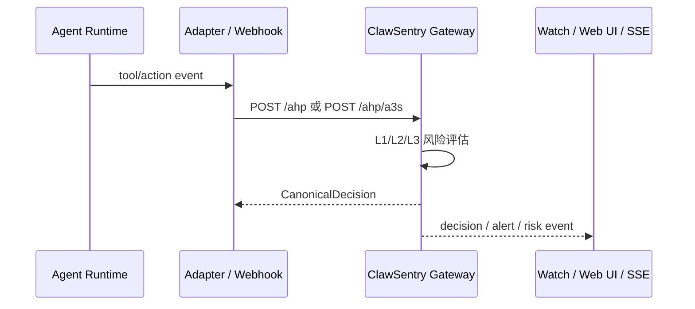

# API 概览

<section class="cs-doc-hero cs-doc-hero--api" markdown>
<div class="cs-eyebrow">ClawSentry API Surface</div>

## 面向企业 Web 接入的 API 地图

ClawSentry 的公开 API 分为决策入口、报表监控、实时 SSE、L3 advisory 和 OpenClaw Webhook。二次开发者优先使用 OpenAPI Reference 查看字段、schema、鉴权和示例。

<div class="cs-actions" markdown>
[查看交互 Reference](reference.md){ .md-button .md-button--primary }
[Metric Dictionary](metric-dictionary.md){ .md-button }
[下载 OpenAPI JSON](openapi.json){ .md-button }
</div>
</section>

## Web 前端应该先看什么

!!! tip "推荐接入顺序"
    1. 先用 `GET /health` 与 `GET /metrics` 确认 Gateway 可达性与指标边界。
    2. 再接 `GET /report/summary`、`GET /report/sessions`、`GET /report/session/{session_id}/page` 形成仪表板首屏。
    3. 需要实时 UI 时接 `GET /report/stream`，并通过 `?token=` 或 Bearer token 处理浏览器侧鉴权。
    4. 只有在需要处置动作时，再接 acknowledge、enforcement、quarantine 与 L3 advisory 的写入型端点。

| 目标 | 首选端点 | 说明 | 继续阅读 |
| --- | --- | --- | --- |
| 判断服务是否可用 | `GET /health` | Gateway 健康检查，不需要认证 | [健康检查](reporting.md#get-health) |
| 首屏运营概览 | `GET /report/summary` | 聚合统计、风险分布、活跃会话 | [报表摘要](reporting.md#get-report-summary) |
| 会话列表 | `GET /report/sessions` | 支持 Web UI 清单和筛选 | [会话列表](reporting.md#get-report-sessions) |
| 会话详情分页 | `GET /report/session/{session_id}/page` | 推荐给前端使用，避免一次性拉取过多事件 | [分页回放](reporting.md#get-report-session-page) |
| 实时事件 | `GET /report/stream` | SSE；支持浏览器 query token | [SSE 事件流](reporting.md#get-report-stream) |
| 告警处置 | `GET /report/alerts` / `POST /report/alerts/{alert_id}/acknowledge` | 查询和确认告警 | [告警端点](reporting.md#get-report-alerts) |
| 风险指标字段 | `latest_composite_score` / `session_risk_ewma` / `system_security_posture` | 新增报表、SSE、Dashboard、Enterprise OS 展示字段；`cumulative_score` 仅 legacy 兼容 | [Metric Dictionary](metric-dictionary.md) |
| Enterprise OS 20 类风险统计 | `GET /enterprise/report/live` / `GET /enterprise/report/summary` | `by_trinityguard_subtype` 查 20 类风险数，`by_trinityguard_tier` 查 RT1/RT2/RT3 三大风险层；不要和 L1/L2/L3 决策层混淆 | [Enterprise OS 风险统计](reporting.md#enterprise-os-risk-taxonomy-query) |

## 风险指标与决策边界

新增报表字段遵循“显示先行、决策不变”的边界：

| 字段族 | 默认用途 | 决策影响 | 说明 |
| --- | --- | --- | --- |
| `cumulative_score` | 旧 UI / 旧告警兼容 | 否 | 保留原字段，不重新定义为窗口累计分。 |
| `latest_composite_score` | 当前风险读数 | 否 | 最新事件 composite score；Dashboard 可作为 fallback。 |
| `session_risk_sum` / `session_risk_ewma` | 窗口趋势与主展示分 | 否 | UI/Enterprise OS 首选 `session_risk_ewma`，暴露量看 `session_risk_sum`。 |
| `risk_points_sum` | L3 风险压力解释 | 否 | 与 L3 内部阈值口径相近，但外显字段不自动替代触发逻辑。 |
| `window_risk_summary` | API/SSE/Dashboard 窗口容器 | 否 | 必须声明窗口、事件数和同窗口聚合字段。 |
| `system_security_posture` | Enterprise OS / Dashboard 全局态势 | 否 | 必须支持 fresh/stale/degraded cache 状态。 |

完整字段字典见 [Metric Dictionary](metric-dictionary.md)。

## API 分区

<div class="cs-card-grid cs-card-grid--compact" markdown>

<div class="cs-card" markdown>
### 决策入口
`POST /ahp`、`POST /ahp/a3s`、`POST /ahp/codex`、`POST /ahp/resolve`

把 Agent 事件提交给 Gateway，获得 `allow / block / defer / modify` 判决，或回写人工审批结果。
</div>

<div class="cs-card" markdown>
### 报表与监控
`GET /report/*`、`GET /metrics`、`GET /health`

查询聚合统计、会话轨迹、风险时间线、告警和 Prometheus 指标；`/report/*` 是文档分组别名，不是实际 route。新增风险展示字段以 [Metric Dictionary](metric-dictionary.md) 为准，默认不改变决策语义。
</div>

<div class="cs-card" markdown>
### Enterprise 风险 taxonomy
`GET /enterprise/report/live`、`GET /enterprise/report/summary`

企业模式启用后，Enterprise OS 可直接读取 TrinityGuard-derived 20 类风险统计：实时态势看 `by_trinityguard_subtype` / `by_trinityguard_tier`，历史窗口审计看 `trinityguard.by_subtype` / `trinityguard.by_tier`。
</div>

<div class="cs-card" markdown>
### 实时事件流
`GET /report/stream`

通过 SSE 接收 decision、alert、risk、DEFER、budget、watch/trajectory 和 L3 advisory 事件；浏览器可使用 query token。SSE 中的 `latest_composite_score`、`window_risk_summary` 等字段是观测/展示合同，默认不回写判决。
</div>

<div class="cs-card" markdown>
### Webhook 接入
`POST /webhook/openclaw`

接收 OpenClaw Webhook，执行 token/HMAC/timestamp/IP/idempotency 检查后归一化为 ClawSentry 事件。
</div>

</div>

## 鉴权与运行边界

| 边界 | 适用范围 | 说明 |
| --- | --- | --- |
| `CS_AUTH_TOKEN` | Gateway HTTP API | 生产环境必须设置。为空时 Gateway Bearer 认证会被禁用，仅适合本地开发。 |
| `CS_METRICS_AUTH` | `GET /metrics` | 为 `true` 时 metrics 也要求 Bearer token。 |
| `?token=` | `GET /report/stream` / Web UI | 浏览器友好的 SSE 与 UI 登录路径；token 会进入 sessionStorage。 |
| `OPENCLAW_WEBHOOK_TOKEN` | `POST /webhook/openclaw` | Webhook 主令牌。 |
| `OPENCLAW_WEBHOOK_SECRET` | `POST /webhook/openclaw` | HMAC 密钥；配置后 strict 模式会拒绝缺失或无效签名。 |
| Enterprise mode | `/enterprise/*` | 条件注册端点；默认 Reference 标注为 enterprise，不承诺默认环境可用。 |

!!! warning "生产提示"
    `GET /health` 是公开健康检查；`GET /metrics` 是否需要认证由 `CS_METRICS_AUTH` 控制；其余 Gateway API 在 `CS_AUTH_TOKEN` 为空时也会变成无认证模式。生产环境不要依赖默认空 token。

## 典型调用流程



## OpenAPI 与维护边界

公开站点保留稳定的 OpenAPI artifact，便于前端、SDK 或 HTTP client 集成：

- [`openapi.json`](openapi.json)：交互式 API Reference 使用的 OpenAPI artifact。

维护者可在源码仓库中复跑 API inventory 校验，确认文档端点、OpenAPI 和路由定义一致：

```bash
python scripts/docs_api_inventory.py validate
```
