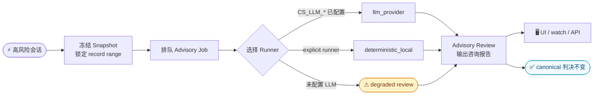

# L3 咨询审查

<div class="cs-doc-hero" markdown>
<div class="cs-eyebrow">决策引擎 · L3 咨询审查</div>

## 高风险会话的只读复盘报告

L3 咨询审查是一个**拉取式（pull-based）**后处理系统，消费固定 evidence snapshot 生成只读复盘报告。它不在实时决策链中运行，不启动后台 scheduler，也不修改任何 canonical 决策。

!!! note "FSPR 与 L3 Advisory"
    FSPR 可以复用 provider/role orchestration 思路，但它是 Skill Trust package review evidence，不是人工审批式 L3 Advisory。FSPR findings 和 recommendations 需要通过 Gateway policy 或 lifecycle API 才能影响后续 trust-list 状态。

<div class="cs-pill-row" markdown>
<span class="cs-pill">只读复盘</span>
<span class="cs-pill">不改写判决结果</span>
<span class="cs-pill">Web UI 可触发</span>
<span class="cs-pill">CLI / API 自动化</span>
</div>

</div>

---

## 先看一个场景

你在 Web UI 里看到一个 session 变成 **high risk**：

1. Agent 先读取了 `.env` 或 SSH key；
2. 后面又执行了 `curl` / `scp` / archive packaging；
3. Dashboard 和 `clawsentry watch` 都提示风险升高；
4. 你想知道：这到底是正常部署，还是准备外传？

在 Session Detail 点 **Request L3 full review**，或运行：

```bash
clawsentry l3 full-review --session sess-001 --token "$CS_AUTH_TOKEN"
```

典型输出：

```text
L3 advisory full review requested
snapshot: l3snap-...
job:      l3job-... (completed)
review:   l3adv-... (completed, risk=high)
advisory_only: True
canonical_decision_mutated: False
```

---

## Advisory 与同步 L3 Agent 的区别 {#advisory-vs-agent}

| 维度 | 同步 L3 Agent | L3 咨询审查 |
|------|--------------|------------|
| 运行位置 | 实时决策链中，由策略触发 | 决策链之外，operator 显式触发或自动 snapshot |
| 输入 | 当前事件 + bounded context（live） | 固定 evidence snapshot（frozen record range） |
| 输出 | 决策路径中的 L3 结果 / trace | advisory review + recommended operator action |
| 延迟模型 | 同步路径预算内完成，超时则降级 | job/review 生命周期：queued → running → completed |
| 执行方式 | 同步调用，不可排队 | 拉取式 worker，可 queue-only 后单独运行 |
| 是否修改 canonical 决策 | 不适用（参与决策生成） | 明确不修改，`canonical_decision_mutated=false` |
| LLM 配置 | 继承同步 `CS_LLM_*` | 同样继承 `CS_LLM_*`；无有效配置时写入 `degraded` review |
| 后台 scheduler | 不适用 | 不启动；drain 是有界 one-shot |

---

## Operator 安全边界 {#operator-contract}

| 问题 | 实际行为（来自源码） |
|------|----------------------|
| 触发方式 | Web UI 手动 full-review；CLI/API 显式请求；或 `CS_L3_ADVISORY_ASYNC_ENABLED`+`CS_L3_HEARTBEAT_REVIEW_ENABLED` 下的自动冻结 |
| 输入 | 固定 record range 的 frozen trajectory snapshot；不读取 live workspace |
| 输出 | `snapshot_id`、`job_id`、`review_id`、`risk_level`、`recommended_operator_action`，以及可选 `analysis_summary` / `analysis_points` / `operator_next_steps` |
| 是否重判 allow/block/defer | 不会；响应始终带 `advisory_only=true`、`canonical_decision_mutated=false` |
| 是否自动联网 | `llm_provider` runner 须有效 `CS_LLM_*` 配置；无配置时写入 `degraded` review，含明确的 reason code |
| 是否后台扫全量 session | 不会；`drain` 是有界 one-shot（max_jobs 上限 10） |

---

## 工作流程



### 三个核心对象

| 对象 | 职责 | 典型 ID | 查询入口 |
|------|------|---------|---------|
| Snapshot | 固定 record range 的 frozen evidence 包 | `l3snap-...` | Session Detail / SSE / API |
| Job | 复盘任务，含 runner 和状态机 | `l3job-...` | `watch` queued/running/completed 行 |
| Review | 最终咨询报告，含 risk_level 与 action | `l3adv-...` | Session Detail L3 advisory review 卡片 |

---

## Review 输出字段 {#output-fields}

来自 `parse_l3_advisory_worker_response`（`cs.l3_advisory.worker_response.v1`）：

| 字段 | 类型 | 说明 | 约束 |
|------|------|------|------|
| `schema_version` | string | `cs.l3_advisory.worker_response.v1` | 固定值 |
| `risk_level` | string | `low` / `medium` / `high` / `critical` | 无效值强制为 `medium` |
| `findings` | string[] | 复盘依据列表 | 非 list 时替换为 `["provider response missing findings"]` |
| `confidence` | float \| null | 置信度（0–1） | 非数值时置为 null |
| `recommended_operator_action` | string | `none` / `inspect` / `escalate` / `configure_llm_provider` | critical→escalate；high/medium→inspect；low→none；degraded (misconfigured LLM provider)→configure_llm_provider |
| `l3_state` | string | `completed` / `failed` / `degraded` | 非法值强制为 `degraded` |
| `l3_reason_code` | string \| null | 降级或失败的 reason code（见下表） | 可选 |
| `analysis_summary` | string | 自然语言摘要 | 最长 360 字符 |
| `analysis_points` | string[] | 关键依据，2–5 条 | 最多 5 条，每条最长 180 字符 |
| `operator_next_steps` | string[] | 操作建议，1–3 条 | 最多 3 条，每条最长 180 字符 |

### Degraded reason codes

| reason_code | 触发条件 |
|-------------|---------|
| `provider_disabled` | `CS_LLM_PROVIDER` 未设置或 provider 被禁用 |
| `provider_missing_key` | API key 为空 |
| `provider_missing_model` | `CS_LLM_MODEL` 为空 |
| `provider_invalid_config` | 其他配置校验失败 |
| `provider_not_implemented` | provider shell 存在但未实现完成（dry_run 路径） |
| `provider_timeout` | LLM 调用超时 |
| `provider_error` | LLM 调用抛出异常 |
| `provider_response_invalid` | provider 返回不是合法 JSON 对象 |
| `provider_unsupported` | provider 名称不在受支持列表内 |

!!! warning "配置缺失时会显式降级，不会静默 fallback"
    `llm_provider` runner 在 `CS_LLM_PROVIDER`、API key 或 `CS_LLM_MODEL` 任一缺失时，写入 `l3_state=degraded` review 并附 reason code，而不是静默改跑本地逻辑。

---

## CLI 参考 {#cli}

### full-review（立即运行或仅排队）

```bash
clawsentry l3 full-review \
  --session <session_id> \
  [--token <bearer_token>]          # 默认读 CS_AUTH_TOKEN
  [--gateway-url <url>]             # 默认 http://127.0.0.1:$CS_HTTP_PORT
  [--runner llm_provider|deterministic_local]  # 默认 llm_provider
  [--from-record-id <n>]            # 冻结范围起点
  [--to-record-id <n>]              # 冻结范围终点
  [--max-records <n=100>]           # 最大冻结记录数
  [--max-tool-calls <n=0>]          # advisory evidence tool-call 预算
  [--trigger-event-id <id>]         # operator 触发事件 ID
  [--trigger-detail <str>]          # 触发备注
  [--queue-only]                    # 只冻结 + 排队，不运行 worker
  [--json]                          # 输出原始 JSON
  [--timeout <s=30>]                # HTTP 超时秒数
```

固定审查范围示例：

```bash
clawsentry l3 full-review \
  --session sess-001 \
  --from-record-id 4 \
  --to-record-id 8 \
  --runner deterministic_local
```

仅排队示例：

```bash
clawsentry l3 full-review \
  --session sess-001 \
  --queue-only \
  --json
```

### jobs list

```bash
clawsentry l3 jobs list \
  [--state queued|running|completed|failed]  # 默认 queued
  [--runner llm_provider|deterministic_local]
  [--session <session_id>]
  [--json] [--timeout <s=30>]
```

### jobs run-next（有界 one-shot）

```bash
clawsentry l3 jobs run-next \
  --runner deterministic_local \
  [--session <session_id>] [--dry-run] [--json]
```

只选择 `job_state=queued` 的最旧一条；`running` / `completed` / `failed` 不会被 rerun。

### jobs drain（批量有界 one-shot）

```bash
clawsentry l3 jobs drain \
  --runner deterministic_local \
  --max-jobs 2 \
  [--session <session_id>] [--dry-run] [--json]
```

!!! note "drain 的硬上限"
    `max_jobs` 范围 1–10，超出范围会报错。`drain` 不是 daemon；它选出至多 max_jobs 条 queued job 后退出。

---

## Runner 配置 {#runners}

公开支持的 runner（`PUBLIC_L3_ADVISORY_RUNNERS`）：

| Runner | 默认 | 是否联网 | 适用场景 |
|--------|------|---------|---------|
| `llm_provider` | 是 | 是（须有效 `CS_LLM_*`） | 生产 full-review 与 queued job |
| `deterministic_local` | 否 | 否 | 离线调试 / 审计管道验证 |

!!! tip "fake_llm 是内部测试专用"
    `fake_llm` runner 仅供单元测试使用，不在公开 runner 列表中，生产环境请勿使用。

### llm_provider 配置优先级

1. 读取 `CS_LLM_PROVIDER`（主路径）：

| 环境变量 | 说明 | 默认值 |
|---------|------|-------|
| `CS_LLM_PROVIDER` | `openai` 或 `anthropic` | — |
| `CS_LLM_MODEL` | 模型名称 | — |
| `CS_LLM_API_KEY` | API key（或 `OPENAI_API_KEY` / `ANTHROPIC_API_KEY`） | — |
| `CS_LLM_BASE_URL` | 自定义 base URL | — |
| `CS_LLM_TEMPERATURE` | 生成温度 | `0.0` |
| `CS_LLM_PROVIDER_TIMEOUT_MS` | LLM 调用超时（ms） | `3000` |

2. 若无 `CS_LLM_PROVIDER`，回落到 legacy `CS_L3_ADVISORY_*` 变量（兼容旧配置）：

| 环境变量 | 说明 |
|---------|------|
| `CS_L3_ADVISORY_PROVIDER_ENABLED` | `true` 启用 legacy 路径 |
| `CS_L3_ADVISORY_PROVIDER` | provider 名称 |
| `CS_L3_ADVISORY_MODEL` | 模型名称 |
| `CS_L3_ADVISORY_API_KEY` | API key（优先于 provider 专属 key） |
| `CS_L3_ADVISORY_BASE_URL` | 自定义 base URL |
| `CS_L3_ADVISORY_PROVIDER_DRY_RUN` | `false` 才真正调用（默认 `true`） |
| `CS_L3_ADVISORY_TEMPERATURE` | 生成温度（默认 `1.0`） |
| `CS_L3_ADVISORY_DEADLINE_MS` | LLM 调用超时（默认 `30000` ms） |

---

## Heartbeat / Idle 自动排队 {#heartbeat-idle-aggregate-queueing}

当同时开启：

```bash
CS_L3_ADVISORY_ASYNC_ENABLED=true
CS_L3_HEARTBEAT_REVIEW_ENABLED=true
```

兼容事件（`heartbeat` / `idle` / `success` / `rate_limit`）在满足以下条件时，会自动冻结 snapshot 并排队一个 `trigger_reason=heartbeat_aggregate` 的 advisory job：

- 同一 session 在最新 terminal heartbeat review 后出现新的 high/critical evidence delta；
- 同一 `(session_id, runner)` 当前无 queued/running 的 `heartbeat_aggregate` job。

!!! warning "不启动后台 scheduler"
    自动 snapshot 只是冻结证据并排队 job；它不自动运行 worker，不启动 scheduler，也不修改 canonical decision。

---

## Web UI 字段速查

| 卡片字段 | 含义 |
|---------|------|
| `Risk` | 复盘后的 risk_level |
| `Action` | recommended_operator_action：`Inspect` / `Escalate` / `None` |
| `Runner` | 生成此报告的 runner |
| `Records 4–8` | 本次复盘固定的 record 范围 |
| `Analysis summary` | analysis_summary（最长 360 字符） |
| `Analysis points` | analysis_points（最多 5 条，各 180 字符） |
| `Next steps` | operator_next_steps（最多 3 条） |
| `canonical decision unchanged` | 原始判决未被修改 |

!!! tip "值守路径"
    先看 `Action`，再看 frozen record boundary（确认证据范围），最后用 `review_id` 在 API / replay 里查细节。不要把 advisory review 当成新的 block/allow 判决。

---

## clawsentry watch 输出

```text
L3 ADVISORY SNAPSHOT  l3snap-...  Range=4->8
L3 ADVISORY JOB       l3job-...   State=Completed Runner=deterministic_local
L3 ADVISORY REVIEW    l3adv-...   State=Completed Action=Inspect
L3 ADVISORY ACTION    l3adv-...   Boundary: advisory only; canonical unchanged
```

---

## API 速查 {#api}

### Full-review 端点

```http
POST /report/session/{session_id}/l3-advisory/full-review
```

请求体：

```json
{
  "trigger_detail": "operator_requested_full_review",
  "from_record_id": 4,
  "to_record_id": 8,
  "max_records": 100,
  "max_tool_calls": 0,
  "runner": "llm_provider",
  "run": true
}
```

响应（始终包含 `advisory_only: true`、`canonical_decision_mutated: false`）：

```json
{
  "snapshot": {"snapshot_id": "l3snap-..."},
  "job": {"job_id": "l3job-...", "job_state": "completed"},
  "review": {"review_id": "l3adv-...", "l3_state": "completed"},
  "advisory_only": true,
  "canonical_decision_mutated": false
}
```

### 其他端点

| 方法 | 路径 | 说明 |
|------|------|------|
| `POST` | `/report/session/{id}/l3-advisory/snapshots` | 单独创建 snapshot |
| `POST` | `/report/l3-advisory/snapshot/{snapshot_id}/jobs` | 创建 job |
| `POST` | `/report/l3-advisory/job/{job_id}/run-local` | 以 deterministic_local 运行 job |
| `POST` | `/report/l3-advisory/job/{job_id}/run-worker` | 以 llm_provider 运行 job |
| `PATCH` | `/report/l3-advisory/review/{review_id}` | 更新 review lifecycle |
| `GET`  | `/report/l3-advisory/jobs` | 列出 jobs（支持 state / runner / session_id 过滤） |
| `POST` | `/report/l3-advisory/jobs/run-next` | 运行最旧一条 queued job |
| `POST` | `/report/l3-advisory/jobs/drain` | 批量运行 queued jobs（max 10） |

完整字段见 [报表与监控端点](../api/reporting.md#l3-advisory-endpoints)。

---

## Provider smoke 验证 {#smoke}

在真实 session 上运行之前，可用随包 devtools 模块验证 provider runner 配置：

```bash
python -m clawsentry.devtools.l3_advisory_provider_smoke \
  --output-report artifacts/l3-provider-smoke.md \
  --json
```

步骤：

1. 构造 frozen snapshot；
2. 排队一个 `llm_provider` job；
3. 执行一次受闸门保护的 review；
4. 输出 Markdown 证据报告。

!!! note "smoke 验证的边界"
    - 缺少 `CS_LLM_PROVIDER` / API key / `CS_LLM_MODEL` 时，结果应安全降级为 `degraded`；
    - 加 `--require-completed` 可让未完成的 review 以非零退出，适合用作发布 gate；
    - smoke 不启动 scheduler，不修改 canonical decision，只写 `advisory_only=true` 的 review。

---

## 常见误解 {#faq}

| 误解 | 实际行为 |
|------|---------|
| "它会重判 allow/block 吗？" | 不会；它只生成 advisory review，`canonical_decision_mutated` 始终为 false |
| "它会自动联网调用 LLM 吗？" | 不会；`llm_provider` 须显式配置有效 `CS_LLM_*` |
| "它会后台持续扫描所有 session 吗？" | 不会；full-review 是显式触发，drain 是有界 one-shot |
| "它会读取最新 live 文件吗？" | 不会；只读 frozen trajectory records，范围由 snapshot 固定 |
| "失败会伪装成成功吗？" | 不会；配置缺失或 provider 不可用会写入 `degraded` + 明确 reason code |

---

## 相关入口 {#related-entrypoints}

如果你想了解同步决策链里的 L3 审查器，继续看 [L3 审查 Agent](l3-agent.md)。

完整 API 字段见 [API 概览](../api/overview.md)、[报表 API](../api/reporting.md#l3-advisory-endpoints)。实时监控见 [Web 仪表板](../dashboard/index.md)。
