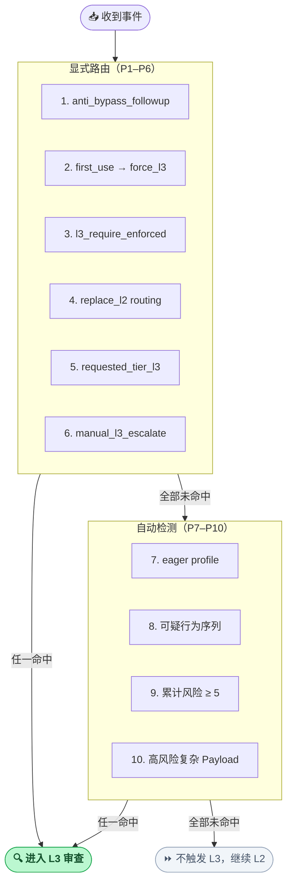
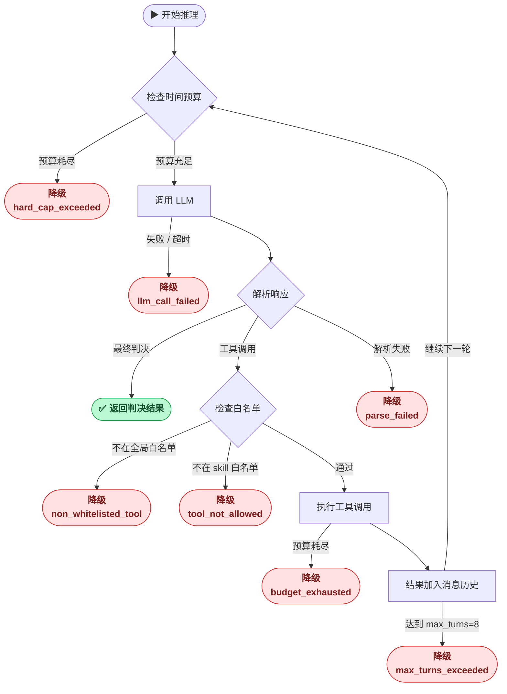

决策引擎 · L3 审查代理

## L3 审查 Agent

多轮工具调用推理，对高风险事件进行深度自主上下文调查；只读工具集保证分析过程零副作用。

最多 8 轮推理
14 只读工具
最多 20 次工具调用
可配置 YAML Skills

## 概述 {#overview}

L3 是 ClawSentry 三层决策模型的最高层，部署一个拥有只读工具集的 AI 审查代理对高风险事件进行深度自主调查。与 L2 的单轮 LLM 调用不同，L3 可以进行多轮推理，主动调用工具收集证据，最终给出详细安全评估。

!!! info "设计哲学"
    L1 看模式，L2 看语义，L3 **看上下文**。L3 不仅分析当前事件本身，还会主动查阅源代码、git 历史、文件系统结构和会话轨迹，在完整上下文中做出判断。

!!! note "与 L3 咨询审查的区别"
    本页描述**同步判决路径**中的 L3 审查 Agent（`AgentAnalyzer`）。需要 operator 手动复盘的 job / review 流程见 [L3 咨询审查](l3-advisory.md)。

---

## 触发条件 {#trigger-policy}

`L3TriggerPolicy.trigger_metadata()` 按优先级依次检查以下条件：

| 优先级 | 触发原因 | 条件 |
|---|---|---|
| 1 | `anti_bypass_followup` | `session_risk_summary.l3_request_reason == "anti_bypass_followup"` |
| 2 | `first_use_skill_trust_action` | `session_risk_summary.first_use_skill_trust_action == "force_l3"` |
| 3 | `session_l3_require` | `session_risk_summary.l3_require_enforced is True` |
| 4 | `replace_l2_routing` | `session_risk_summary.l3_routing_mode == "replace_l2"` |
| 5 | `requested_tier_l3` | `session_risk_summary.l3_request_reason == "requested_tier_l3"` |
| 6 | `manual_l3_escalate` | `session_risk_summary` 含 `l3_escalate`、`force_l3` 或 `manual_l3_escalation` 任一为真 |
| 7 | `eager` | `session_risk_summary.l3_trigger_profile == "eager"` |
| 8 | `suspicious_pattern` | 会话历史中检测到可疑行为序列（见下表） |
| 9 | `cumulative_risk` | 历史 + 当前事件风险分累计 ≥ 5（low=0, medium=1, high=2, critical=3） |
| 10 | `high_risk_complex_payload` | 工具属于高风险工具集 **且** payload 满足复杂度阈值 |

### 可疑行为序列模式 {#suspicious-patterns}

| 模式名 | 检测逻辑 |
|---|---|
| `secret_plus_network` | 历史中同时出现凭证访问 + 网络活动 |
| `privilege_escalation_chain` | 按顺序：read → write（有 read）→ sudo（有 write 或 exec） |
| `tmp_staging_exfil` | 先出现 tmp 写入，后出现 tmp + 网络访问 |
| `recon_then_sudo` | 先出现侦察动作，后出现 sudo |
| `secret_harvest_archive` | ≥2 次凭证访问后出现敏感材料归档 |

### Payload 复杂度阈值 {#payload-complexity}

`_payload_complexity()` 满足任一条件即为"复杂 payload"：

| 条件 | 阈值 |
|---|---|
| JSON 序列化后字节数 | ≥ 512 |
| JSON 最大嵌套深度 | ≥ 3 |
| 顶层 dict key 数量 | ≥ 6 |

### 高风险工具集

`_HIGH_RISK_TOOLS`：`bash`, `shell`, `exec`, `sudo`, `chmod`, `chown`, `write`, `edit`, `write_file`, `edit_file`, `create_file`

---

## 多轮推理循环 {#multi-turn-loop}

`AgentAnalyzer` 默认工作在多轮模式（`enable_multi_turn=True`，`max_reasoning_turns=8`）。

每轮迭代步骤：

1. 检查剩余时间预算，若 ≤ 0 → 降级（`hard_cap_exceeded`）
2. 调用 LLM，超时或异常 → 降级（`llm_call_failed`）
3. 解析 LLM 响应：
   - 若解析为工具调用（`{thought, tool_call, done: false}`）→ 继续执行工具
   - 若解析为最终判决（`{risk_level, findings, confidence}`）→ 返回结果
   - 若解析失败 → 尝试最终判决解析，失败则降级
4. 检查 `tool_call.name`：
   - 不在全局白名单 `_ALLOWED_TOOL_CALLS` → 降级（`requested_non_whitelisted_tool`）
   - 不在当前 skill 的 `allowed_tools` → 降级（`requested_tool_not_allowed_by_skill`）
5. 执行工具调用，工具预算耗尽 → 降级（`tool_call_budget_exhausted`）
6. 将工具结果加入消息历史，进入下一轮
7. 循环结束（达到 `max_reasoning_turns=8`）→ 降级（`max_turns_exceeded`）

### 降级路径汇总 {#degradation-paths}

所有降级均使用 `_degraded()`：复制 L1 snapshot 的风险等级，`confidence=0.0`，`decision_tier=L1`。

| 触发条件 | `l3_reason_code` |
|---|---|
| 未触发 L3 条件 | `trigger_not_matched` |
| Payload 超出长度预算 | `analysis_budget_exceeded` |
| 时间预算耗尽 | `hard_cap_exceeded` |
| LLM 调用失败 / 超时 | `llm_call_failed` |
| LLM 响应无法解析 | `llm_response_parse_failed` |
| 格式纠正重试失败 | `format_retry_failed` |
| 达到最大推理轮数 | `max_turns_exceeded` |
| 工具调用超出预算 | `tool_call_budget_exhausted` |
| 请求全局白名单外工具 | `requested_non_whitelisted_tool` |
| 请求 skill 未授权工具 | `requested_tool_not_allowed_by_skill` |
| 其他异常 | `analysis_exception` |

---

## ReadOnlyToolkit {#toolkit}

所有工具调用经沙箱保护：路径严格限制在 `workspace_root` 内（`_safe_path()` 对绝对路径转义进行检查）。

全局预算上限 `MAX_TOOL_CALLS = 20`；实际预算由分析器自适应计算：

- 多轮模式：`min(20, 4 + 初始证据源数量)`
- 单轮模式：`min(20, 2 + 初始证据源数量)`
- Skill 可通过 `max_tool_calls` 字段进一步收窄预算

| 工具 | 参数 | 返回 | 沙箱约束 |
|---|---|---|---|
| `read_trajectory` | `session_id`, `limit=100`（上限 500）| 轨迹记录列表 | 仅读 trajectory store |
| `read_trajectory_page` | `session_id`, `cursor`, `limit=50`（上限 100）| 分页结果 | 仅读 trajectory store |
| `read_file` | `relative_path` | 文件内容字符串（上限 512 KB）| 路径不可逃出 `workspace_root` |
| `read_file_range` | `relative_path`, `start_line=1`, `max_lines=120`（上限 500）| 行范围字典 | 同上 |
| `read_transcript` | — | 会话 transcript 内容（上限 512 KB）| 需提前绑定 `transcript_path` |
| `read_session_risk` | `limit=50`（上限 200）| 会话风险摘要 | 仅读 session registry |
| `read_l3_trace` | `limit=20`（上限 100）| L3 触发记录列表 | 仅读 session registry |
| `search_codebase` | `pattern`（regex）, `glob`, `max_results=50` | 匹配行列表（上限 2000 文件，2 秒超时）| 路径不可逃出 `workspace_root` |
| `query_git_diff` | `ref=HEAD` | diff 字符串（上限 512 KB）| 仅 git 只读操作 |
| `query_git_status` | — | git status 字符串 | 仅 git 只读操作 |
| `query_git_show` | `ref=HEAD`, `path` 可选 | show 输出 | 仅 git 只读操作 |
| `list_changed_files` | `ref=HEAD` | 文件路径列表 | 仅 git 只读操作 |
| `read_package_manifest` | `relative_path`（package.json / pyproject.toml / Cargo.toml）| 解析后的依赖摘要 | 路径不可逃出 `workspace_root` |
| `list_directory` | `relative_path=.` | 条目路径列表 | 路径不可逃出 `workspace_root` |

!!! warning "写操作完全不存在"
    ReadOnlyToolkit 没有任何写入方法。LLM 请求写操作时，`_ALLOWED_TOOL_CALLS` 白名单检查会立即触发降级，不会执行任何文件系统变更。

---

## SkillRegistry 与 Skill 选择 {#skill-registry}

`SkillRegistry` 从 `skills_dir` 加载所有 `*.yaml` 文件，要求必须含 `general-review` skill。

### Skill 评分算法

`_ranked_skills()` 对每个 enabled skill 计算得分：

| 维度 | 得分 |
|---|---|
| `risk_hints` 命中（每个）| +10 |
| `tool_names` 命中（事件工具名）| +5 |
| `payload_patterns` 命中（每个）| +1 |

得分 > 0 的 skill 进入排名，按 `(score, skill.priority, -registry_order)` 降序排列，取第一名。得分均为 0 时回退到 `general-review`。

### 触发覆盖规则

在 `_select_skill()` 中，特定触发原因直接路由到指定 skill（不经过评分）：

| `trigger_reason` | 强制选择的 Skill |
|---|---|
| `first_use_skill_trust_action` | `skill-trust-audit`（若存在）|
| `anti_bypass_followup` | `data-staging-exfil-chain-audit`（若存在）|

### Skill Manifest 字段 `clawsentry.l3_skill.v1`

| 字段 | 类型 | 说明 |
|---|---|---|
| `name` | string | 唯一 skill 标识符 |
| `description` | string | 技能描述，用于次级标准选取 |
| `system_prompt` | string | 注入 LLM 的系统提示 |
| `triggers.risk_hints` | list[str] | 命中时 +10 分的风险提示词 |
| `triggers.tool_names` | list[str] | 命中时 +5 分的工具名 |
| `triggers.payload_patterns` | list[str] | 命中时 +1 分的 payload 子串 |
| `evaluation_criteria` | list[{name, severity, description}] | 评估标准，severity 必须为 low/medium/high/critical |
| `allowed_tools` | list[str] | 允许调用的工具子集（须是全局白名单子集）|
| `max_tool_calls` | int（1-20）| 可收窄工具调用预算上限 |
| `required_evidence` | list[str] | 审查前必须具备的证据类型 |
| `severity_rubric` | dict[str, list[str]] | 各严重级别的判断标准，v1 必须覆盖 high 或 critical |
| `output_tags` | list[str] | 输出标签（`[a-z][a-z0-9_]{1,63}`）|
| `benign_exceptions` | list[str] | 已知良性例外说明 |
| `priority` | int | 同分时的次级排名依据 |

---

## AgentAnalyzer 配置 {#configuration}

`AgentAnalyzerConfig` 各字段与对应行为：

| 字段 | 默认值 | 说明 |
|---|---|---|
| `provider_timeout_ms` | 120 000 | 单次 LLM 调用超时（ms）|
| `hard_cap_ms` | 120 000 | 整个 L3 分析硬性时间上限（ms）|
| `l3_budget_ms` | `None` | 自定义 L3 预算；`None` 表示使用传入的 `budget_ms` |
| `max_reasoning_turns` | 8 | 多轮循环最大迭代次数 |
| `initial_trajectory_limit` | 20 | 初始读取的轨迹记录数 |
| `max_findings` | 10 | 返回的最大 finding 数量 |
| `enable_multi_turn` | `True` | `False` 退回单轮模式（遗留兼容）|

实际生效预算 `effective_budget = min(l3_budget_ms or budget_ms, budget_ms, provider_timeout_ms, hard_cap_ms)`。

!!! tip "单轮模式"
    `enable_multi_turn=False` 启用遗留单轮模式：触发 → 选择 skill → 收集最小上下文 → 单次 LLM 调用 → L2Result。单轮模式的工具预算上限为 `min(20, 2 + 初始证据源数量)`。解析失败时有一次格式纠正重试（需剩余预算 ≥ 3000 ms）。

---

## 代码位置 {#source-code}

| 文件 | 内容 |
|---|---|
| `src/clawsentry/gateway/agent_analyzer.py` | `AgentAnalyzer`、多轮/单轮循环、`_ALLOWED_TOOL_CALLS` |
| `src/clawsentry/gateway/l3_trigger.py` | `L3TriggerPolicy`、可疑模式检测、payload 复杂度 |
| `src/clawsentry/gateway/review_toolkit.py` | `ReadOnlyToolkit`、`_safe_path()`、工具实现 |
| `src/clawsentry/gateway/review_skills.py` | `SkillRegistry`、`select_skill()`、manifest 校验 |
