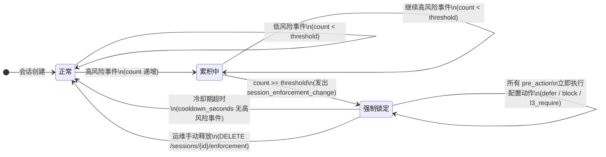
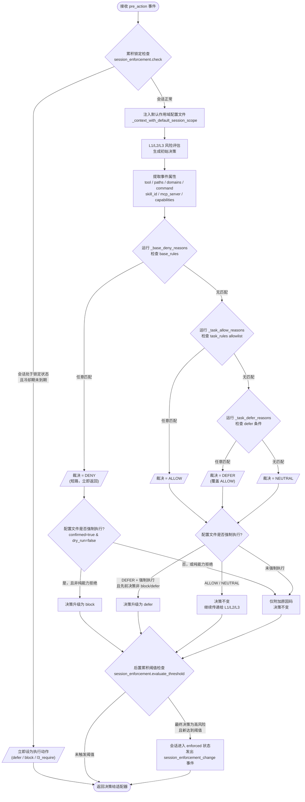

# 作用域限制

<div class="cs-doc-hero" markdown>
<p class="cs-eyebrow">决策引擎 · 作用域限制</p>

## 一次配置，每次预操作自动执行

作用域限制允许你精确告知 ClawSentry，某个任务允许访问哪些工具、路径、域名、命令、技能和 MCP 服务器。两种独立机制共同执行这些边界：

- **会话作用域配置文件（Session Scope Profile）** — 从 JSON 配置文件加载的每任务允许/拒绝列表
- **会话累积锁定策略** — 当会话累积过多高风险事件后自动升级

<div class="cs-pill-row" markdown>
<span class="cs-pill">四种处置规则</span>
<span class="cs-pill">强制拒绝 → 阻断</span>
<span class="cs-pill">强制推迟 → 人工审核</span>
<span class="cs-pill">累积风险阈值 → 会话锁定</span>
</div>
</div>

## 限制类型

每个预操作事件都会经过两层规则检查：`base_rules`（硬性拒绝，无法被任务规则覆盖）和 `task_rules`（任务级允许/推迟决策）。

### base_rules — 硬性拒绝

| 类型 | 配置字段 | 匹配逻辑 | 原因码 |
|------|----------|----------|--------|
| 工具名称 | `denied_tools` | 不区分大小写精确匹配 | `scope_deny:tool <name>` |
| 命令前缀 | `denied_command_prefixes` | `command.startswith(prefix)`（不区分大小写） | `scope_deny:command_prefix <prefix>` |
| 文件路径 | `denied_paths` | 规范化路径的前缀匹配或子串匹配 | `scope_deny:path <match>` |
| 域名 | `denied_domains` | 精确匹配或子域名后缀匹配 | `scope_deny:domain <match>` |
| 技能 ID | `denied_skill_ids` | 不区分大小写精确匹配 | `scope_deny:skill <id>` |
| 技能信任状态 | `denied_skill_trust_states` | 不区分大小写精确匹配 | `scope_deny:skill_trust_state <state>` |
| MCP 服务器 | `denied_mcp_servers` | 不区分大小写精确匹配 | `scope_deny:mcp_server <name>` |
| MCP 工具 | `denied_mcp_tools` | 不区分大小写精确匹配 | `scope_deny:mcp_tool <name>` |
| MCP 状态 | `denied_mcp_statuses` | 不区分大小写精确匹配 | `scope_deny:mcp_status <status>` |
| MCP 信任级别 | `denied_mcp_trust_levels` | 不区分大小写精确匹配 | `scope_deny:mcp_trust_level <level>` |
| 能力 | `denied_capabilities` | 不区分大小写精确匹配 | `scope_deny:capability <cap>` |
| 破坏性命令 | *(硬编码)* | 正则：`rm -r*`、`sudo`、`dd of=/dev/`、`mkfs`、`chmod 777` | `scope_deny:destructive_command` |

!!! warning "破坏性命令检测始终激活"
    当配置文件的 `confirmed=true` 且 `dry_run=false` 时，破坏性命令正则会在任意配置文件上触发，即使 `denied_command_prefixes` 为空。这是基线不变量，无法禁用。

### task_rules — 允许与推迟

当任务规则匹配时，动作产生 `scope_allow`。当任务规则列表非空但动作不在其中，或检测到特定不安全条件时（无论允许列表内容如何），动作产生 `scope_defer`。

| 类型 | 允许条件 | 推迟条件 | 原因码 |
|------|----------|----------|--------|
| 工具 | `allowed_tools` 包含该工具 | `allowed_tools` 非空且工具不在列表中 | `scope_allow:tool` / `scope_defer:unknown_tool` |
| 命令 | `allowed_command_prefixes` 匹配 | `allowed_command_prefixes` 非空且无匹配 | `scope_allow:command_prefix` / `scope_defer:unknown_command` |
| 路径 | `allowed_path_prefixes` 匹配 | `allowed_path_prefixes` 非空且路径不匹配 | `scope_allow:path_prefix` / `scope_defer:unknown_path` |
| 域名 | `allowed_domains` 匹配 | `allowed_domains` 非空且域名不匹配 | `scope_allow:domain` / `scope_defer:unknown_domain` |
| 技能 ID | `allowed_skill_ids` + 身份可信 | 列表非空且（身份不可信，或 ID 不在列表中） | `scope_allow:skill` / `scope_defer:unknown_skill` 或 `scope_defer:untrusted_skill_identity` |
| 技能信任状态 | `allowed_skill_trust_states` 包含该状态且身份可信 | 列表非空且（身份不可信，或状态不在列表中） | `scope_allow:skill_trust_state` / `scope_defer:skill_trust_state` 或 `scope_defer:untrusted_skill_trust_state` |
| MCP 服务器 | `allowed_mcp_servers` 包含该名称 | 列表非空且名称不在其中 | `scope_allow:mcp_server` / `scope_defer:unknown_mcp_server` |
| MCP 工具 | `allowed_mcp_tools` 包含该名称 | 列表非空且名称不在其中 | `scope_allow:mcp_tool` / `scope_defer:unknown_mcp_tool` |
| MCP 状态 | `allowed_mcp_statuses` 包含该状态 | 列表非空且状态不在其中 | `scope_allow:mcp_status` / `scope_defer:mcp_status` |
| MCP 信任级别 | `allowed_mcp_trust_levels` 包含该级别 | 列表非空且级别不在其中 | `scope_allow:mcp_trust_level` / `scope_defer:mcp_trust_level` |
| 能力 | `allowed_capabilities` 包含该能力 | `allowed_capabilities` 非空且能力不在其中 | `scope_allow:capability` / `scope_defer:unknown_capability` |
| 排队能力 | *(始终推迟)* | 能力在 `queued_capabilities` 中 | `scope_defer:queued_capability` |
| 网络写操作 | *(始终推迟)* | `curl/wget/http/httpie` 带 `-d`、`--data`、`-F`、`--upload-file` 等参数 | `scope_defer:network_write` |
| 无范围网络 | *(始终推迟)* | URL 存在、无 `allowed_domains`、且 `"network"` 不在 `queued_categories` 中 | `scope_defer:network_unscoped` |

## 裁决与执行

### 四种裁决值

| 裁决 | 含义 | 策略引擎执行时的处理 |
|------|------|----------------------|
| `deny` | 动作命中了 base_rules 拒绝列表 | 将决策替换为 `block`（终态） |
| `defer` | 动作超出任务作用域 | 将决策升级为 `defer`，除非已经是 `block` 或 `defer` |
| `allow` | 动作匹配了 task_rules 允许列表 | 不变，继续传递给 L1/L2/L3 风险引擎 |
| `neutral` | 未找到适用规则 | 不变，继续传递给 L1/L2/L3 风险引擎 |

!!! info "allow 和 neutral 不会绕过 L1/L2/L3"
    `scope_allow` 裁决仅表示该动作在任务作用域内。完整的风险引擎仍会运行，并可独立地进行阻断。

### 自动收窄中的 MCP 边界

启用 `CS_CAPABILITY_NARROWING_ENABLED` 后，Gateway 在高会话风险后生成
SessionScopeProfile，而不是让 adapter 本地隐藏工具。MCP 自动收窄使用
`CS_CAPABILITY_NARROWING_ALLOWED_MCP_*` 与
`CS_CAPABILITY_NARROWING_DENIED_MCP_*` 映射到同名 `allowed_mcp_*` /
`denied_mcp_*` 字段。MCP status 允许值为 `allowlist`、`greylist`、
`blacklist`、`unlisted`、`revoked`、`disabled`；trust level 允许值为
`trusted`、`local_unreviewed`、`unknown`、`untrusted`。
Capability 自动收窄也可通过 `CS_CAPABILITY_NARROWING_ALLOWED_CAPABILITIES`、
`CS_CAPABILITY_NARROWING_DENIED_CAPABILITIES` 与
`CS_CAPABILITY_NARROWING_QUEUED_CAPABILITIES` 映射到 `allowed_capabilities`、
`denied_capabilities` 与 `queued_capabilities`。常见 capability 包括
`filesystem.write`、`network.fetch`、`future_execution.entrypoint`。

### 强制执行模式与试运行模式

仅当 `confirmed=true` 且 `dry_run=false` 时，配置文件才处于**强制执行**状态。当配置文件未强制执行时：

- 作用域裁决和原因码会附加到决策原因字符串中。
- 策略引擎不执行任何收紧操作。
- `watch --interactive` 会显示假设的裁决结果供审查。

!!! warning "从 dry_run=true 开始"
    首次部署时，请设置 `confirmed=false` 且 `dry_run=true`。观察 `watch` 输出以验证原因码，然后再启用真实执行。仅在验证配置文件后，才将其切换为 `confirmed=true, dry_run=false`。

### 纯能力拒绝例外

当所有拒绝原因码均为 `scope_deny:capability …`，且先前决策已经是 `defer` 时，策略引擎不会将其升级为 `block`。其他所有拒绝原因均会产生 `block`，与先前决策无关。

## 会话累积锁定策略

这是一个**独立于作用域配置文件**的机制 — 一旦会话累积了可配置数量的高风险事件，就会对该会话的所有后续决策进行升级。

### 会话锁定生命周期



1. 每次最终决策后，Gateway 检查会话的累积高风险计数。
2. 若 `count >= threshold` 且执行已启用，会话进入 `enforced`（强制锁定）状态。
3. 该会话的所有后续 `pre_action` 请求立即升级为配置的动作（`defer`、`block` 或 `l3_require`）。
4. 自上次高风险事件起，经过 `cooldown_seconds` 的无活动时间后，会话自动释放。
5. 运维人员也可通过 API 手动释放会话（`DELETE /sessions/{id}/enforcement`）。

!!! info "会话锁定与作用域配置文件是叠加关系，而非替代关系"
    即使未加载作用域配置文件，会话锁定执行也会触发。若两者同时激活，会话锁定优先，因为 Gateway 在应用作用域评估之前先检查会话锁定执行状态。

## 配置

### 会话作用域配置文件

| 配置字段 | 环境变量 | 默认值 | 含义 |
|----------|----------|--------|------|
| 配置文件路径 | `CS_SESSION_SCOPE_PROFILE_FILE` | *(无)* | 指向 JSON 文件的路径，解析为 `SessionScopeProfile`。优先于内联环境变量。 |
| 内联配置文件路径 | `CS_SESSION_SCOPE_PROFILE` | *(无)* | 同上；当文件变量未设置时使用。 |

当两个变量均未设置时，不加载默认作用域配置文件；仅运行 L1/L2/L3 风险引擎。

当请求已携带 `context.session_scope_profile` 时，默认配置文件不会被应用。

### 配置文件 JSON 字段

| 字段 | 类型 | 默认值 | 必填 | 含义 |
|------|------|--------|------|------|
| `scope_version` | string | — | 是 | 必须为 `"cs.session_scope.v1"` |
| `profile_id` | string | — | 是 | 非空标识符，出现在原因码和 watch 输出中 |
| `source` | string | `"operator"` | 否 | 信息性字段；表示谁生成了此配置文件 |
| `confirmed` | bool | `false` | 否 | 必须为 `true` 才能真实执行 |
| `dry_run` | bool | `true` | 否 | 必须为 `false` 才能真实执行 |
| `base_rules` | object | `{}` | 否 | 所有 `denied_*` 列表（硬编码的破坏性命令检查始终适用） |
| `task_rules` | object | `{}` | 否 | 所有 `allowed_*`、`queued_capabilities` 和 `queued_categories` 列表 |

### 会话累积锁定策略

| 环境变量 | 默认值 | 含义 |
|----------|--------|------|
| `AHP_SESSION_ENFORCEMENT_ENABLED` | `false` | 启用会话累积锁定执行 |
| `AHP_SESSION_ENFORCEMENT_THRESHOLD` | `3` | 会话被锁定前的高风险事件数量 |
| `AHP_SESSION_ENFORCEMENT_ACTION` | `defer` | 对锁定会话应用的动作：`defer`、`block` 或 `l3_require` |
| `AHP_SESSION_ENFORCEMENT_COOLDOWN_SECONDS` | `600` | 会话自动释放前的无活动秒数；0 表示不自动释放 |

## 执行流程



1. Agent 执行工具，适配器向 Gateway 发送 `pre_action` 事件。
2. **累积锁定检查。** Gateway 调用 `session_enforcement.check(session_id)`。若会话处于强制执行状态且冷却期未到期，决策立即设为执行动作，跳至步骤 8。
3. **注入默认配置文件。** 若 `context.session_scope_profile` 不存在，`_context_with_default_session_scope()` 会附加启动时从 `CS_SESSION_SCOPE_PROFILE_FILE` 加载的配置文件。
4. **L1/L2/L3 风险评估。** 策略引擎运行完整风险分析并生成初始决策。
5. **作用域评估。** `evaluate_session_scope(event, context)` 运行：
   a. 从事件中提取 `tool`、`paths`、`domains`、`command`、`skill_id`、`mcp_server`、`mcp_tool`、`capabilities`。
   b. 运行 `_base_deny_reasons()` — 任意匹配产生 `DENY`。
   c. 运行 `_task_allow_reasons()` — 任意匹配产生 `ALLOW`。
   d. 运行 `_task_defer_reasons()` — 任意匹配产生 `DEFER`；defer 裁决优先于 allow 裁决。
   e. 无匹配 → `NEUTRAL`。
6. **作用域收紧**（`_with_scope_evaluation()`）：
   - 未强制执行：仅附加原因字符串；不改变决策。
   - `DENY` + 强制执行：将决策替换为 `block`（受纯能力例外约束）。
   - `DEFER` + 强制执行 + 先前决策非 `block`/`defer`：升级为 `defer`。
   - `ALLOW` 或 `NEUTRAL`：不变。
7. **决策后累积阈值检查。** 若最终决策为高风险，`session_enforcement.evaluate_threshold()` 递增会话计数。若阈值新达到，会话进入强制执行状态，并发出 `session_enforcement_change` 事件。
8. 决策返回给适配器。

## Watch 输出示例

路径在拒绝列表中（强制执行模式）：
```text
Scope: enforced profile=docs-only verdict=deny
Reasons: scope_deny:path ~/.ssh
Decision: block
```

未知域名（强制执行模式）：
```text
Scope: enforced profile=docs-only verdict=defer
Reasons: scope_defer:unknown_domain unknown.example
Decision: defer
```

检测到网络写操作（试运行模式）：
```text
Scope: preview profile=docs-only verdict=defer dry_run=true
Reasons: scope_defer:network_write
Decision: allow  ← 因 dry_run=true 未收紧
```

会话累积锁定：
```text
session_enforcement_change session_id=abc123 action=defer high_risk_count=3
Decision: defer  ← 该会话所有后续 pre_action 事件均如此
```

## 最小可用配置文件

```json
{
  "scope_version": "cs.session_scope.v1",
  "profile_id": "docs-only",
  "source": "operator",
  "confirmed": true,
  "dry_run": false,
  "base_rules": {
    "denied_paths": ["~/.ssh", ".env"],
    "denied_domains": ["pastebin.com", "file.io"],
    "denied_command_prefixes": ["sudo", "rm -rf"]
  },
  "task_rules": {
    "allowed_tools": ["read_file", "write_file", "bash"],
    "allowed_path_prefixes": ["site-docs/", "docs/", "README.md"],
    "allowed_domains": ["github.com"],
    "allowed_command_prefixes": ["git status", "python -m pytest", "mkdocs build"]
  }
}
```

使用前先验证：
```bash
clawsentry scope validate --profile scope.json
```

使用配置文件启动 Gateway：
```bash
CS_SESSION_SCOPE_PROFILE_FILE=scope.json clawsentry start --framework codex
```

## 另见

- 完整配置文件字段参考：[会话作用域配置](../configuration/session-scope.md)
- 预览端点：[POST /ahp/scope/preview](../api/decisions.md#post-ahp-scope-preview)
- 工具输出泄漏与作用域边界：[后操作围栏](post-action.md)
