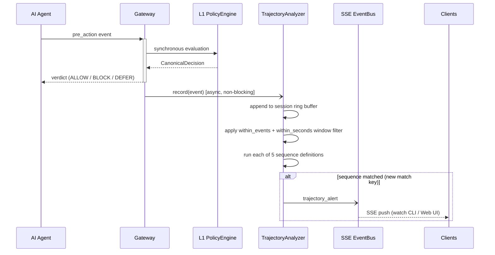
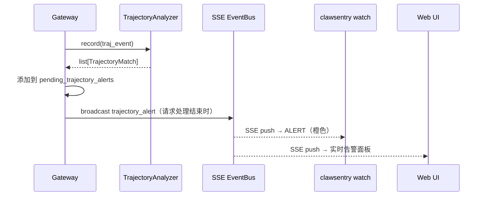

# 轨迹分析器

<div class="cs-doc-hero" markdown>
<div class="cs-eyebrow">决策引擎 · 轨迹分析</div>

## 跨事件序列检测，识别隐蔽多步骤攻击链

`TrajectoryAnalyzer` 为每个会话维护一个滑动窗口事件缓冲区，在每次 L1/L2/L3 判决完成后，异步检查近期事件是否构成已知攻击链——例如先读取凭据文件再发起网络外传、先侦察再进行权限提升等。匹配成功时，它会发出 `trajectory_alert` SSE 事件，并根据配置将判决升级为 DEFER 或 BLOCK。

<div class="cs-pill-row" markdown>
<span class="cs-pill">异步、非阻塞</span>
<span class="cs-pill">5 种内置攻击序列</span>
<span class="cs-pill">SSE 实时告警</span>
<span class="cs-pill">可配置判决升级</span>
</div>
</div>

!!! abstract "快速导航"
    [概览](#overview) · [工作原理](#how-it-works) · [5 种内置序列](#builtin-sequences) · [步骤匹配逻辑](#step-matchers) · [输出模式](#output-schema) · [SSE 事件格式](#sse-event) · [决策流水线集成](#pipeline-integration) · [配置项](#configuration) · [源文件](#source-files)

## 概览 {#overview}

单事件风险分数（D1–D6）捕捉的是当前操作的危险程度。真实的 APT（高级持续性威胁）模式是跨多个操作的有序链——每个步骤单独看风险很低，但序列整体揭示了攻击意图。

`TrajectoryAnalyzer`（`src/clawsentry/gateway/trajectory_analyzer.py`）是 ClawSentry 的跨事件序列检测引擎。它在每个会话的环形缓冲区中存储每条记录事件的紧凑表示，并将每个新事件与五个内置攻击链定义进行比对。

!!! info "定位：异步且非阻塞"
    `TrajectoryAnalyzer` **不**参与同步的 `pre_action` 决策路径。Gateway 在 L1/L2/L3 评估完成**之后**调用 `trajectory_analyzer.record()`。默认情况下，结果以 `trajectory_alert` SSE 事件广播，不修改当前判决。可选的 `defer` 和 `block` 模式可针对 `pre_action` 事件上的 HIGH 及以上级别匹配升级判决。

---

## 工作原理 {#how-it-works}



### 环形缓冲区构建

每个会话拥有一个 `collections.deque(maxlen=max_events_per_session)`（默认 50）。调用 `record()` 时：

1. 从原始事件字典中提取 `_BufferedEvent`——字段包括：`event_id`、`tool_name`、`path`（来自 `payload.path` 或 `payload.file_path`）、`command`（来自 `payload.command`）、`ts`（`occurred_at_ts` 或 `time.time()`）。
2. 追加事件；当队列满时，deque 自动丢弃最旧的条目。
3. 将该会话移至内部 `_buffers` 字典的末尾，以维护 LRU 顺序。
4. 如果总会话数超过 `max_sessions`（默认 10,000），则驱逐最旧的会话。
5. 对更新后的缓冲区运行所有已注册的序列检测。

### 窗口过滤

对于每个序列定义，分析器：

1. 从缓冲区中截取最后 `within_events` 个事件。
2. 丢弃 `ts < current_event.ts − within_seconds` 的事件。
3. 过滤后要求至少保留 `len(seq.steps)` 个事件。

### 匹配算法

| 序列类型 | 算法 |
|---|---|
| 有序多步骤（2 步） | `_match_ordered_steps` — 按顺序扫描窗口；每次当前步骤匹配时推进步骤索引；所有步骤均匹配时成功 |
| 计数型（1 步 + `min_count`） | `_match_count_step` — 统计匹配该步骤谓词的事件数；计数 ≥ `min_count` 时成功 |

### 去重逻辑

每个会话跟踪已发出的 `(sequence_id, frozenset(matched_event_ids))` 元组。每个唯一事件 ID 组合只发出一次匹配。当去重集合超过 `max_events × max(len(sequences), 1)` 条时，将被清空以限制内存增长。

```mermaid
flowchart TD
    A[新序列匹配] --> B{match_key 是否已在<br/>dedup 集合中？}
    B -- 是 --> C[跳过，不发出告警]
    B -- 否 --> D[添加 match_key 到 dedup 集合]
    D --> E{dedup 集合大小<br/>> max_events × max(sequences,1)？}
    E -- 是 --> F[清空 dedup 集合]
    E -- 否 --> G[发出 trajectory_alert]
    F --> G
```

---

## 5 种内置攻击序列 {#builtin-sequences}

| ID | 描述 | 步骤 1 | 步骤 2 / 计数 | `within_events` | `within_seconds` | 风险级别 |
|---|---|---|---|:---:|:---:|:---:|
| `exfil-credential` | 读取敏感文件后发起网络请求 | `sensitive_file_read` | `network_request` | 5 | 60 | `critical` |
| `backdoor-install` | 下载远程脚本后使其可执行或写入 Shell 配置 | `remote_download` | `make_executable_or_shell_config` | 5 | 60 | `critical` |
| `recon-then-exploit` | 系统枚举后进行权限提升 | `recon_command` | `privilege_escalation` | 8 | 120 | `critical` |
| `secret-harvest` | 短时间内多次读取凭据文件 | `credential_file_read`（×≥3） | — | 10 | 30 | `high` |
| `staged-exfil` | 写入临时目录后从其中外传数据 | `tmp_write` | `tmp_exfil` | 10 | 120 | `high` |

---

## 步骤匹配逻辑 {#step-matchers}

每种步骤类型对应一个精确谓词，针对缓冲事件的 `tool_name`、`path` 和 `command` 字段进行评估。

### 工具名集合

| 集合名称 | 成员 |
|---|---|
| `READ_TOOLS` | `read_file`, `read`, `cat`, `head`, `tail` |
| `WRITE_TOOLS` | `write_file`, `edit_file`, `create_file`, `write`, `edit`, `chmod`, `chown` |
| `NETWORK_TOOLS` | `http_request`, `fetch`, `web_fetch`, `curl`, `wget` |

### 每步骤谓词

| 步骤类型 | 条件 |
|---|---|
| `sensitive_file_read` | `tool_name` ∈ `READ_TOOLS` **且** `path` 匹配 `_CREDENTIAL_PATH_RE` |
| `network_request` | `tool_name` ∈ `NETWORK_TOOLS` **或** `_NETWORK_COMMAND_RE` 匹配 path/command 的组合 |
| `remote_download` | `_DOWNLOAD_RE` 匹配 `command` |
| `make_executable_or_shell_config` | `_CHMOD_EXEC_RE` 匹配 `command` **或**（`tool_name` ∈ `{write_file,write,edit_file,edit}` 且 `_SHELL_CONFIG_RE` 匹配 `path`） |
| `recon_command` | `_RECON_RE` 匹配 `command` |
| `privilege_escalation` | `_PRIVESC_RE` 匹配 `command` |
| `credential_file_read` | `tool_name` ∈ `READ_TOOLS` **且** `path` 匹配 `_CREDENTIAL_PATH_RE`（与 `sensitive_file_read` 相同） |
| `tmp_write` | `tool_name` ∈ `WRITE_TOOLS` **且** `_TMP_PATH_RE` 匹配 `path` |
| `tmp_exfil` | `_TMP_PATH_RE` 匹配 `command` **且** `_NETWORK_COMMAND_RE` 匹配 `command` |
| `tool_names`（自定义） | `tool_name` ∈ 用户提供的列表（大小写不敏感） |

### 正则定义（来自 risk_signals.py）

| 正则常量 | 模式 |
|---|---|
| `_CREDENTIAL_PATH_RE` | `\.(env\|pem\|key\|p12\|pfx\|jks\|keystore)(?:$\|[^a-z0-9])\|id_rsa\|id_ed25519\|credentials\|\.secret\|\.token\|\.password\|\.aws/\|\.ssh/`（大小写不敏感） |
| `_DOWNLOAD_RE` | `(curl\|wget)\s+.*https?://`（大小写不敏感） |
| `_CHMOD_EXEC_RE` | `chmod\s+\+?[0-7]*x`（大小写不敏感） |
| `_SHELL_CONFIG_RE` | `\.(bashrc\|bash_profile\|profile\|zshrc\|zprofile)$`（大小写不敏感） |
| `_RECON_RE` | `\b(uname\|id\|whoami\|hostname\|cat\s+/etc/(os-release\|issue\|passwd)\|lsb_release\|arch)\b`（大小写不敏感） |
| `_PRIVESC_RE` | `\bsudo\b.*\b(chmod\|chown\|rm\|mv\|cp\|useradd\|usermod\|visudo\|passwd\|install)\b`（大小写不敏感） |
| `_NETWORK_COMMAND_RE` | `\b(curl\|wget\|scp\|rsync\|nc\|ncat\|socat)\b\|https?://`（大小写不敏感） |
| `_TMP_PATH_RE` | `/tmp/\|/var/tmp/\|c:\\temp\\`（大小写不敏感） |

---

## 输出模式 {#output-schema}

`trajectory_analyzer.record()` 返回 `list[TrajectoryMatch]`。每个 `TrajectoryMatch` 是一个数据类：

| 字段 | 类型 | 描述 |
|---|---|---|
| `sequence_id` | `str` | 匹配序列的 ID（如 `exfil-credential`） |
| `risk_level` | `str` | `low` / `medium` / `high` / `critical` |
| `matched_event_ids` | `list[str]` | 满足每个步骤的事件 ID（有序多步骤），或前 `min_count` 个匹配事件的 ID（计数型） |
| `reason` | `str` | 人类可读的描述；计数型序列追加 ` (N occurrences)` |

---

## SSE 事件格式 {#sse-event}

当 `trajectory_alert_action` 为 `broadcast`（或无论操作如何在匹配检测后），Gateway 发出 `trajectory_alert` SSE 事件：

```json
{
  "type": "trajectory_alert",
  "session_id": "session-001",
  "sequence_id": "exfil-credential",
  "risk_level": "critical",
  "matched_event_ids": ["evt-a1b2c3", "evt-d4e5f6"],
  "reason": "Read sensitive file then make network request",
  "handling": "broadcast",
  "timestamp": "2026-05-18T10:23:45.123Z"
}
```

| 字段 | 来源 |
|---|---|
| `type` | 始终为 `trajectory_alert` |
| `session_id` | 来自原始事件 |
| `sequence_id` | `TrajectoryMatch.sequence_id` |
| `risk_level` | `TrajectoryMatch.risk_level` |
| `matched_event_ids` | `TrajectoryMatch.matched_event_ids` |
| `reason` | `TrajectoryMatch.reason` |
| `handling` | 当前生效的 `trajectory_alert_action` 值（`broadcast` / `defer` / `block`） |
| `timestamp` | 事件中的 `occurred_at`，或 `utc_now_iso()` |

在 `clawsentry watch` 中，`trajectory_alert` 事件以 `ALERT` 类型显示（橙色高亮）。使用 `--filter trajectory_alert` 可仅显示此类型。



!!! note "L3 异步触发"
    风险级别为 `high` 或 `critical` 的 `trajectory_alert` 在 `CS_L3_ADVISORY_ASYNC_ENABLED=true` 时还会触发 L3 异步证据快照。L3 快照中的 `trigger_reason` 字段被设置为 `trajectory_alert`。

---

## 决策流水线集成 {#pipeline-integration}

`trajectory_alert_action` 字段控制匹配是否影响当前判决：

1. Gateway 接收 `pre_action` 事件，同步调用 L1/L2/L3，获得 `CanonicalDecision`。
2. Gateway 调用 `trajectory_analyzer.record(traj_event)`，返回 `list[TrajectoryMatch]`。
3. 对于每个匹配，将 `trajectory_alert` 字典添加到 `pending_trajectory_alerts`。
4. 满足以下所有条件时触发判决升级：
    - `trajectory_alert_action` 为 `defer` 或 `block`
    - 事件类型为 `PRE_ACTION`
    - 尚未应用会话级强制执行动作
    - `TrajectoryMatch.risk_level` 为 `high` 或 `critical`
5. 若升级成功，判决被替换为 `DEFER` 或 `BLOCK`，并在 `meta_dict["trajectory_alert_decision_override"]` 中记录 `sequence_id`、`risk_level` 和 `handling`。
6. 所有 `pending_trajectory_alerts` 在请求处理器结束时以 SSE 事件广播。

| `trajectory_alert_action` | 对判决的影响 | 是否发出 SSE |
|---|---|:---:|
| `broadcast`（默认） | 无——判决不变 | 是 |
| `defer` | PRE_ACTION 上的 HIGH+ 匹配 → `DEFER` | 是 |
| `block` | PRE_ACTION 上的 HIGH+ 匹配 → `BLOCK` | 是 |

!!! warning "升级条件"
    判决升级仅适用于 `pre_action` 事件。后置动作事件会收到 SSE 告警，但判决不会因轨迹分析而被修改。

!!! warning "BLOCK 优先于 DEFER"
    若现有判决已为 `BLOCK`，则 `defer` 升级将被静默跳过，以避免将更严格的决策降级。

---

## 配置项 {#configuration}

| 环境变量 | `DetectionConfig` 字段 | 默认值 | 描述 |
|---|---|:---:|---|
| `CS_TRAJECTORY_MAX_EVENTS` | `trajectory_max_events` | `50` | 每个会话的环形缓冲区大小（事件数） |
| `CS_TRAJECTORY_MAX_SESSIONS` | `trajectory_max_sessions` | `10000` | 最大并发会话数；超出时按 LRU 驱逐最旧会话 |
| `CS_TRAJECTORY_ALERT_ACTION` | `trajectory_alert_action` | `broadcast` | 轨迹匹配的响应行为：`broadcast`、`defer` 或 `block` |

三个字段均可通过 `DetectionConfig` 编程设置。预设覆盖：

| 预设 | `trajectory_alert_action` |
|---|---|
| `strict` | `defer` |
| `aggressive` | `block` |
| `normal`（默认） | `broadcast` |

!!! tip "始终激活"
    `TrajectoryAnalyzer` 随 Gateway 自动启动，没有启用/禁用开关。若要有效禁用，可设置 `CS_TRAJECTORY_MAX_SESSIONS=0`（由于 `max(max_sessions, 1)` 保护机制，实际会保留 1 个会话的最小值——不建议使用此方式）。

---

## 源文件 {#source-files}

| 模块 | 路径 | 职责 |
|---|---|---|
| `TrajectoryAnalyzer` | `src/clawsentry/gateway/trajectory_analyzer.py` | 核心检测引擎、环形缓冲区、5 种内置序列定义、步骤匹配器 |
| `risk_signals` | `src/clawsentry/gateway/risk_signals.py` | 共享正则常量和谓词函数（`is_credential_path`、`has_recon_command` 等） |
| Gateway 集成 | `src/clawsentry/gateway/server.py` | 调用 `trajectory_analyzer.record()`、应用判决升级、广播 SSE |
| `DetectionConfig` | `src/clawsentry/gateway/detection_config.py` | `trajectory_max_events`、`trajectory_max_sessions`、`trajectory_alert_action` 字段及环境变量映射 |

---

## 相关页面

- [后置动作分析器](post-action.md) — 同样异步；检测工具输出中的即时威胁
- [L2 语义分析](l2-semantic.md) — 同步语义层，与轨迹分析互补
- [检测流水线配置](../configuration/detection-config.md) — 完整 `CS_TRAJECTORY_*` 参数参考
- [报告与监控 → SSE](../api/reporting.md#get-report-stream) — 如何订阅 `trajectory_alert` 事件
